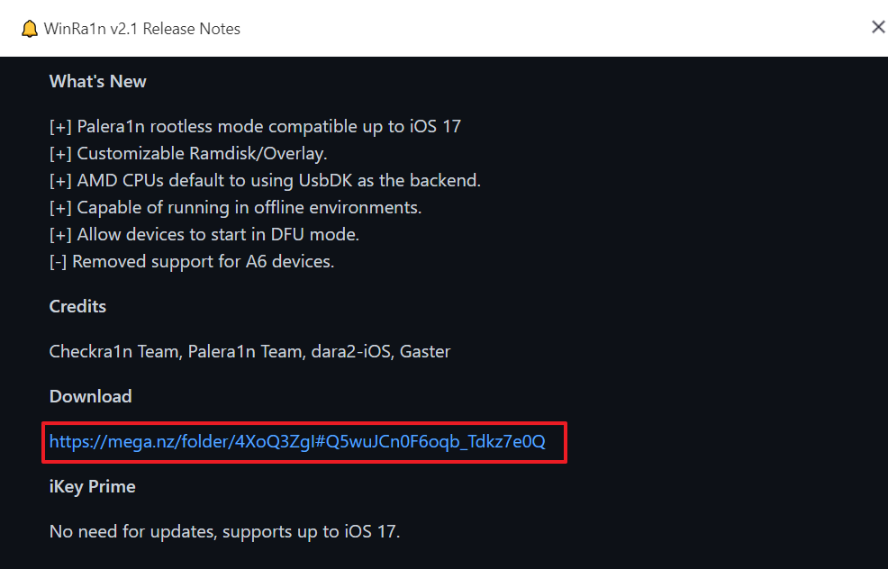
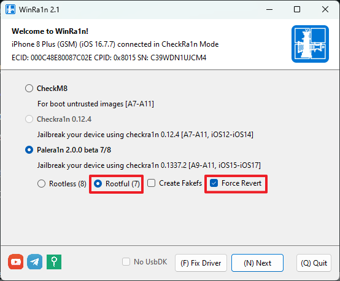

# iOS 진단


## 1. 탈옥

가장 먼저 탈옥을 하기 전에 아이튠즈를 설치한다.

- iTunes 설치 (Apple 드라이버 용) https://www.apple.com/kr/itunes/
  - Microsoft 가 아닌 Apple 공식 홈페이지에서 다운로드


---

### 1.1 환경 구성

1. 환경 구성 : iPhone X 
2. ios 버전 :  16.7.11 
3. PC : Windows

**주의 : 탈옥 진행해야할 아이폰에 암호 설정 X**

###  1.2 iPhone 탈옥 조건 확인

아이폰 탈옥의 경우, 칩셋 종류와 ios 버전에 따라 탈옥 방법 및 툴이 달라지므로 아래의 사이트에서 확인이 필요하다.

https://appledb.dev/

### 1.3 탈옥(Jailbreak) 툴 확인

위 사이트에 있는 대로  iPhone X 기종의 ios 16.7.11 버전일 경우 `paleran1n` 을 이용하여 탈옥을 진행해야 한다.


**참고. CheckRa1n 의 경우도 paleran1n으로 탈옥 가능**

### 1.4 iPhone 탈옥 `Palera1n` 설치

> Palera1n 설치하기

아래의 사이트를 통해서 Palear1n 관련 파일을 다운로드 해야한다.

https://www.ikeytools.com/
접속 후 `WinRaln v2.1 Releases Notes` 게시글 접속한 뒤



해당 다운로드 링크에 들어가서 zip 파일을 다운로드 받는다.

1. 다운로드 받은 zip 파일 압축 해제
2. 확장자가 `.msi` 인 `UsbDk_~_x64.msi` 설치 후 PC 재부팅
- 주의. 만약 이미 설치되어 재설치 시 에러가 발생한다면 설정 > 설치된 앱에서 해당 `UsbDk_~_x64.msi` 를 검색 후 삭제 -> PC 재부팅, 설치 -> PC 재부팅한다.

3. `WinRa1n2.1.exe` 실행 (아래처럼 진행이 안 되면 `WinRa1n2.0.exe` 등 기타 버전으로 실행)


실행하면


1) PC와 iOS 기기를 연결한 뒤
2) `Palera1n 2.0.0 beta 7/8` 선택
3) `Rootful(7)`, `Create Fakefs` 선택
4) `(F) Fix Driver` 진행 후 `(N) Next` 진입
- 주의. 여기서 UsbDK가 NoUsbDK 으로 비활성화 되어있는데 iOS 버전마다 탈옥 시 다름. 만약 활성화되어 있는 경우 체크 선택


1) (S) Start 누르기
2) 음향 낮추는 키와 전원키를 동시에 3초 누르기
3) 전원키를 떼고 음향 낮추는 키만 10초 누르기


핸드폰에 위의 문구가 나타나는지 확인
- `"COPYING FILES TO FAKEFS..."(MAY TAKE UPTO 10 MINITUES)`

만약, 확인되지 않는다면 탈옥이 정상적으로 진행되지 않음
  정상적으로 문구 확인이 된다면


Create Fakefs 해제 후 동일하게 진행


iPhone에 Palera1n 설치 완료됨 확인


> 번외1) 아이폰 CLI 모드 탈출 방법 

탈옥 중 오류로 인하여 무한루프가 도는 경우가 있다.
나와 같은 경우는 다음과 같은 명령어가 반복되면서 CLI 모드 종료가 되지 않았다.

```
jbinit : mount rootfs /dev/disk1s8
jbinit : mounting rootfs /dev/disk1s8 FAILED with err=2!
```
이럴 경우, 아래와 같은 방법으로 강제 재부팅 하면 된다.

1. 음향 높이는 키 빠르게 한 번

2. 음향 낮추는 키 빠르게 한 번

3. 부팅 시 나오는 사과 모양 뜰 때까지 전원 버튼을 눌르기


> 번외2) Create Fakefs 단계에서 오류

아래의 명령어가 무한루프가 도는 경우, 사진처럼 Rootfol(7), Force Revert 설정 후 (N) Next 눌러 진행한 다음 정상적으로 탈옥되었다.


```
AppleCBTL1612::checkPinVoltage: write(dxctrl :0x1c)
AppleCBTL1612::checkPinVoltage: reset(dxctrl :0x10)
```

