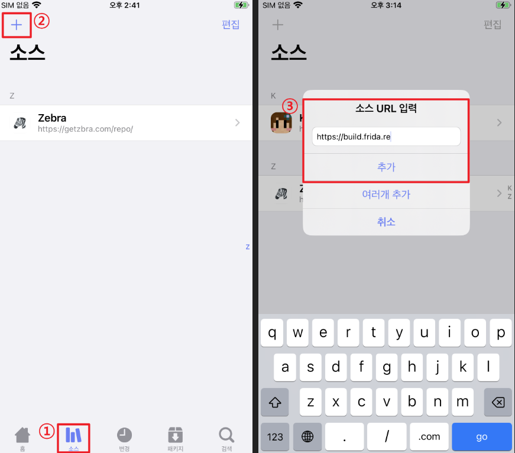
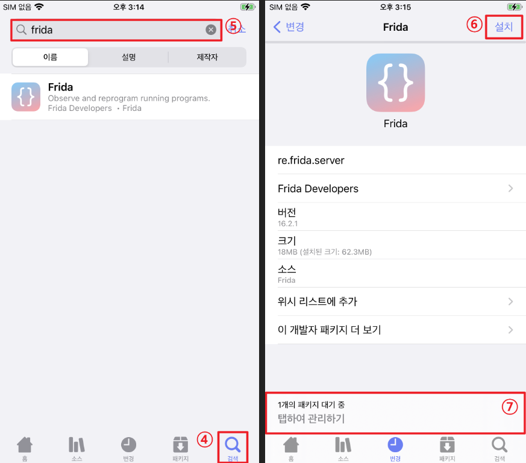
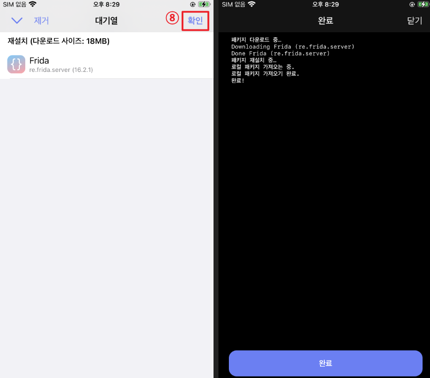

# iOS 진단 셋팅 Frida 설치


## 환경 구성

환경 구성 : iPhone X

ios 버전 :  16.7.11

PC : Windows


## ios 기기 내 Frida 설치

Frida 란 모바일 취약점진단에서의 Frida는 후킹, 디버그, 트래픽 스니핑, 암호 해독 등에 이용되므로 필수적인 도구 중 하나이다.


1. Zebra 접속 후 하단 소스 탭 접속
2. 우측 상단 + 버튼 누르기
3. 소스 URL에 아래의 주소 입력하여 Repository 추가
- https://build.frida.re




4. 하단 검색 탭 접근
5. Frida 검색 후 검색 결과 접속
6. 설치 버튼 누른 후 아래의 패키지 대기열 접근



8. 확인 누른 후 설치 완료 확인



## PC에 Frida 서버 구축
1. anaconda prompt 접속하여 가상 환경을 생성한다.
```shell
# conda create -n <변수명> python=<버전 지정>
(base) C:\Users\rhcsu>conda create -n frida python=3.7.3 -y
```
2. 생성한 frida 환경에 접속한다.
```shell
(base) C:\Users\rhcsu>conda activate frida
```

3. pip install 명령어를 이용하여 frida 관련 툴을 설치한다.
```shell
(frida) C:\Users\rhcsu>pip install Frida-tools
```

4. frida --version 명령어를 이용하여 설치 완료된 것을 확인한다.
```shell
(frida) C:\Users\rhcsu>frida --version
```
5. USB 케이블을 이용하여 ios 기기를 pc와 연결 후 firda-ps 명령어를 이용하여 ios에 설치된 애플리케이션을 확인한다.
```shell
(frida) C:\Users\rhcsu>frida-ps -Uai
# frida 옵션
  -U, --usb             connect to USB device # USB에 연결된 Device
  -a, --applications    list only applications # 애플리케이이션 리스트 출력
  -i, --installed       include all installed applications # 설치된 모든 응용프로그램 출력
```

```terminaloutput
Waiting for USB device to appear...
 PID  Name                                   Identifier
----  -------------------------------------  --------------------------------------------------------
1534  DVIA-v2                                com.highaltitudehacks.DVIAswiftv2
1343  Dopamine                               com.opa334.Dopamine.726YNLRKV9
 563  Home                                   com.apple.Home
 565  MobilePhone                            com.apple.mobilephone
1118  MobileSlideShow                        com.apple.mobileslideshow
1648  NewTerm                                ws.hbang.Terminal
1828  ScreenshotServicesService              com.apple.ScreenshotServicesService
1780  Search                                 com.apple.Spotlight
1117  Settings                               com.apple.Preferences
 625  Sileo                                  org.coolstar.SileoStore
 559  TrollInstallerX                        com.Alfie.TrollInstallerX.726YNLRKV9
 804  TrollStore                             com.opa334.TrollStore
 564  Voice Memos                            com.apple.VoiceMemos
 666  Zebra                                  xyz.willy.Zebra
```