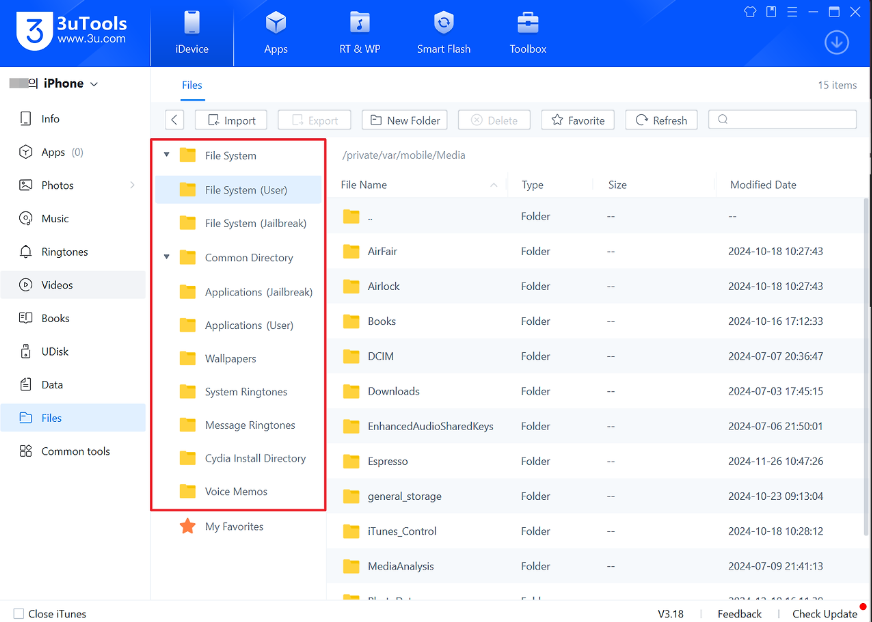
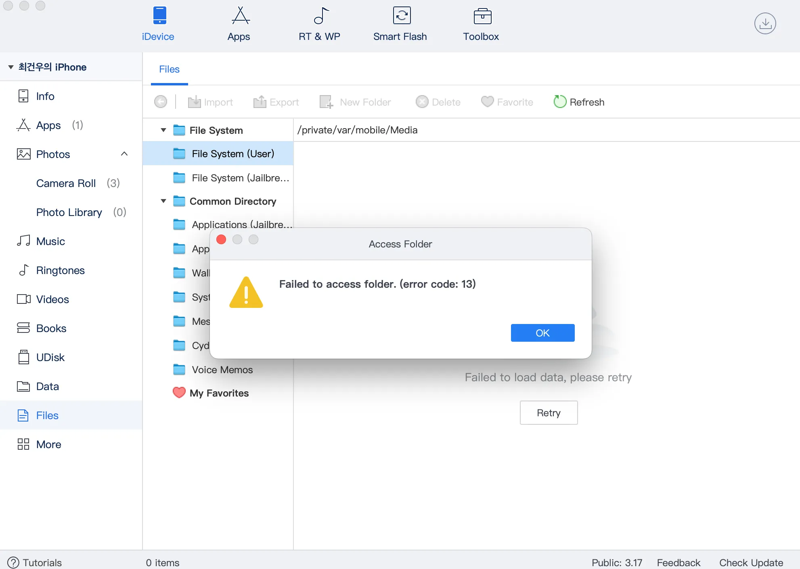
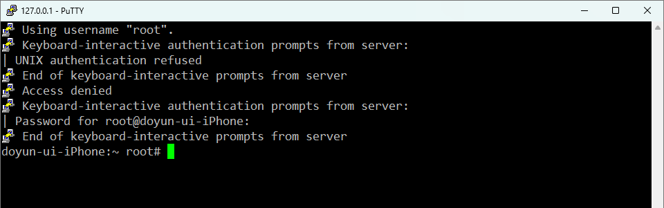

# iOS 진단 셋팅 트웍 및 OpenSSH 접속

`Tweak(트윅)` : IOS가 지원하지 못하는 기능을 Cydia를 이용하여 설치하는 프로그램

## 1. 환경 구성

환경 구성 : iPhone X

ios 버전 :  16.7.11

PC : Windows

## 2. palera1n을 통해서 Sileo, Zebra 설치

`Sileo`와 `Zebra` 는 `cydia`와 같이 repository에 있는 트윅를 설치할 수 있게 해주는 도구이다.
- `cydia` : AppStore에서 이용할 수 없는 기능이 포함된 최초의 비공식 AppStore

설치방법은 간단하다.
탈옥 후 `Palera1n` 실행한 뒤  `Sileo`,`Zebra` 를 눌러 설치하면 된다.


## 3. MTerminal 설치

`MTerminal`은 iOS 기기에서 CLI 환경으로 사용 가능하게 해주는 트윅이다.
- ※ `MTerminal`이 실행이 되지 않는다면, `NewTerm` 을 설치해준다.
설치 방법은 아래와 같다.
1. Zebra 어플 내 소스탭에서 '+' 누르기
2. 아래의 소스 URL 입력하여 Repo 추가
- https://apt.binger.com


3. 검색탭에 MTerminal 검색 후 검색 결과 접속
4. '받기' 버튼 눌러 설치


5. 대기열 접근하여 '확인' 버튼 누르기
6. Teminal 어플이 설치된 것을 확인


## 4. Filza 설치

`Filza`는 iOS 기기 내 루트 디렉터리부터 파일을 검색, 복사 및 붙여넣기, 압축풀기 등의 기능을 사용할 수 있는 트웍이다.

※ 세부 과정은 MTeminal과 동일하며 소스는 아래 URL 을 입력하면 된다.
- https://tigisoftware.com/cydia/


## 5. AppSync Unified 설치
`AppSync Unified` 는 서명되지 않은 IPA 패키지를 설치할 수 있게 한다.

※ 세부 과정은 MTeminal과 동일하며 소스는 아래 URL 을 입력하면 된다.
- https://cydia.akemi.ai/

나의 경우 해당 URL 소스가 추가가 되지 않아 아래 방법을 통해 진행함

1. **GitHub에서 `.deb` 파일 다운로드**

    * 브라우저로 [Akemin-dayo의 AppSync GitHub 릴리즈 페이지](https://github.com/akemin-dayo/AppSync/releases/)로 접속
    * 가장 최신 버전(예: 116.0)을 찾고, 네 기기 환경에 맞는 `.deb` 파일을 고른다. 예:

        * `iphoneos-arm` (rootful 탈옥)
        * `iphoneos-arm64` (rootless 탈옥) 
    * `.deb` 파일을 다운로드 한 뒤, `3utools` 나 `WinSCP` 를 사용하여 iOS 기기로 다운로드.

2. 위에서 다운로드한 **`Filza`로 `.deb` 파일 열기 및 설치**

    * 탈옥된 iOS 기기에서 **Filza** 앱을 연다.
    * 다운로드한 `.deb` 파일이 있는 위치(예: `Downloads` 폴더)로 이동.
    * 해당 `.deb` 파일을 누르면 Filza에서 `.deb` 패키지 뷰가 열린다.
    * `.deb` 파일 화면 오른쪽 위 또는 하단에 있는 **Install** 버튼을 탭한다.
    * 설치가 완료되면, Filza에서 “설치됨” 같은 표시가 나오거나 완료 알림이 뜰 수 있음.

## 6. Darwin CC Tools 설치
`Darwin CC Tools`는 Otool 명령어 진단 도구를 사용하기 위해 설치한다.

※ 세부 과정은 MTeminal과 동일하며 소스는 아래 URL 을 입력하면 된다.
- https://apt.binger.com/

## 7. Apple File Conduit2 설치

`Apple File Conduit2`은  PC에서 아이폰 내부 폴더를 접근 가능하도록 하는 트웍이다.

1. Selio 어플 내 검색 기능을 이용하여 Apple File Conduit2을 찾기
2. Apple File Conduit2 설치


`MobileSubstrate` 에러 로그 발생하여 트웍 설치가 안 된다면 아래 방법을 수행하면 해결 가능하다.

- 1. 사파리 브라우저에서 https://ellekit.space 에 접속 후 `Add to Sileo` 버튼 클릭
     
- 2. `Sileo` 에서 `Ellekit` 레포지토리 생성되었는지 확인
     
- 3. 이후 검색창에 `ellekit` 을 검색하여 `ellekit` 트윅을 다운로드
- 4. `Apple File Conduit2` 트윅을 다시 다운로드 받은 후 일정시간의 재부팅(완전한 재부팅이 아닌 `ellekit`가 설치될 때 재부팅이므로 탈옥 해제되지 않음) 후에 `mobilesubstrate` 문제가 해결되는 것을 확인
 

3. `Apple File Conduit2` 이 정상적으로 다운로드 되면 PC의 `3uTools`를 통해 PC에서 아이폰 내부 폴더 확인 가능



### Failed to access folder. (error code: 13) 에러 발생 시 해결방법


위와 같이 `Failed to access folder. (error code: 13)`에러 발생 시 
```bash
$ ldid -S /usr/libexec/afcd
$ ldid -S /usr/libexec/afc2d
```
명령어 사용 시 해결 가능

### 최종적으로 3uTools에서 내부 디렉터리가 보이지 않는다면 WinSCP 으로 대체

## 8. 3uTools 설치

`3uTools`는  `iOS Version` 및 탈옥 여부(`Jailbroken`) 등 확인할 수 있으며
IPA를 통한 어플 설치, 기기내 파일 추출 등 할 수 있는 PC 툴이다.

PC에서 아래의 URL을 통해 설치할 수 있다.

https://www.3u.com/


## 9. 3uTools를 통한 SSH 접속

1. 3uTools 상단 Toolbox 접속
2. Open SSH Tunnel 누르기


3. SSH Client 선택. ※ 접속 안 될 경우, ios 기기에 `openSSH` 설치한다.
아래와 같이 접속 시 계정은 기본 계정을 사용한다.


4. PuTTY를 통해 SSH 접속한 것을 확인



3uTools 없이 CMD 명령 프롬포트 창으로도 아래와 같이 접속 가능
```poewrshell
C:\Users\yeong>ssh root@127.0.0.1 -P 22
root@127.0.0.1's password:
Hongui-iPhone:~ root#
```