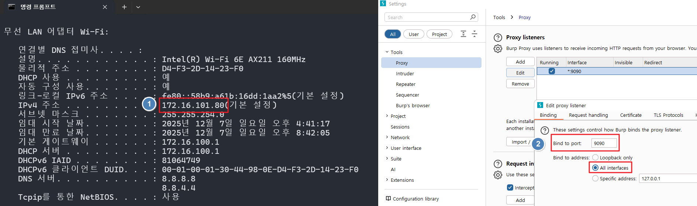
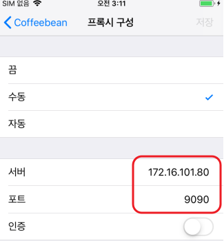

# Proxy Setting

### 1) 네트워크 설정
디바이스, Burp 가 설치된 PC가 동일한 대역의 네트워크를 사용해야 한다.(같은 Wifi 망 사용 시 편리)

참고로 PC가 Wifi 지원을 안 하는 특수한 경우 IpTime-A3000U 같은 별도의 랜카드 필요함

같은 Wifi 망으로 가정하여 진행한다

1. 

PC IP 확인 및 Burp 설정(All Interface 및 9090 포트)

2. 

1에서 확인된 PC IP와 포트를 iOS 디바이스에 설정

### 2) HTTPS 통신을 위한 버프 인증서 설정

✔ Step 1) Burp 인증서를 파일로 추출하는 법
Burp →
Proxy → Options →
Proxy Listeners → 아래에 있는 “Import / Export CA Certificate”

선택:
Export → Certificate in DER format (.cer)

파일명 예: burpCA.cer

이 파일이 iOS로 옮겨야 할 파일임.

✔ Step 2) PC에서 iOS로 파일 전송(WinSCP)

iOS 디바이스 /var/mobile/Media/DCIM/ 경로로 `burpCA.cer` 파일 전송

참고로 /var/mobile/Media/DCIM/ 경로는 기본 앱 Files 으로 접근 가능한 경로이다.

그 후 :
설정 → 일반 → VPN 및 기기 관리 → burpCA.cer 프로파일 → 설치

---

