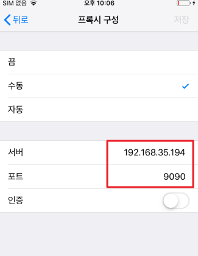
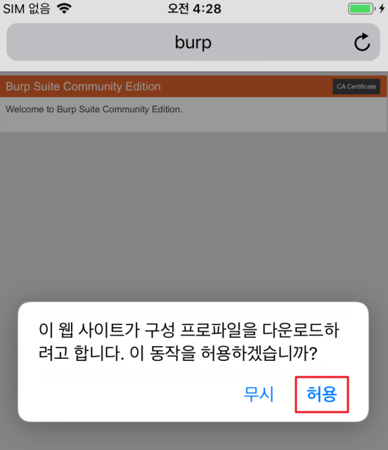
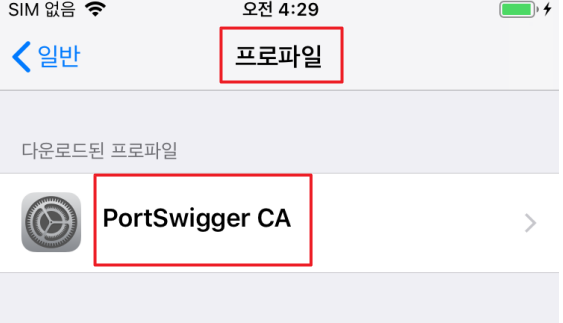
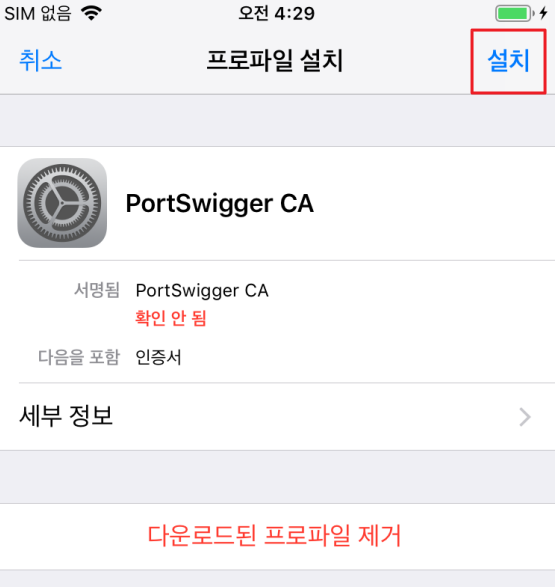
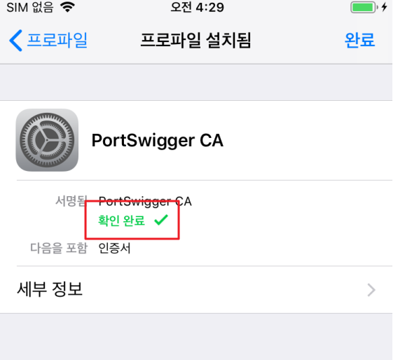

# Proxy Setting

### 1) 네트워크 설정
디바이스, Burp 가 설치된 PC가 동일한 대역의 네트워크를 사용해야 한다.(같은 Wifi 망 사용 시 편리)

참고로 PC가 Wifi 지원을 안 하는 특수한 경우 IpTime-A3000U 같은 별도의 랜카드 필요함

같은 Wifi 망으로 가정하여 진행한다

1. 

PC IP 확인 및 Burp 설정

2. 

1에서 확인된 PC IP와 포트를 iOS 디바이스 프록시 설정

---

### 2) HTTPS 통신을 위한 버프 인증서 설정

Safari 브라우저 들어가서 http://burp/ 입력 후 화면 우측 CA Certificate 선택 후 허용
- 
- 

설정 > 일반 > 프로파일 메뉴에 들어가서 설치
- 
- 
- 
---

