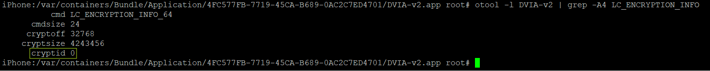
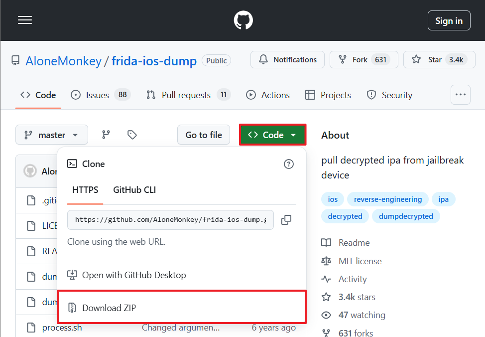
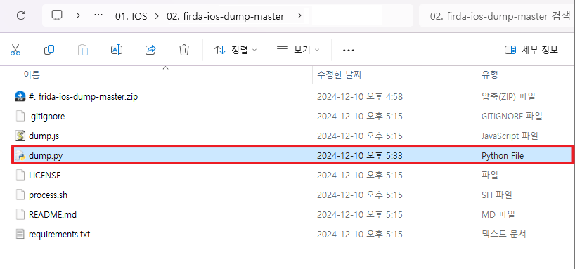
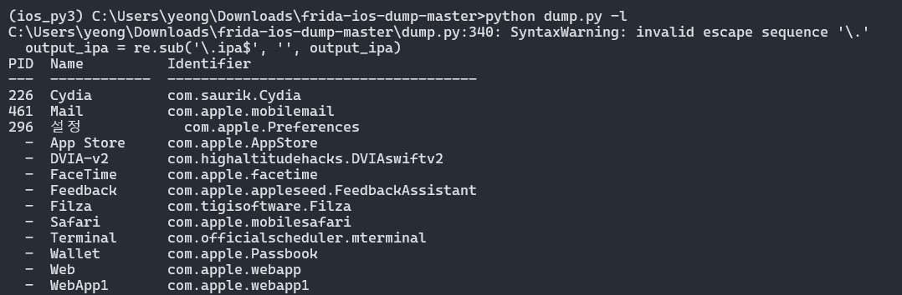
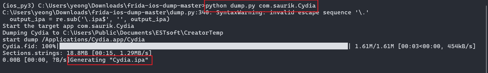
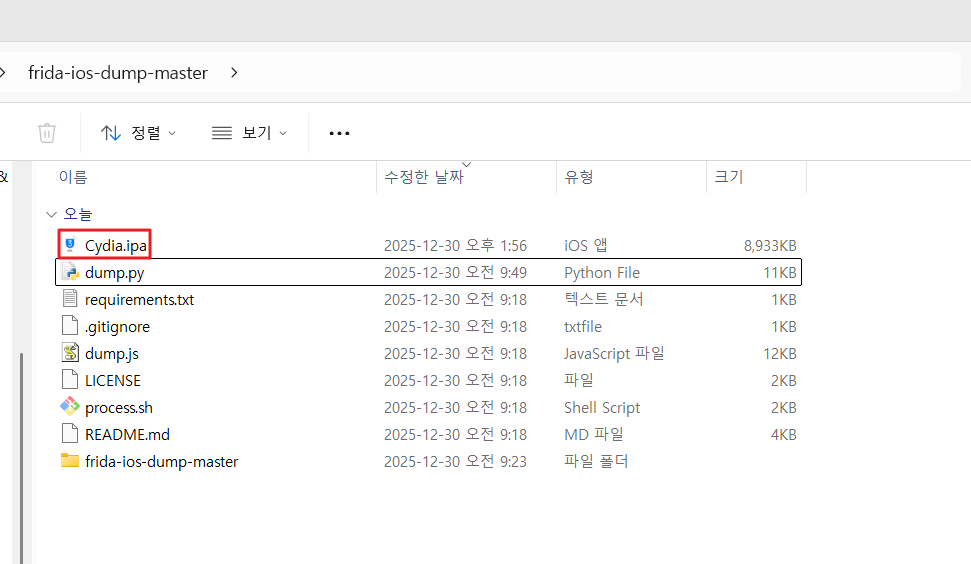
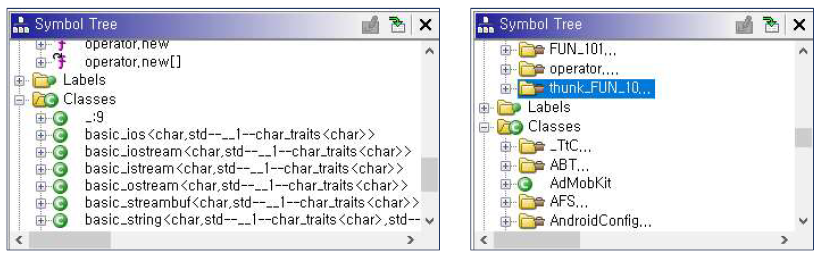
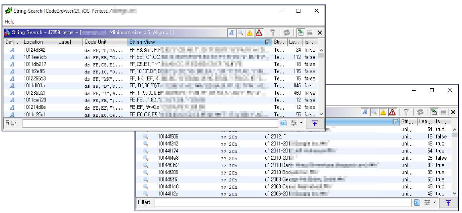

# Fairplay DRM


iOS 앱을 진단을 하기 위해선 암호화 되지 않은 IPA 파일이 필요한데

고객사에서 직접 IPA 파일을 제공받는 경우가 아니라면 앱 스토어에 정식 등록되어 있는 앱을 직접 다운로드 후 진행해야 하는 경우가 생긴다.

정식 앱 스토어에서 받는 앱의 경우 내부의 코드 및 데이터를 보호하기 위한 FairPlay DRM, 암호화가 기본 적용되어 있는데

정상적인 취약점 진단 작업을 수행하기 위해 사전 복호화 작업이 요구된다.

---


## 1. Fairplay DRM 설명과 기능

- 콘텐츠의 불법 사용과 유출을 방지하기 위해 제공하는 솔루션

- Failplay는 애플사의 DRM(Digital Rights Management) 규격

– 앱 스토어에서 다운로드한 공식 앱은 FairPlay DRM 이 적용되어 있고

- 다운 받은 앱에 대한 바이너리 파일은 반드시 암호화되어 보호된다는 뜻

- MS사는 Playready, 구글은 Widevine DRM을 사용함

---

## 2. DRM 복호화 원리

- 단말기에서 앱 실행시 암호화된 바이너리 파일은 커널의 Mach-O(마크오브젝트) 로더에 의해 런타임 중 해독

- 이 런타임 중의 해독 과정 전체를 특정 도구(frida-ios-dump 등)로 덤프로 추출하여 해독된 바이너리 내용을 고스란히 확인할 수 있음

---

## 3. Fairplay DRM 적용 여부 확인


1. 확인을 원하는 앱의 바이너리 경로로 이동한 뒤 (/var/containers/Bundle/Application/UUID/) 
2. Otool 도구를 사용하여 LC_ENCRYPTION_INFO의 cryptid 설정 값으로 확인 가능 (적용된 경우 1, 아닌경우 0)

`otool -l [바이너리파일] | grep -A4 LC_ENCRYPTION_INFO `


- 

별도로 설치한 DVIA-v2 앱은 설정 값 0(DRM 설정안됨)

공식 앱스토어에서 받은 캐치딜 앱은 설정 값 1(DRM 설정됨)

---

## 4. 복호화 도구 소개 및 설치 (Windows 환경에서 작업 시)

[Frida-ios-dump](https://github.com/AloneMonkey/frida-ios-dump)


### Step 1. frida가 설치된 상태에서 아래 frida-ios-dump 파일을 다운받은 후, 압축 해제한다.

https://github.com/AloneMonkey/frida-ios-dump



### Step 2. 아나콘다 생성되어 있는 가상환경 list를 확인한다. 없으면 생성 진행


```shell
(base) C:\Users\ >conda env list
```

출력 결과
```terminaloutput
# conda environments:
#
base                  *  C:\Users\ \anaconda3
frida16111               C:\Users\ \anaconda3\envs\frida16111
ios_py3                  C:\Users\yeong\anaconda3\envs\ios_py3
```

### Step 3. 생성한 가상환경으로 접속한다.

```shell
(base) C:\Users\>conda activate ios_py3
```

### Step 4. 압축 해제한 firda-ios-dump 파일에 접근한다.

```shell
(frida16111) C:\Users\>cd D: 01. IOS\02. firda-ios-dump-master
```

### Step 5. pip3 install 명령어를 이용하여 requirement.txt. 파일을 설치한다.


주의. requirement.txt 파일 내 frida-tools 는 이미 설치되어 있으므로 frida-tools 삭제한 진행한다.

```shell
(frida16111) D: 01. IOS\02. firda-ios-dump-master>pip3 install -r requirements.txt
```


### Step 6. frida-ios-dump 폴더 내 dump.py 파일을 아래 사진과 같이 수정한다.


dump.py 파일 확인

dump.py 내 Host / Port 번호 수정

변경 전) Host = 127.0.0.1 / Port = 2222

변경 후) Host = 단말기 IP / Port = 22


### Step 7. gow를 다운로드 후 PC에 설치한다.


dump.py 코드 내에서 리눅스 명령어인 chmod 를 사용하는데

윈도우 cmd에서는 추가 프로그램 설치를 하지 않으면 해당 명령어를 사용하지 못한다.

따라서 Gow 프로그램을 설치하여 윈도우 cmd 환경에서 리눅스 명령어가

사용 가능하게끔 해주면 해결 가능하다.

https://github.com/bmatzelle/gow/releases


### Step 8.  덤프 진행

`python dump.py -l`
- 덤프 가능한 앱 리스트 확인
  - 


`python dump.py [패키지명]`
- 덤프
  - 
  - 
  
복호화된 IPA 파일로 저장됨

해당 IPA 파일 확장자를 zip으로 변경하고 압축 해제한 뒤 바이너리 파일을 분석하면 된다.


- 복호화 전 바이너리 파일과 복호화 후 바이너리 파일 분석 비교
  - 
  - 


 