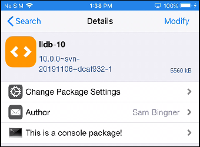
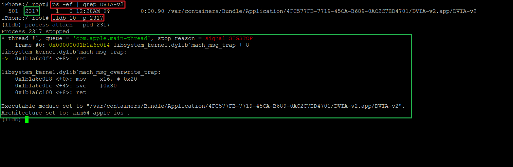

1. Cydia에서 lldb-10 검색하여 설치

- 

만약 Repo에 lldb-10 가 없을 시 https://apt.procurs.us/ 추가

---

2. lldb 연결

- `ps -ef` 으로 PID 확인
- `lldb-10 -p [PID]` 으로 attach 

---

3. 명령어 사용법

| 명령어 | 설명 |
|--------|------|
| `po $x0` | 객체(`x0` 레지스터)의 `description` 메서드 호출 |
| `p` | primitive 값 출력 |
| `br list` | 브레이크포인트 리스트 출력 |
| `br delete 1` | 브레이크포인트 삭제 (예: 1번) |
| `br set -n viewDidLoad` | 특정 메서드 이름에 브레이크포인트 설정 |
| `br set -a <address>` | 특정 주소에 브레이크포인트 설정 |
| `c` | Process Continue |
| `n` | Next (Step Over) – branch 포인트를 넘어감 |
| `s` | Step In – branch 포인트 안으로 들어감 |
| `finish` | Step Out – 함수에서 빠져나옴 |
| `bt` | backtrace – 현재 스택 경로 출력 |
| `bt all` | 모든 thread의 backtrace 출력 |
| `thread list` | thread 목록 출력 |
| `thread select 1` | 1번째 thread 선택 |
| `frame info` | 현재 frame 정보 출력 |
| `frame select 2` | 2번째 frame 선택 |
| `watchpoint list` | watchpoint 목록 출력 |
| `watchpoint delete 1` | 1번째 watchpoint 삭제 |
| `watchpoint set variable _x` | watchpoint 설정 (변수 `_x`) |
| `register read -A` | 모든 레지스터 값 출력 |
| `register read x0` | `x0` 레지스터 값 출력 |
