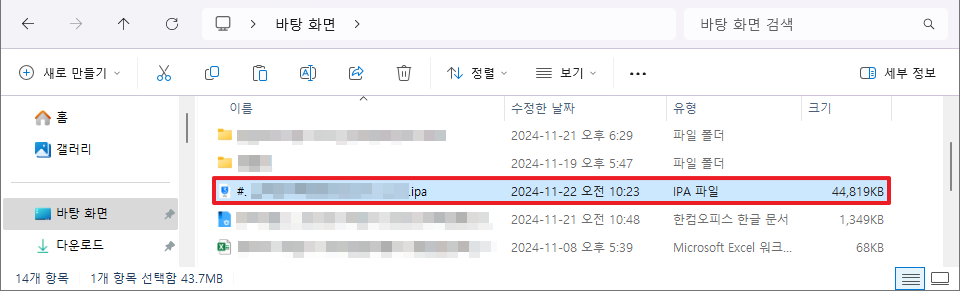

### 1. IPA 추출하기 위해 iMazing 프로그램을 다운로드 한다. 

https://imazing.com/download/windows

### 2. iMazing 프로그램에 접속 후 원하는 모바일 기기를 선택한다.

### 3. [앱 관리] 메뉴 접근한다.

### 4. Apple 계정으로 로그인한다.

### 5. 표시된 아이콘을 선택하여 라이브러리로 다운로드한다.

### 6. 우클릭 후 [IPA 내보내기]를 선택하여 IPA 추출한다.

### 7. IPA를 추출한 위치를 선택한다.

### 8. 선택한 위치에 IPA가 추출된 것을 확인한다.

