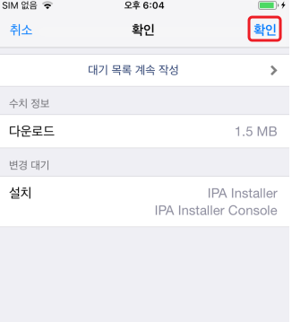

## 1. Cydia 스토어에서 IPA Installer 트웍 설치 

### IPA Installer 트윅 설치
- 
- 

### IPA Installer 다운로드 확인
- 


## 2. 3uTools을 통해 원하는 추출 IPA 번들 ID 확인

`3uTools` 프로그램을 통해 iOS 기기의 설치된 IPA 패키지 파일 내의 info.plist 에서 번들 ID(`com.highaltitudehacks.DVIAswiftv2`)를 확인할 수 있다.


## 3. SSH 에서 명령어 사용
```shell
ipainstaller -b [번들ID]
```
출력결과
```shell
iPhone:~ root# ipainstaller -b com.highaltitudehacks.DVIAswiftv2
Backing up application with identifier "com.highaltitudehacks.DVIAswiftv2"...
The application has been backed up as /private/var/mobile/Documents/DVIA-v2 (com.highaltitudehacks.DVIAswiftv2) v2.0.ipa.
```
출력 결과에서 `/private/var/mobile/Documents/` 경로에 추출됨을 확인 가능

## 4. 3uTools 을 통해 IPA 추출되었는지 확인


1. 출력 결과에서 확인된 `/private/var/mobile/Documents/` 경로 입력 시 
2. 추출된 IPA 존재 확인


마우스 우클릭 후 `Export` 클릭 시 IPA를 PC에 저장 가능하다.