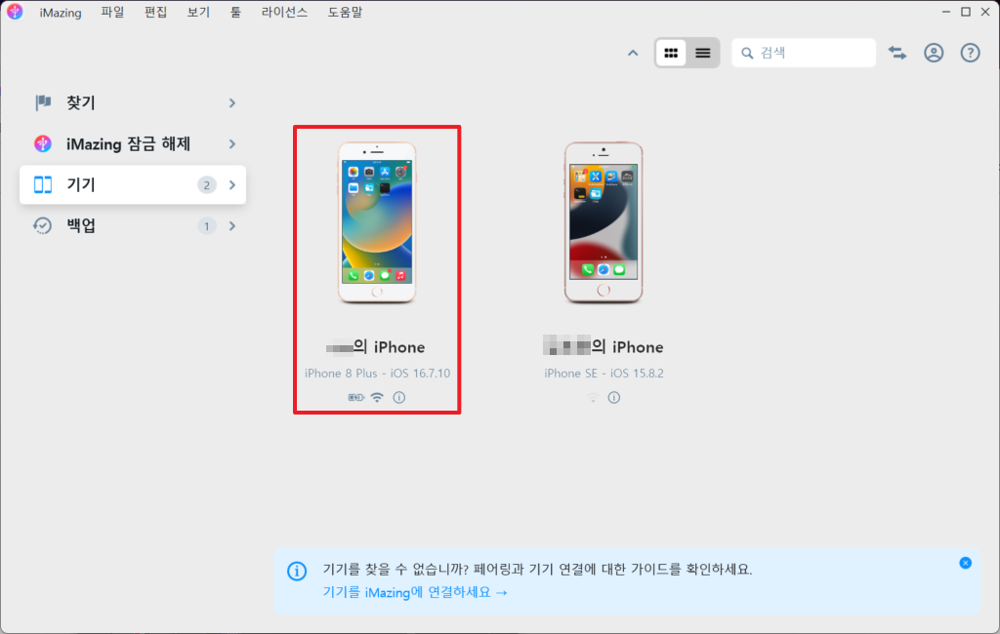
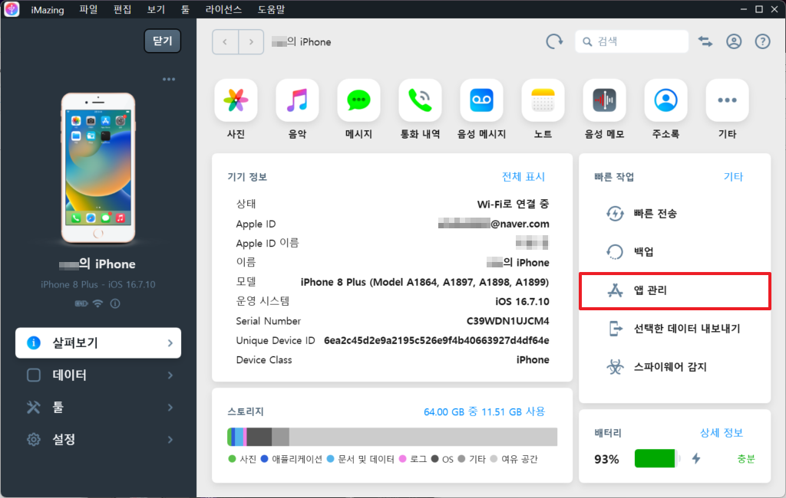
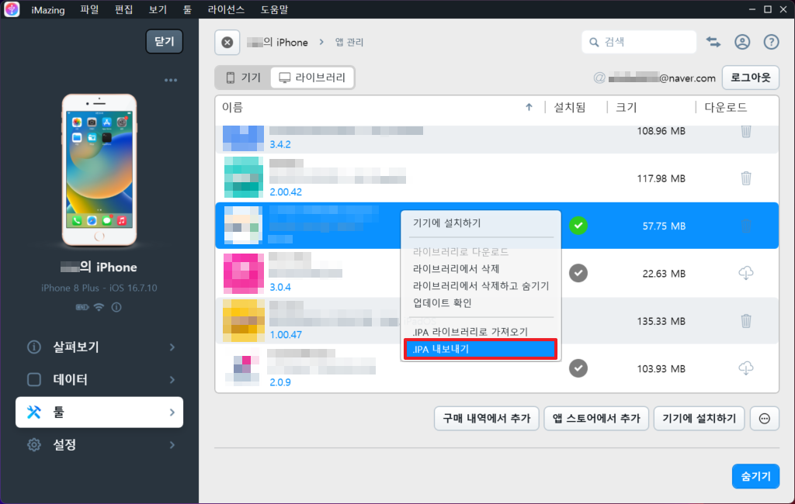
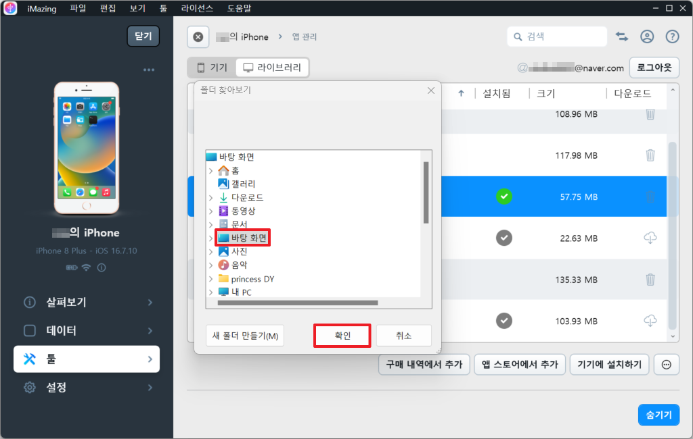
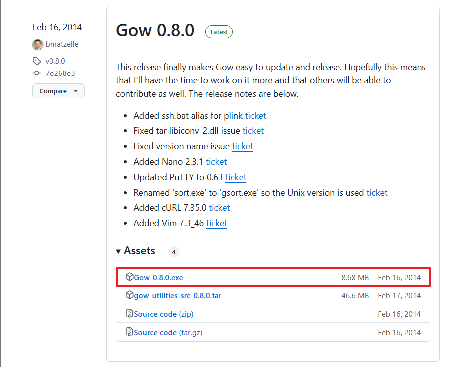
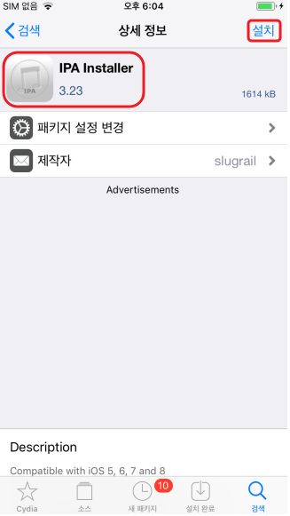
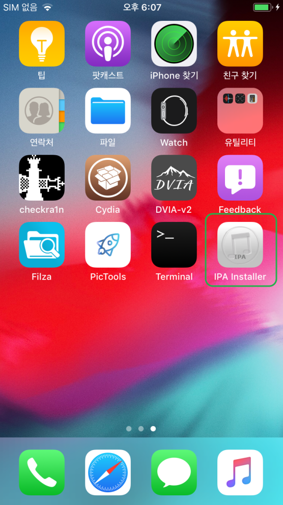
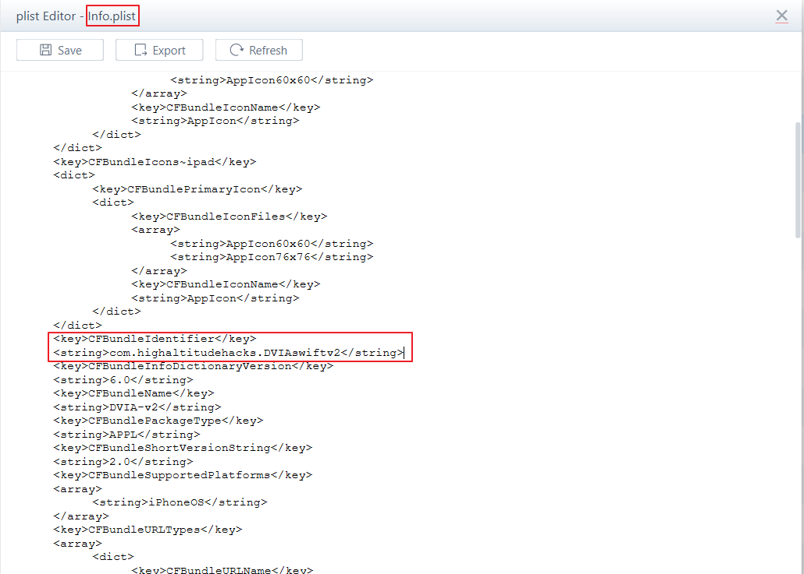
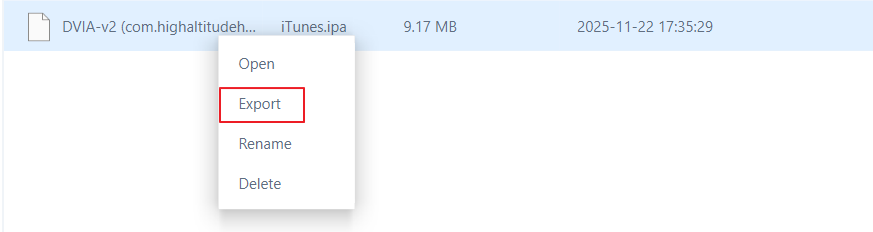

# IPA 추출 방법 3가지

IPA 추출 방법은 아래 3가지가 존재하며 3가지 중 하나를 선택하여 추출하면 된다.


### 1. iMazing 이용하기
### 2. Frida-iOS-dump 이용하기
### 3. IpaInstaller 

---

### 1. iMazing 이용하기

#### 1. IPA 추출하기 위해 iMazing 프로그램을 다운로드 한다. 

https://imazing.com/download/windows

#### 2. iMazing 프로그램에 접속 후 원하는 모바일 기기를 선택한다.




#### 3. [앱 관리] 메뉴 접근한다.



#### 4. Apple 계정으로 로그인한다.


#### 5. 표시된 아이콘을 선택하여 라이브러리로 다운로드한다.


#### 6. 우클릭 후 [IPA 내보내기]를 선택하여 IPA 추출한다.



#### 7. IPA를 추출한 위치를 선택한다.



#### 8. 선택한 위치에 IPA가 추출된 것을 확인한다.


---

### 2. Frida-iOS-dump 이용하기


#### 1. frida가 설치된 상태에서 아래 frida-ios-dump 파일을 다운받은 후, 압축 해제한다.

https://github.com/AloneMonkey/frida-ios-dump


#### 2. 아나콘다 생성되어 있는 가상환경 list를 확인한다. 없으면 생성 진행


```shell
(base) C:\Users\ >conda env list
```

출력 결과
```terminaloutput
# conda environments:
#
base                  *  C:\Users\ \anaconda3
frida16111               C:\Users\ \anaconda3\envs\frida16111
```

#### 3. 생성한 가상환경으로 접속한다.

```shell
(base) C:\Users\>conda activate frida16111
```

#### 4. 압축 해제한 firda-ios-dump 파일에 접근한다.

```shell
(frida16111) C:\Users\>cd D: 01. IOS\02. firda-ios-dump-master
```

#### 5. pip3 install 명령어를 이용하여 requirement.txt. 파일을 설치한다.

requirement.txt 파일 내 frida-tools 는 이미 설치되어 있으므로 frida-tools 삭제한 뒤 

```shell
(frida16111) D: 01. IOS\02. firda-ios-dump-master>pip3 install -r requirements.txt
```
출력 결과
```terminaloutput
Collecting asn1crypto (from -r requirements.txt (line 1))
  Using cached asn1crypto-1.5.1-py2.py3-none-any.whl.metadata (13 kB)
Collecting bcrypt (from -r requirements.txt (line 2))
  Downloading bcrypt-4.2.1-cp39-abi3-win_amd64.whl.metadata (10 kB)
Collecting cffi (from -r requirements.txt (line 3))
				.....중략.....
Downloading cryptography-44.0.0-cp39-abi3-win_amd64.whl (3.2 MB)
   ━━━━━━━━━━━━━━━━━━━━━━━━━━━━━━━━━━━━━━━━ 3.2/3.2 MB 2.9 MB/s eta 0:00:00
Using cached enum34-1.1.10-py3-none-any.whl (11 kB)
				.....중략.....
Downloading pygments-2.18.0-py3-none-any.whl (1.2 MB)
   ━━━━━━━━━━━━━━━━━━━━━━━━━━━━━━━━━━━━━━━━ 1.2/1.2 MB 2.2 MB/s eta 0:00:00
   				.....이하생략.....
```


#### 6. frida-ios-dump 폴더 내 dump.py 파일을 아래 사진과 같이 수정한다.

- 

dump.py 파일 확인

dump.py 내 Host / Port 번호 수정

변경 전) Host = 127.0.0.1 / Port = 2222

변경 후) Host = 단말기 IP / Port = 22


#### 7. gow를 다운로드 후 PC에 설치한다.


dump.py 코드 내에서 리눅스 명령어인 chmod 를 사용하는데

윈도우 cmd에서는 추가 프로그램 설치를 하지 않으면 해당 명령어를 사용하지 못한다.

따라서 Gow 라는 프로그램을 설치하여 윈도우 cmd 환경에서 리눅스 명령어가

사용 가능하게끔 해주면 해결 가능하다.

https://github.com/bmatzelle/gow/releases



#### 8. firda를 이용해 추출할 앱 패키지 명을 확인한다.

```shell
(frida16111) C:\Users\rhcsu>frida-ps -Uai
```

```terminaloutput
  PID  Name       Identifier
-----  ---------  -------------------------------
31822  App Store  com.apple.AppStore
25083  Filza      com.tigisoftware.Filza
 7523  NewTerm    ws.hbang.Terminal
31821  Safari     com.apple.mobilesafari
29772  Sileo      org.coolstar.SileoStore
 1886  Terminal   com.officialscheduler.mterminal
25515  Zebra      xyz.willy.Zebra
 4624  palera1n   com.samiiau.loader
41086  *******       co.kr.*******.app # 추출할 앱 확인
```

#### 9. 추출할 어플을 실행 시킨 후, 아래의 명령어를 이용해서 IPA 추출 시도한다.

```shell
(frida16111) D: 01. IOS\ 02. firda-ios-dump-master>python dump.py "co.kr.*******.app"
```

```terminaloutput
CryptographyDeprecationWarning: Python 3.7 is no longer supported by the Python core team and support for it is deprecated in cryptography. A future release of cryptography will remove support for Python 3.7.
  from cryptography.hazmat.backends import default_backend
Start the target app co.kr.*******.app
Dumping ******* to C:\Users\AppData\Local\Temp
[frida-ios-dump]: SafetokenPattern.framework has been loaded.
[frida-ios-dump]: Safetoken.framework has been loaded.
[frida-ios-dump]: SafetokenBiometric.framework has been loaded.
[frida-ios-dump]: SASLibrary.framework has been loaded.
start dump /private/var/containers/Bundle/Application/89C70437-FE98-4C19-88F3-B627A2ED5ADA/*******_IOS.app/_IOS
_IOS.fid: 100%|█████████████████████████████████████████████████████████| 9.79M/9.79M [00:01<00:00, 6.50MB/s]
start dump
					.....중략.....
                    module_test.js: 22.0MB [00:07, 3.16MB/s]
0.00B [00:00, ?B/s]Generating "*******.ipa" # 추출 완료
```

#### 10. 다음과 같이 frida-ios-dump 폴더 내 IPA가 추출된 것을 볼 수 있다.


> 번외 1. 엑세스가 거부되었습니다.


IPA 추출하는 과정에서 다음과 같이 '엑세스가 거부되었습니다.'라는 오류가 발생될 경우, 본문 '7. gow를 다운로드 후  PC에 설치한다.'를 참고하면 된다.

```shell
(frida16111) D: 01. IOS 02. firda-ios-dump-master>python dump.py "co.kr.*******.app"
```

```terminaloutput
C:\Users \anaconda3\envs\frida\lib\site-packages\paramiko\transport.py:32: 
CryptographyDeprecationWarning: Python 3.7 is no longer supported by the 
Python core team and support for it is deprecated in cryptography. A future release 
of cryptography will remove support for Python 3.7.
  from cryptography.hazmat.backends import default_backend
*** Caught exception: <class 'PermissionError'>: [WinError 5] 액세스가 거부되었습니다:
 'C:\\Users\\AppData\\Local\\Temp\\Payload\\Safetoken.fid'
Traceback (most recent call last):
  File "dump.py", line 336, in <module>
    create_dir(PAYLOAD_PATH)
  File "dump.py", line 246, in create_dir
    shutil.rmtree(path)
  File "C:\Users\anaconda3\envs\frida\lib\shutil.py", line 513, in rmtree
    return _rmtree_unsafe(path, onerror)
  File "C:\Users\anaconda3\envs\frida\lib\shutil.py", line 397, in _rmtree_unsafe
    onerror(os.unlink, fullname, sys.exc_info())
  File "C:\Users\anaconda3\envs\frida\lib\shutil.py", line 395, in _rmtree_unsafe
    os.unlink(fullname)
PermissionError: [WinError 5] 액세스가 거부되었습니다: 'C:\\Users\ \\AppData\\Local\\
Temp\\Payload\\Safetoken.fid'
Traceback (most recent call last):
  File "dump.py", line 360, in <module>
    shutil.rmtree(PAYLOAD_PATH)
  File "C:\Users \anaconda3\envs\frida\lib\shutil.py", line 513, in rmtree
    return _rmtree_unsafe(path, onerror)
  File "C:\Users \anaconda3\envs\frida\lib\shutil.py", line 397, in _rmtree_unsafe
    onerror(os.unlink, fullname, sys.exc_info())
  File "C:\Users \anaconda3\envs\frida\lib\shutil.py", line 395, in _rmtree_unsafe
    os.unlink(fullname)
PermissionError: [WinError 5] 액세스가 거부되었습니다: 'C:\\Users\ \\AppData\\Local\\Temp\\
Payload\\Safetoken.fid'
```

---

### 3. IPA Installer 트웍 사용


#### 1. Cydia 스토어에서 IPA Installer 트웍 설치

IPA Installer 트윅 설치
- 
- 

IPA Installer 다운로드 확인
- 


#### 2. 3uTools을 통해 원하는 추출 IPA 번들 ID 확인

`3uTools` 프로그램을 통해 iOS 기기의 설치된 IPA 패키지 파일 내의 info.plist 에서 번들 ID(`com.highaltitudehacks.DVIAswiftv2`)를 확인할 수 있다.



#### 3. SSH 접속 및 IPA Installer 도구 사용
```shell
ipainstaller -b [번들ID]
```
출력결과
```shell
iPhone:~ root# ipainstaller -b com.highaltitudehacks.DVIAswiftv2
Backing up application with identifier "com.highaltitudehacks.DVIAswiftv2"...
The application has been backed up as /private/var/mobile/Documents/DVIA-v2 (com.highaltitudehacks.DVIAswiftv2) v2.0.ipa.
```
출력 결과에서 `/private/var/mobile/Documents/` 경로에 추출됨을 확인 가능

#### 4. 3uTools 을 통해 IPA 추출되었는지 확인


1. 출력 결과에서 확인된 `/private/var/mobile/Documents/` 경로 입력 시
2. 추출된 IPA 존재 확인


마우스 우클릭 후 `Export` 클릭 시 IPA를 PC에 저장 가능하다.

---
