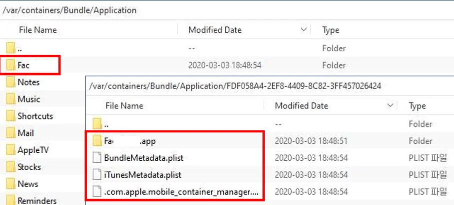
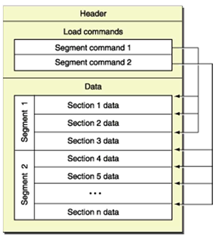
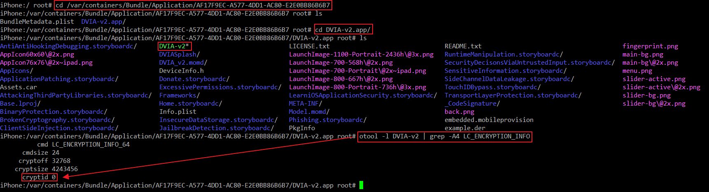

# 📑 목차

- 📂 [1. IPA 파일 구조](#1-ipa-파일-구조)
  - 🗂️ [1.1 압축 해제 시](#1-1-압축-해제-시)
  - 📥 [1.2 앱 설치 시](#1-2-앱-설치-시)
- 📱 [2. iOS 애플리케이션 구조](#2-ios-애플리케이션-구조)
- 📱 [3. Mach-O 바이너리 파일](#3-mach---o-바이너리-파일)
  - 🗂️ [3.1 Mach-O 바이너리 파일](#31-mach-o-바이너리-파일)
  - 📥 [3.2 Mach-O 바이너리 파일 형식](#32-mach-o-바이너리-파일-형식)
  - 📥 [3.3 fairplay-drm](#33-fairplay-drm)


# 1. IPA 파일 구조

## 1. 1 압축 해제 시
IPA 파일을 압축 해제 후 파일 구조는 아래 용도와 같다.

- `Payload` - 최상위 디렉토리
- `Payload/Application.app` - 컴파일된 애플리케이션, 앱에서 사용하는 리소스, info.plist 등이 포함되어 있음
  - `info.plist` 는 애플리케이션 실행을 위한 구성 파일, 버전 정보 등이 포함되어 있음.
  - <span style="color:green"> 진단 시 한번정도 꼭 확인해야함!
- `Payload/Application.app/AppBinary` - 실행가능한 바이너리 파일, 보통 DRM으로 암호화 되어있어 복호화해야 분석이 가능함.
- `Payload/Application.app/_CodeSignature` - 개발자 인증서로 만든 애플리케이션 서명 정보가 있음.
- `iTunesMetadata.plist` - 개발자 이름, 번들 식별자, 저작권 정보 등의 세부 정보가 포함됨.

## 1. 2. 앱 설치 시 




Bundle Container (`/var/containers/Bundle/Application/$uuid`) 
- uuid는 **앱이 설치**될 때 부여되는 고유 식별자 → 재설치 시 변함 
- 앱의 번들을 저장 
- 번들은 macOS 및 IOS에서 소프트웨어를 제공하는 편리한 방법으로 실행 가능한 코드와  해당 코드에서 사용하는 리소스(이미지, 비디오 등)를 가진 디렉토리
- <span style="color:green"> ※내가 설치된 앱 확인하려면 수정된 날짜로 정렬해서 보면 쉽게 찾을 수 있음(앱 이름이 uuid 로 나타날 수도 있음)

Data Container (`/var/containers/Data/Application/$uuid`)
- 앱과 사용자 데이터 저장
- 서브 디렉터리를 가짐

iCloud Container (`/private/var/mobile/Library/Mobile Documents`)
- iCloud와 관련된 데이터 저장
- iCloud 지원 IOS 애플리케이션이 사용하는 데이터가 포함됨
- 앱에서 지원하는 데이터가 저장됨, **but 진단 시 확인할 데이터는 없음**

AppName.app/ (`/var/containers/Bundle/Application/$uuid/AppName.app`)
- 앱의 번들로 일반적으로 쓰기가 불가능하고 읽기만 가능 
- but 탈옥상태에서 읽기, 쓰기, 삭제 가능 
- iTunes나 iCloud에 백업되지 않음

Documents/ (`/var/mobile/Containers/Data/Application/$uuid/Documents/`)
- 사용자가 생성한 문서.데이터와 외부 앱에서 받은 파일 저장
- 사용자에게 노출되고 생성, 삭제, 수정 가능한 파일 포함 + 사용자가 다운로드한 파일
- iTunes나 iCloud에 백업됨(사용자에게 노출되는 데이터만 저장해야 함)
- <span style="color:green"> ※ 중요정보 존재 시 취약점!


Library/ (`/var/mobile/Containers/Data/Application/$uuid/Library/`)
- 유저 데이터 파일 및 임시파일을 제외한 모든 파일 관리
- Application Support, Caches 디렉터리를 주로 사용되고, Caches 디렉터리를 제외한 디렉터리는 iTunes나 iCloud에 백업됨
- <span style="color:green"> ※ 중요정보 존재 시 취약점!, 백업되는 디렉토리에 중요정보나 평문데이터가 있으면 취약점!

Library/Application support/ (`/var/mobile/Containers/Data/Application/$uuid/Library/Application Support/`)
- 앱을 실행하는 데 사용되는 폴더로 사용자에게 보이지 않음(탈옥 시 확인 가능)
- 앱이 생성하고 관리하는 데이터,  설정, 템플릿 등(앱 생성 데이터라고 생각하면 좋음)

Library/Caches/ (`/var/mobile/Containers/Data/Application/$uuid/Library/Caches/`)
- 데이터 캐시 파일을 저장하는 곳으로 앱 성능을 위한 목적으로 존재
- 디스크 공간 확보를 위해 삭제할 수 있으므로 쉽게 재생성 가능한 파일

Library/Preferences  (`/var/mobile/Containers/Data/Application/$uuid/Library/Preferences/`)
- 앱 중요 설정정보가 담겨있는 디렉토리 + 중요정보
- <span style="color:green"> ※ 반드시 확인해야함

tmp (`/var/mobile/Containers/Data/Application/$uuid/tmp`)
- 임시파일을 위한 저장소로 앱 실행하는데 필요 없는 파일
- 백업되지 않고 앱이 실행되지 않으면 디렉터리를 비움
- but, 한번정도는 체크해서 중요정보 남기는지 확인하면 좋음

루트(`/`) 
- 탈옥된 디바이스에서는 루트디렉터리(`/`) 아래의 모든 파일과 디렉터리에 읽기&쓰기 권한을 가짐
- 구조
  - macOS 파일 시스템과 유사한 디렉터리 - Applications, Library, System, User
  - UNIX 파일 시스템과 유사한 디렉터리 - bin, boot, dev, etc, lib, mnt, sbin, tmp, usr, var
  - iOS 파일 시스템의 고유한 디렉터리 - private, cores
  - 탈옥 도구에 따른 디렉터리
  - symbolic link 디렉터리
  - .file - 파일 시스템의 손상 여부를 확인하기 위한 무결성 검사에 사용됨

# 2. iOS 애플리케이션 구조


`/Applications/$app_name.app`
- 사전에 설치된 애플리케이션 및 탈옥 애플리케이션 디렉터리(카메라, safari 등 기본 앱 + 탈옥 시 탈옥도구들을 해당 디렉토리에 저장함)
- 삭제 후 재설치 불가

`/var/containers/Bundle/Application/$uuid`
- 앱 스토어 애플리케이션 디렉터리 (Bundle Container)(앱스토어에서 설치된 앱 + 임의로 설치한 앱을 해당 디렉토리에 저장함)
- uuid는 각 앱마다 고유하게 부여, 재설치 시 변경됨 + 고유한 값이 도구에 따라 문자열로도 출력되는 경우가 있다.
- <span style="color:green"> ※내가 설치된 앱 확인하려면 수정된 날짜로 정렬해서 보면 쉽게 찾을 수 있음(앱 이름이 uuid 로 나타날 수도 있음)

`/var/mobile/Containers/Data/Application/$uuid`
- 데이터 디렉터리(Data Container) → 위에 Data Container 동일
- 모든 애플리케이션 내부 데이터를 저장
- 기존 상태에서는 ios 샌드박스로 인해 특정 어플리케이션에서만 접근 가능 but 탈옥 시 접근가능
- <span style="color:green"> ※ 그래서 중요파일이 존재해서는 안된다. 타 사용자가 단말 탈취 후 탈옥을 통해 중요정보 탈취 같은 시나리오도 생각해야함.


`/var/Keychains/keychain-2.db`
- 사용자 이름, 패스워드, 인증 정보, 네트워크 암호와 같은 민감한 정보를 저장하는 공간이다.
- Sqlite 데이터베이스로 구성된 파일이며 모든 데이터는 암호화됨
- <span style="color:green"> 하지만 복호화 가능한 툴이 존재하므로 해당 툴을 사용하여 중요정보 탈취가 가능한지 확인해야함.


# 3. Mach - O 바이너리 파일

## 3.1 Mach-O 바이너리 파일

- IOS 디바이스에 설치된 앱은 Mach-O 바이너리 파일 형태 
- Mach-O는 Mach object format의 줄임말 
- 실행 파일, 오브젝트 코드, 공유 라이브러리, 동적으로 로드된 코드 및 코어 덤프를 위한 파일 형식 
- 앱 스토어에서 다운로드한 앱은 FairPlay DRM을 이용해 암호화되며 로더에 의해 런타임 중에 해독됨

## 3.2 Mach-O 바이너리 파일 형식



* 리버스 엔지니어링 과정에서 유용한 정보로, 세 가지 섹션으로 나뉨
* Header
  * Mach-O 파일 설명
  * Mach-O 파일을 식별하고 아키텍처와 파일 해석에 영향을 미치는 플래그 등의 파일 포맷 정보를 포함
* Load Commands
  * 세그먼트와 해당 섹션을 설명
  * Header 다음에 오는 영역으로 파일 및 레이아웃에 대한 세부정보를 포함
* Data
  * 실제 세그먼트 데이터
  * Load Commands는 세그먼트와 섹션의 정확한 레이아웃을 지정하지만, Data 영역에는 하나 이상의 세그먼트에 실제 데이터를 포함 (특정 타입 또는 코드의 데이터가 포함됨)

## 3.3 Fairplay DRM
Fairplay DRM
- 앱 스토어에서 다운로드한 앱은 FairPlay DRM을 이용해 암호화되어 보호됨
- 암호화된 바이너리 파일은 커널의 Mach-O 로더에 의해 런타임 중 해독
- Fairplay DRM 적용 여부는 Otool 도구를 사용하여 LC_ENCRYPTION_INFO 의 cryptid 값으로 확인 가능
  -  ```shell
     cd /var/containers/Bundle/Application/[$uuid]
     cd [AppName] /
     otool -l [바이너리 파일] | grep -A4 LC_ENCRYPTION_INFO
     ```
  -  
  - 0이면 암호화 X, 1이면 암호화 O
- 암호화된 바이너리를 분석하기 위해선 해독이 필요 
  - 암호화를 해독하면 바이너리 작동 방식, 내부 클래스 구조 등을 쉽게 파악 가능 
  - Class-dump, frida-ios-dump 도구를 통해 획득 가능
  - 복호화 방법은 뒤에서 설명.


