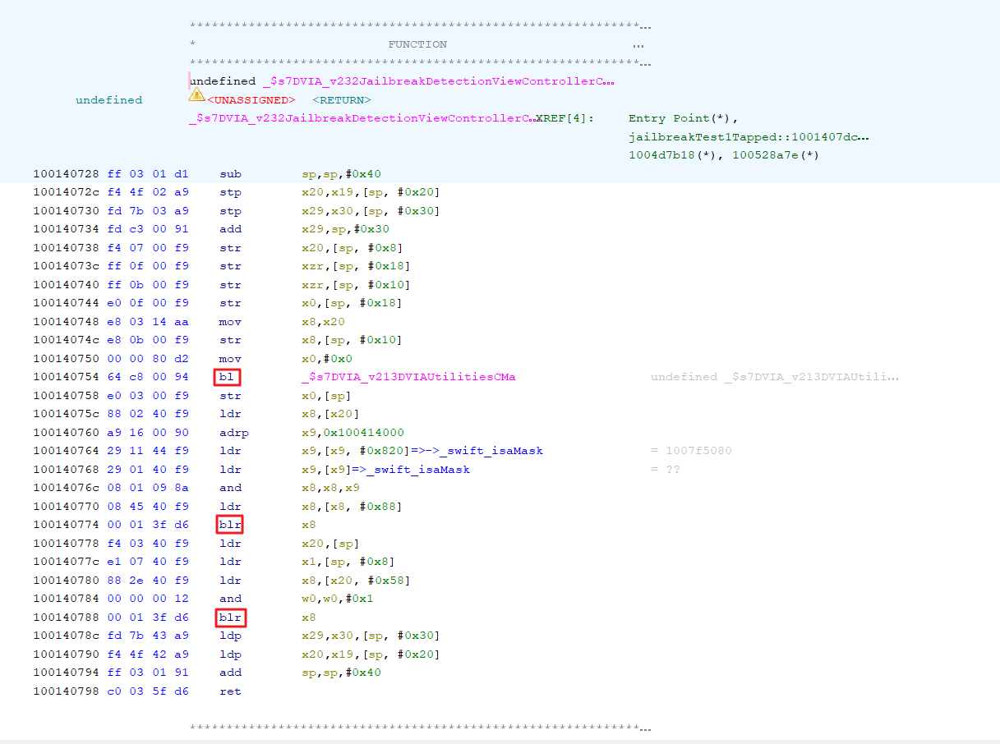
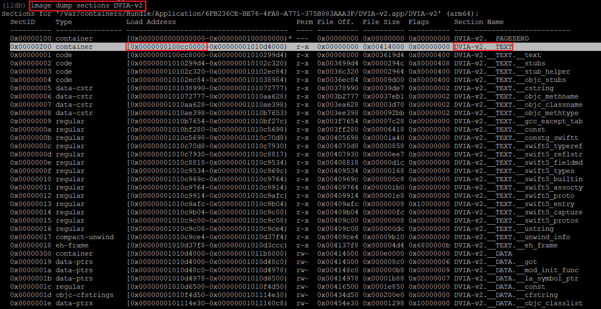
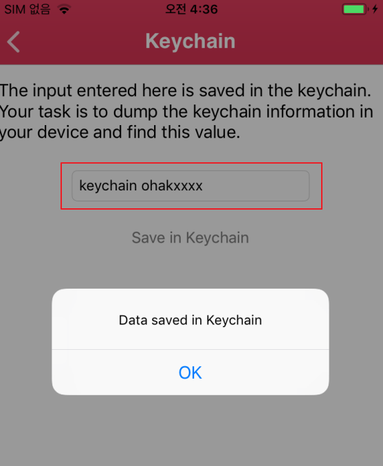
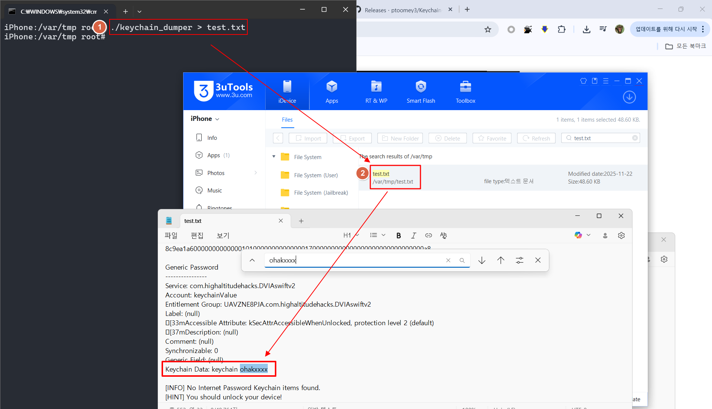
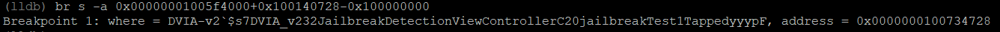
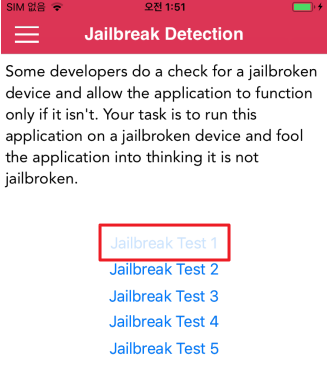
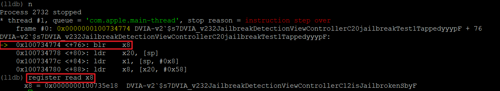
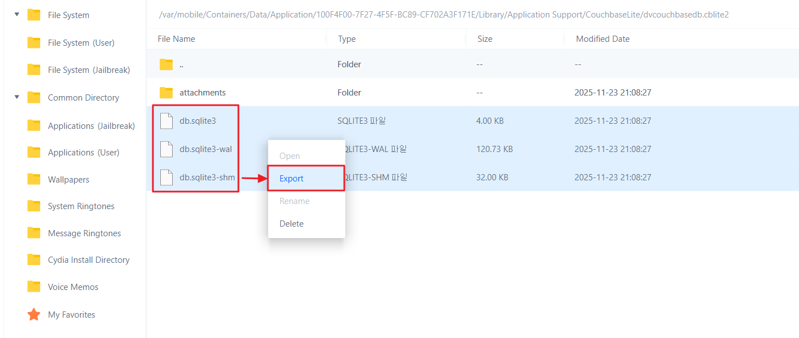

# 📦 Local Data Storage 취약점
Local Data Storage
- iOS 애플리케이션은 임시 데이터와 영구 데이터를 저장하기 위해 로컬 시스템과 상호작용함
- 애플리케이션이 중요한 정보를 임시/영구 형식으로 안전하지 않은 상태로 저장하면 위험이 발생(자동 로그인 정보)
- 내부에 저장하기 위한 다양한 형식이 존재
  - XML & Plist
  - SQLite files
  - Keychain data
  - Core data
  - NSUserDefault class
  - Temporart File (data cache)
  - etc
- 진단 시 확인 필요한 리스트
  - 데이터 컨테이너 경로인 `/var/mobile/Containers/Data/Application/$uuid` 경로
  - DB
  - plist
  - sqlit
  - 그 외 등등 단말 내 저장되는 데이터 모두 확인 필요

## 📑 목차
- 진단 대상 : [DVIA-V2](https://github.com/prateek147/DVIA-v2)
* [1. 📁 Plist 확인](#1-plist-확인)
* [2. ⚙️ UserDefault 확인](#2-userdefault-확인)
* [3. 🔐 KeyChain](#3-keychain)
* [4. 🗄️ Core Data](#4-core-data)
* [5. 🌐 Webkit Caching](#5-webkit-caching)
* [6. 💾 Realm](#6-realm)
* [7. 🧩 Couchbase Lite](#7-couchbase-lite)
* [8. 📚 YapDatabase](#8-yapdatabase)
* [🛡️ Local Data Storage 대응방안](#local-data-storage-대응방안)


## 1. Plist 확인

Plist
- Property List의 줄임말 
- 애플리케이션 데이터 및 설정 정보를 저장하는 데 사용되는 XML 파일 
- `저장된 정보는 암호화가 되지 않아 중요한 정보를 저장하면 안됨`
- Info.plist에는 버전 정보, 실행가능한 바이너리 이름, 지원되는 IOS 버전 및 디바이스 모델 등의 정보가 저장 
  - ex) `/var/containers/Bundle/Application/$uuid/DVIA-v2.app/info.plist`
- 이 외에도 plist 형식을 사용하여 앱에서 필요한 데이터를 내부 저장소에 저장 
  - 앱과 사용자 데이터를 저장하는 Data Container에서 확인 가능 
  - `/var/mobile/Containers/Data/Application/$uuid/` 하위 디렉터리 모두 확인 필요
- 확인방법 
  - SSH & 3uTools & plist Editor 등 


데이터 컨테이너 내 Documents 디렉터리(`/var/mobile/Containers/Data/Application/$uuid/Documents`)에 중요정보 저장 확인


## 2. UserDefault 확인

UserDefault 
- UserDefault 취약점에서 NSUserDefaults 클래스를 사용하여 저장

NSUserDefault 클래스 
- 사용자 기본 설정 및 속성을 저장하는 가장 일반적인 방법 중 하나 
- 애플리케이션을 종료하고 재시작해도 정보는 계속 유지 
- 로그인 상태 저장에 사용될 때도 있음(계정정보, 인증 토큰 등)
- 해당 클래스로 저장한 데이터는 암호화되지 않은 상태로 plist 파일에 저장


데이터 컨테이너 내 Library 디렉터리(`/var/mobile/Containers/Data/Application/$uuid/Library/Preferences`)에 중요정보 저장 확인

## 3. KeyChain

Keychain

- IOS 키체인은 암호화 키와 세션 토큰과 같은 짧고 민감한 데이터 비트를 안전하게 저장할 수 있는 암호화된 데이터베이스 
- 키체인은 API를 통해 접속할 수 있고 SQLite 데이터베이스로 구현됨 
- macOS에서는 모든 애플리케이션이 원하는 만큼 키체인을 만들 수 있으며, 로그인 계정마다 키체인이 존재
- IOS의 키체인은 모든 앱에서 하나의 키체인만 사용할 수 있음 
  - IOS는 기기 내 모든 앱들이 하나의 키체인 데이터 베이스를 사용해야함, 하지만 앱들간 키체인 공유가 불가능해서 보안상 문제가 되지 않지만 탈옥시에는 문제가 발생 
- kSecAttrAccessGroup 속성의 접근 그룹 기능을 통해 동일한 개발자가 서명한 앱 간 항목에 대한 접근 공유 가능 
- 키체인에 대한 접근은 securityd 데몬에 의해 관리됨 
  - 앱의 키체인 엑세스 그룹, 애플리케이션 식별자 및 애플리케이션 그룹 사용 권한에 따라 관리됨 
- keychain을 통해 저장된 암호화 정보는 `/var/Keychains/keychain-2.db` 경로에 저장됨

keychain_dumper

- 키체인 항목을 확인하기 위해 `keychain_dumper` 도구 사용(키체인은 암호화된 데이터베이스)
- `keychain_dumper` 도구를 사용하면 탈옥된 디바이스의 키체인 내용을 덤프 가능
- 사용방법
- 1. [keychain_dumper 다운로드 링크](https://github.com/ptoomey3/Keychain-Dumper/) 설치
- 2. 3utools를 이용해서 iOS 단말기 내 `/var/tmp/` 에 설치
- 3. ```shell
     cd /var/tmp/
     unzip Keychain-Dumper-master.zip
     chmod 755 keychain_dumper
     ./keychain_dumper
     ```
- 4. 단말 내 모든 keychain db를 암호화를 제거하고 볼 수 있음 
- 5. 취약점 발생 시 조치 가이드는 키 체인에 들어가는 정보도 암호화가 필요(키 체인은 복호화가 가능하기 때문)




- 1. `./keychain_dumper > test.txt`을 통해 키 체인 덤프을 test.txt에 저장
- 2. test. txt 확인 시 키 체인을 통한 암호화된 입력 정보가 복호화를 통해 평문으로 노출됨을 확인 가능


## 4. Core Data

Core Data
- Core Data는 애플리케이션의 모델 객체를 관리(MVC, model-view-controller)하기 위한 프레임 워크 
- Core Data는 SQLite를 영구 저장소로 사용할 수 있지만, 프레임워크 자체는 데이터베이스가 아님 
- SQLite는 관계형 데이터베이스로 모바일 디바이스와 같은 시스템에 적합한 경량 데이터베이스 엔진을 구현함 
- Core Data는 모델을 만들고, 서로 다른 유형의 개체간의 관계를 관리하고, 데이터를 로컬로 저장하고, 쿼리를 원할때마다 로컬캐시에서 가져오는 기능을함 
- SQLite와 다른 점은 데이터베이스 테이블명 앞에 Z 문자가 붙는것만 다름 
- Core Data에 저장된 데이터는 암호화되지 않아 중요한 정보를 저장하면 안 됨 
- 중요한 정보를 저장하려면 암호화된 데이터를 저장할 수 있는 라이브러리를 사용해야 함
- 데이터 컨테이너 `/var/mobile/Containers/Data/Application/$uuid/Library/Application Support/` 경로에서 확인

사용자 이름, 이메일, 전화번호, 패스워드 입력
- 

생성된 Core Data 확인, 스토리지 및 SQL 관련 파일 모두 선택 후 마우스 우클릭하여 Export 선택

Model.sqlite 파일만 Export 하면 데이터가 없는 현상이 발생하여

스토리지 및 SQL 관련 파일 모두 Export 진행함.
- 

Model.sqlite 파일을 열면 사용자 이름, 이메일, 전화번호, 패스워드 평문으로 저장됨 확인
- 


## 5. Webkit Caching

Webkit Caching

- 웹 페이지를 로드하기 위해 UIWebView를 사용하는 애플리케이션은 응답 시간을 단축하기 위해 Caching을 사용 
- UIWebView는 앱에 웹 컨텐츠를 포함하는 뷰 
- 경우에 따라, 중요한 정보를 응답하는 Caching을 할 수 있음 
- 요청과 응답이 애플리케이션 샌드박스에 저장되는 위치를 찾아 확인 
- <span style="color:green"> ※ 20년 4월 이후 앱에서는 해당 취약점 없음!
- cache 디렉토리 내 db정보에서 중요정보가 저장되는지 확인
- 데이터 컨테이너 `/var/mobile/Containers/Data/Application/$uuid/Library/Caches/App.Name/` 경로에서 확인
- <span style="color:green"> ※ 현재 WebKit Caching은 DVIA-v2에서 정상적으로 동작하지 않음

## 6. Realm

Realm
- Realm 데이터베이스는 IOS 또는 안드로이드에서 사용되는 작은 데이터베이스
- 오픈소스이고 SQLite와 Core Date에 대안으로 제작됨
- Realm은 Applie에서 제공하지 않지만, 주목할 가치가 있는 데이터베이스(사용하는 경우가 많음)
- 설정에 암호화가 활성화되어 있지 않으면 암호화되지 않은 상태로 저장함
- `.realm` 파일을 정상적으로 확인하기 위해서는 구글에 Realm Studio 다운로드 받고 드래그 앤 드롭으로 확인가능
- 데이터 컨테이너 `/var/mobile/Containers/Data/Application/$uuid/Documents/` 경로에서 확장자 `realm`확인
- <span style="color:green"> ※ 현재 Realm Caching은 DVIA-v2에서 정상적으로 동작하지 않음

## 7. Couchbase Lite

Couchbase Lite
- Couchbase Lite는 경량화, 임베디드, 문서 기반(NoSQL), 동기화할 수 있는 데이터베이스 엔진
- iOS와 macOS 앱을 위한 데이터베이스 엔진
- 데이터 컨테이너 `/var/mobile/Containers/Data/Application/$uuid/Library/Application Support/CouchbaseLite/` 경로에서 확인
- 추출 후 DB Browser 에서 조회

사용자 계정 및 패스워드 입력
- 

생성된 Core Data 확인, 스토리지 및 SQL 관련 파일 모두 선택 후 마우스 우클릭하여 Export 선택

특정 .sqlite 파일만 Export 하면 데이터가 없는 현상이 발생하여

스토리지 및 SQL 관련 파일 모두 Export 진행함.
-  

db.sqlite3 파일의 revs 테이블에 사용자 입력 값이 평문으로 저장됨 확인
- 


## 8. YapDatabase

YapDatabase
- YapDatabase는 SQLite를 기반으로 구축된 collection/key/value 저장소
- macOS, iOS, watch를 대상으로 Swift & Object-C 개발자를 위해 SQLite 위에 구축됨
- `/var/mobile/Containers/Data/Application/$uuid/Library/Application Support` 경로에서 확인
- 추출 후 DB Browser 에서 조회
- <span style="color:green"> ※ 현재 YapDatabase은 DVIA-v2에서 정상적으로 동작하지 않음


# Local Data Storage 대응방안
대응방안
- 자격증명, 개인정보, 인증정보 등 중요한 정보는 디바이스 내 저장하지 말아야 함
- 저장해야 할 경우, 반드시 암호화하여 저장


