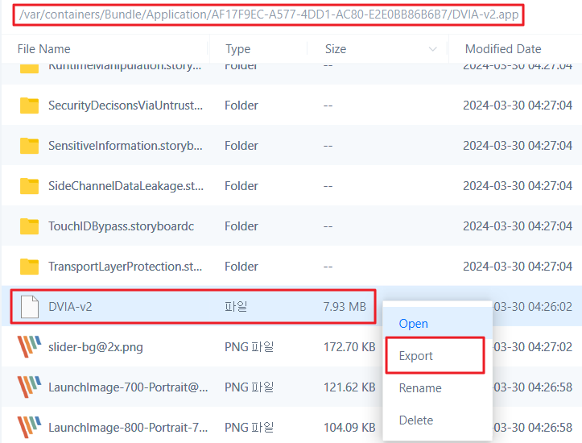
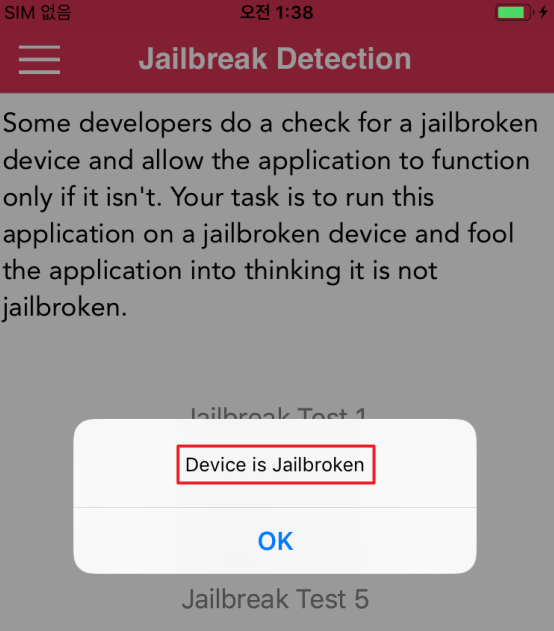
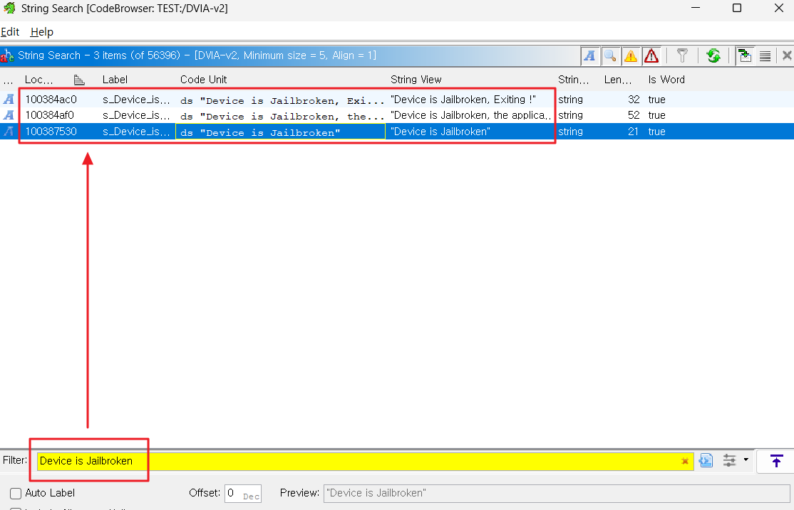
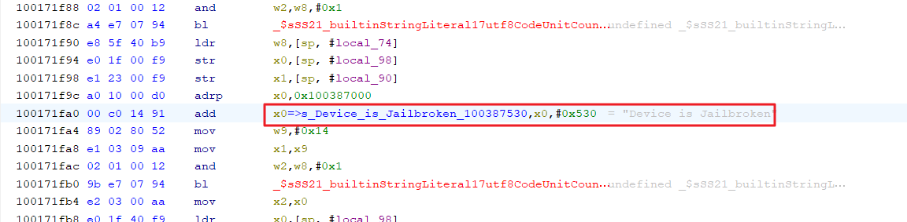
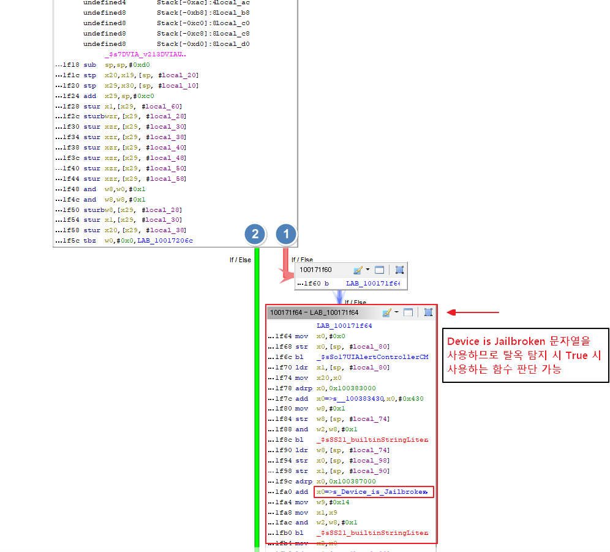
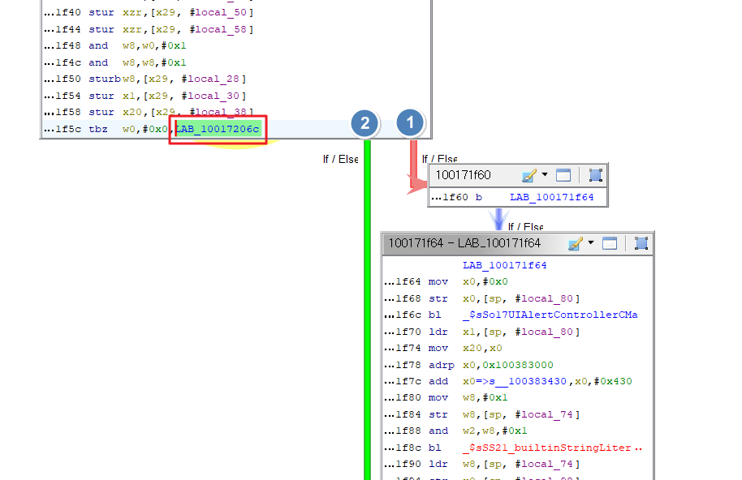
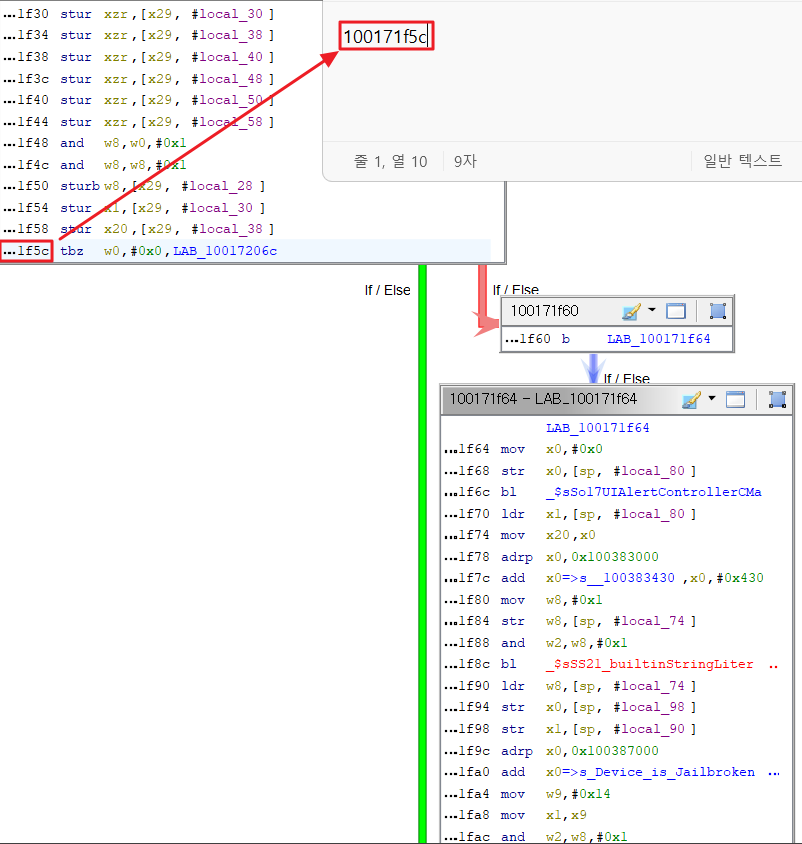
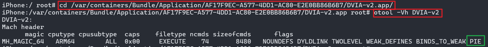
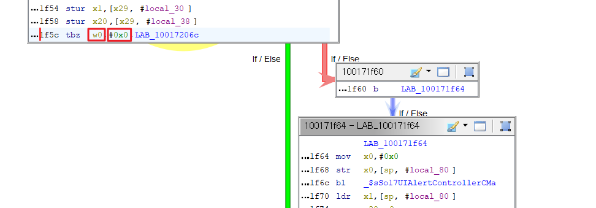
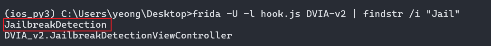

# Jailbreak Detection

Jailbreak Detection

- iOS 탈옥은 샌드박스 제한을 풀어 타 회사에서 사용하는 서명되지 않은 코드를 실행할 수 있게 하는 과정
- 탈옥된 디바이스에서 앱 실행을 어렵게 하기 위해 리버스 엔지니어링 방어 기능을 추가
- iOS의 전형적인 탈옥 감지 기법(Trustwave 발표)
  - File-based Checks(파일 기반 확인)
  - Checking File Permissions(파일 권한 확인)
  - Checking Protocol Handler(프로토콜 헨들러 확인)
  - Calling System APIs(시스템 API 직접 호출 확인)
  - etc


## 1. 🔍 탈옥 탐지 종류 4가지
- [1.1 📁 File-based Checks(파일 기반 확인)](#11-file-based-checks파일-기반-확인)
- [1.2 🔐 Checking File Permissions(파일 권한 확인)](#12-checking-file-permissions파일-권한-확인)
- [1.3 🌐 Checking Protocol Handler(프로토콜 헨들러 확인)](#13-checking-protocol-handler프로토콜-헨들러-확인)
- [1.4 ⚙️ Calling System APIs(시스템-api-직접-호출-확인)](#14-calling-system-apis시스템-api-직접-호출-확인)

## 2. 🛠️ 탈옥 탐지 우회를 위한 Frida 설치 & 기본 문법
- [2.1 📦 아나콘다 & 프리다 환경 설정](#21-아나콘다--프리다-환경-설정)
- [2.2 ✏️ Frida 기본 문법](#22-frida-기본-문법)

## 3. 🔓 Jail Broken 문제 - 1
- [3.1 🧩 Ghidra 도구로 탈옥 탐지 로직 파악](#31-ghidra-도구로-탈옥-탐지-로직-파악)
  - [3.1.1 📥 3utools 도구에서 앱 바이너리 데이터 확보](#311-3utools-도구에서-앱-바이너리-데이터-확보)
  - [3.1.2 🧠 Ghidra에서 추출한 바이너리 로직 분석](#312-ghidra에서-추출한-바이너리-로직-분석)

- [3.2 🧪 파악된 로직을 Frida 도구로 탈옥 탐지 우회](#32-파악된-로직을-frida-도구로-탈옥-탐지-우회)
  - [3.2.1 🛡️ ASLR이 적용 확인](#321-aslr이-적용-확인)
  - [3.2.2 📏 Offset 구하기](#322-offset-구하기)
  - [3.2.3 🎯 레지스터 정보 확인 후킹 코드 작성](#323-레지스터-정보-확인-후킹-코드-작성)
  - [3.2.4 ▶️ 레지스터 정보 확인 후킹 코드 실행](#324-레지스터-정보-확인-후킹-코드-실행)
  - [3.2.5 🛠️ 탈옥 우회 코드 작성](#325-탈옥-우회-코드-작성)
  - [3.2.6 🚀 탈옥 우회 코드 실행](#326-탈옥-우회-코드-실행)

## 4. 🔐 Jail Broken 문제 - 2
- [4.1 🕵️ Frida 도구로 탈옥 탐지 로직 파악](#41-frida-도구로-탈옥-탐지-로직-파악)
  - [4.1.1 📚 메모리에 올라간 모든 클래스 정보 확인 코드 작성](#411-메모리에-올라간-모든-클래스-정보-확인-코드-작성)
  - [4.1.2 ▶️ 메모리에 올라간 모든 클래스 정보 확인 코드 실행](#412-메모리에-올라간-모든-클래스-정보-확인-코드-실행)
  - [4.1.3 🔍 찾은 클래스의 메소드 확인 코드 작성](#413-찾은-클래스의-메소드-확인-코드-작성)
  - [4.1.4 ▶️ 찾은 클래스의 메소드 확인 코드 실행](#414-찾은-클래스의-메소드-확인-코드-실행)
  - [4.1.5 🔎 찾은 메서드의 반환 값 확인 코드 작성](#415-찾은-메서드의-반환-값-확인-코드-작성)
  - [4.1.6 ▶️ 찾은 메서드의 반환 값 확인 코드 실행](#416-찾은-메서드의-반환-값-확인-코드-실행)
- [4.2 🛠️ Frida 도구로 탈옥 탐지 우회 시도](#42-frida-도구로-탈옥-탐지-우회-시도)
  - [4.2.1 ✏️ 탈옥 탐지 우회 코드 작성](#421-frida-도구로-탈옥-탐지-우회-코드-작성)
  - [4.2.2 🚀 탈옥 탐지 우회 코드 실행](#422-frida-도구로-탈옥-탐지-우회-코드-실행)

## 5. 🔍 대응방안 및 기타 유용 자료

---

## 1. 탈옥 탐지 종류 4가지
### 1.1 File-based Checks(파일 기반 확인)

File-based Checks(파일 기반 확인)
- 파일 기반으로 확인하는 것으로 탈옥 여부 확인 가능
- 탈옥과 관련된 파일 및 디렉터리를 확인

### 1.2 Checking File Permissions(파일 권한 확인)

Checking File Permissions(파일 권한 확인)
- 애플리케이션의 샌드박스 외부에 있는 위치에 파일 생성을 시도하는 것으로 탈옥 여부 확인 가능
- 애플리케이션이 /private 디렉터리에 파일을 생성하도록 하여 성공적으로 생성된다면 디바이스가 탈옥된 것

### 1.3 Checking Protocol Handler(프로토콜 헨들러 확인)

Checking Protocol Handler(프로토콜 헨들러 확인)
- 프로토콜 핸들러를 확인하는 것으로 탈옥 여부 확인 가능
- 프로토콜 핸들러란 특별한 URL을 처리하는 프로그램으로 cydia:// 프로토콜 핸들러를 사용하여 시디아에서 설치
- 거의 모든 탈옥 툴이 기본적으로 설치하는 Cydia 앱은 cydia:// 프로토콜 헨들러를 설치함
- Cydia URL을 열어 프로토콜 헨들러 확인 가능하면 탈옥된 것


### 1.4 Calling System APIs(시스템 API 직접 호출 확인)

Calling System APIs(시스템 API 직접 호출 확인)
- 시스템 API를 호출하는 것으로 탈옥 여부 확인 가능
- 탈옥되지 않은 디바이스에서 NULL을 인수로 system 함수를 호출하면 0이 반환
- 탈옥된 디바이스에서 NULL을 인수로 system 함수를 호출하면 1이 반환
- 함수가 탈옥 디바이스에서만 /bin/sh에 대한 접근을 확인하기 때문에 위에 방식으로 확인 가능

---

## 2. 탈옥 탐지 우회를 위한 환경 설정과 Frida 문법


### 2.1 아나콘다 & 프리다 환경 설정
>PC 설정
>1. anaconda 설치, 설치 이상 없을 시 CMD에서 `conda --version` 정상 출력
>2. python 3 버전 설치, 설치 이상 없을 시 CMD에서 `python --version` 으로 3 버전대 정상 출력
>3. 2에서 확인한 python 버전에 맞게 ios_py3  이름의 가상환경 생성 : `conda create -n ios_py3 python=3.12 -y`
>4. ios_py3 이름의 가상 환경 진입 : `conda activate ios_py3` 
>5. 진입한 가상 환경에 Frida 설치 : `pip install frida-tools`
>6. Frida 정상 설치 확인 : `frida --version` 

>iOS 단말 설정
> 1. https://github.com/frida/frida/releases 에 들어가서 확장자 `deb`인 frida server 파일을 설치한다. 주의할 점은 PC와 동일한 버전을 설치해야 한다.
> 2. WinSCP 나 3utools을 통해 설치한 deb 파일을 iOS 기기의 /var/tmp/ 이동
> 3. iOS SSH 접속 후 deb 설치 : `dpkg -i /var/tmp/frida-server.deb` 
> 4. 3번에서 만약 의존성 에러가 발생한다면 : `apt-get -f install` 
> 5. 실행 권한 부여 : `chmod +x /usr/sbin/frida-server`
> 6. 백그라운드로 프리다 서버 실행 : `frida-server &`

> PC의 프리다와 iOS 프리다 통신 연결 확인
> 1. PC 에서 Frida를 ios_py3 이름의 아나콘다 가상환경에 설치하였으므로 가상환경 진입 : `conda activate ios_py3` 
> 2. `frida-ps U` 명령어 사용 시 iOS 에서 실행 중인 프로세스 출력 시 정상

### 2.2 Frida 기본 문법

ObjC.available
- 현재 프로세스에 Objective-C 런타임이 로드되었는지 여부를 지정하는 Boolean(True, False)
- 해당 앱에 Frida가 적용되는지 여부를 파악하는 용도, 따라서 무조건 사용

ObjC.classes
- 현재 등록된 클래스에 대한 ObjC.object 자바스크립트 바인딩에 대한 오브젝트 맵핑 클래스 이름
- 앱 사용 시 로드된 프로세스(Class) 조회 용도

Interceptor.attach(target, callbacks[, data])
- target : 함수에 대한 호출을 가로챔 (호출을 가로채고자 하는 함수의 주소를 지정하는 NativePointer) : 후킹
- callbacks 인수는 하나 이상을 포함하는 오브젝트(객체)
  - onEnter: function(args) : NativePointer 객체의 배열로 인수를 읽거나 쓰는 데 사용할 수 있는 하나의 인수 args가 제공된 callback 함수 
  - onLeave: function(retval)
    - : 원래 return 값을 포함하는 NativePointer에서 파생 객체인 인수 retval이 제공된 callback 함수
    - : retval.replace(1337)를 호출하여 return 값을 정수 1337 으로 바꾸거나,
    - : retval.replace(ptr(0x1234))를 ptr로 감싸면 포인터로 변경 가능
- Module.findBaseAddress(name)
- Module.getBaseAddress(name) 
  - : name 모듈의 base 주소를 반환
  - : 모듈을 찾을 수 없는 경우
    - : find-prefixed 함수는 null을 반환
    - : get-prefixed 함수는 예외를 발생
- NativePointer (new NativePointer(s))
  - : 메모리 주소를 10 진수 또는 16진수로 표현하는 문자열 s에서 새로운 NativePointer를 생성, 포인터 생성 용도 
  - : 간결하게 ptr(s) 로 사용 가능

$methods
- 주어진 객체의 클래스와 부모 클래스에 의해 노출된 기본 메소드 이름을 포함하는 배열

$ownMethods
- $methods 에서 부모 클래스의 메소드만 제외

context
- ia32/x64/arm에 대해 각각 EIP/RIP/PC 및 ESP/RSP/SP를 지정하는 NativePointer 객체인 pc 및 sp 키가 있는 객체
- 다른 프로세스별 키(예: eax, rax, r0, x0 등)도 사용 가능
- 이 키에 할당하여 레지스터 값을 업데이트 가능

그 외 추가 문법은 [Frida url](https://frida.re/docs/javascript-api/)에서 확인

---

## 3. Jail Broken 문제-1

### 3.1 Ghidra 도구로 탈옥 탐지 로직 파악
#### 3.1.1 3utools 도구에서 앱 바이너리 데이터 확보


  - 앱 바이너리의 위치는 Bundle Container(`/var/containers/Bundle/Application/$uuid`)에 위치하며 바이너리 파일이 제일 크기 때문에 사이즈 정렬 후 찾는다.
  - 바이너리 파일를 Export 클릭하여 PC 으로 이동한다.

---

#### 3.1.2 Ghidra에서 추출한 바이너리 로직 분석

1. 

DVIA에서 현재  Device is Jailbroken 이라는 문자열 경고가 출력되어 탈옥 탐지 중임을 확인


2. Ghidra 실행 후 확보한 앱 바이너리 파일을 Ghidra 으로 드래그한다.


3. 

문자열 검색 기능을 사용하여 `Device is Jailbroken` 검색하여 탈옥 검증을 어디에서 검증 중인지 확인한다.

3개의 결과가 출력되며 마지막 3번째가 탈옥 탐지 시 문자열과 정확히 매칭되기 때문에 마지막 3번째를 더블 클릭하면 해당 문자열 주소 위치로 이동한다.

4. 

`Device is Jailbroken` 문자열 주소 위치로 이동한 화면이며, 우측 초록색 주소는 해당 문자열을 사용하는 참조 주소이다. 더블 클릭하면 해당 주소 위치로 이동한다.

5. 

`Device is Jailbroken` 을 사용하는 참조 주소 위치로 이동한 화면이다. 

6. 5번 화면에서 [Window] -> [Function Graph] 탭을 사용하여 함수 로직을 분석한다. 




이 부분이 중요하다.

`Device is Jailbroken` 을 사용하는 함수를 호출한 상위 함수에서  1번(붉은 선) 과 2번(초록색 선)에 따라 분기를 나누는 것을 알 수 있다.

- 1번(붉은 선)은 `Device is Jailbroken` 문자열을 사용하는 함수이므로 탈옥 탐지 시 True 일 경우 사용하는 함수로 판단이 가능하다.


- 2번(초록색 선)은 탈옥 탐지 시 False 일 경우 사용하는 함수로 판단이 가능하다.

7. 

또한 로직을 더 분석하기 위해 상위 함수에서 분기 직전 코드에서  `LAV_10017026c` 을 더블 클릭하여 해당 함수 위치로 이동한다.

8. 

`LAV_10017026c` 주소로 이동 시 `Device is not Jailbroken` 문자열을 사용 중인 것으로 보아 탈옥 탐지 시 False 일 경우의 함수임을 알 수 있다. 또한 초록색 선이다.

9. 

다시 분기 직전으로 돌아와서 초록 선과 붉은 선으로 나뉘어지는 분기 직전의 함수의 위치는 `100171f5c` 이다.

분기 흐름을 읽어 후킹할 지점을 파악 완료하였으며 후킹을 진행한다.

---

### 3.2 파악된 로직을 Frida 도구로 탈옥 탐지 우회
#### 3.2.1 ASLR이 적용 확인

ASLR(Address Space Layout Randomization)
- 주소 공간 배열 무작위화로 직역되며 메모리 손상 취약점 공격을 방지하기 위한 기술이다.
- 프로그램이 실행될 때마다 메모리주소가 랜덤으로 변경된다.
- 탈옥 탐지 우회, 앤 변조등을 하기 위해서는 바이너리 파일에 ASLR이 적용되어 있는지 확인하여야 한다.
- 기본적으로 모든 앱들은 ASLR이 적용 되어 이를 항상 염두에 두어야함


확인 방법은 아래와 같다.


1. iOS SSH 접속 후 Bundle Container `cd /var/containers/Bundle/Application/$uuid/DVIA-v2.app/` 경로로 이동한 뒤
2. `otool -Vh [바이너리파일]` 시 PIE 문자열이 존재하면 ASLR이 적용 됨.

후킹 시 ASLR이 적용되고 있다는걸 인지하고 후킹해야 장애가 발생되지 않는다.
 
PIE 는 Position Independent Execution의 약자로 메모리 어디에 매핑되어도 실행에 지장이 없도록 바이너리를 위치를 독립적으로 컴파일하는 기법을 말하며, 바이너리가 실행될 때마다 랜덤한 주소에 매핑시켜 주는 메모리 보호기법 중 하나이다. PIE가 설정되어 있으면 코드 영역의 주소가 실행될 때마다 변하기 때문에 ROP와 같은 코드 재사용 공격을 막을 수 있다.

---

#### 3.2.2 Offset 구하기

- 3.1.2 Ghidra에서 추출한 바이너리 로직 분석에서 확인한 Ghidra 에서 보이는 분기 타겟 `0x100171f5c` 주소는 ASLR 적용 전 기준 전체 주소이다. 
- ASLR 적용 전 기준 전체 주소의 앞 부분 `0x100000000`은 iOS 앱이 기본으로 잡는 고정 시작주소이다. 
- 실행할 때는 ASLR 적용되어 이 시작주소가 매번 바뀌므로, 변하지 않는 뒤쪽 값(Offset) 만 사용해야 한다. 
- 그래서 : `0x100171f5c - 0x100000000 = 0x171f5c` , 이 `0x171f5c` 가 Frida에서 사용할 진짜 오프셋이다.
- ASLR 사용하지 않는다면 Offset 을 구하지 않고 Ghidra에서 보이는 전체 주소 그대로 후킹하면 된다.

---

#### 3.2.3 레지스터 정보 확인 후킹 코드 작성

- 3.2.1 에서 ASLR 적용됨을 확인
- ASLR 적용되어 3.2.2 에서 Offset `0x171f5c` 을 구함

이제 후킹 코드 작성하면 된다.
 
```js
// 타겟 모듈 설정
const targetModule = Process.getModuleByName("DVIA-v2");
// 타겟 모듈 베이스 주소 저장, 이유는 ASLR이 적용되어 매번 베이스 주소가 달라지기 때문
const realBase = targetModule.base;
console.log("[+] Real Base Address: " + realBase);

// 베이스 주소 저장에 변조 원하는 분기 주소(offset)을 더함
const Jailbreak_address = realBase.add(0x171f5c);
console.log("[+] Hook Target Address: " + Jailbreak_address);

Interceptor.attach(Jailbreak_address, {
  onEnter: function (args) {

    // 레지스터 직접 출력
    console.log(" pc: " + this.context.pc);
    console.log(" sp: " + this.context.sp);
    console.log(" x0: " + this.context.x0);
    console.log(" x1: " + this.context.x1);
    console.log(" x2: " + this.context.x2);
    console.log(" x3: " + this.context.x3);
    console.log(" x4: " + this.context.x4);
    console.log(" x5: " + this.context.x5);
    console.log(" lr: " + this.context.lr);

    // 현재 명령어도 같이 확인
    console.log(" Instruction: " + Instruction.parse(this.context.pc));
    console.log("------------------------------\n");
  }
});
```
---

#### 3.2.4 레지스터 정보 확인 후킹 코드 실행

1. PC 에서 Frida를 ios_py3 이름의 아나콘다 가상 환경에 설치하였으므로 가상환경 진입 : `conda activate ios_py3`
2. 타겟 모듈 실행 중인지 확인 `frida-ps -Ua`
3. 후킹 코드 실행 `frida -U -l hook.js DVIA-v2`

4. 
- 1. 1번의 결과값 주소는 앱 DBI 바이너리 주소 출력(ASLR 이 적용되어 실행될 때마다 변경됨)
- 2. 2번의 결과값 주소는 1번의 결과값 주소에서 변조해야할 분기 메모리 주소(offset) 을 더한 실제 분기 주소 값
- 3. 3번의 출력 값들은 해당 주소를 통과하는 레지스터 값들을 출력
- 참고 : 코드 실행 시 2번까지 주소 출력이 되었을 때 탈옥 탐지 페이지에 접근해야 레지스터 값들이 출력됨

여기서 중요한 레지스터 값은 `x0` 레지스터이다. `x0 :0x1` 을 통해 x0 레지스터의 값이 1로 저장됨을 알 수 있다. 
- x0는 64비트 전체 레지스터 
- w0은 x0의 하위 32 비트만 보는 뷰

왜 레지스터 값 `x0` 부분이 중요하나면 다시 Ghidra 에 돌아가면 

5. 

- 초록색 선(탈옥 X 일 경우) / 붉은 선(탈옥 O일 경우) 
- 분기점 직전 코드에서 핵심은 `w0` 값이 `0x0`인지 아닌지를 비교하여 분기된다. 
  - 즉, `x0` 레지스터의 값을 변경하면 `w0` 레지스터 역시 하위 32 비트이므로 함께 변하게 된다. 
  - 따라서 `x0` 레지스터의 값을 0으로 변경하여 탈옥 탐지 우회 가능하다.

---

#### 3.2.5. 탈옥 우회 코드 작성
`x0` 레지스터 값 변경하는 후킹 코드 작성
```js
// 타겟 모듈 설정
const targetModule = Process.getModuleByName("DVIA-v2"); 
// 타겟 모듈 베이스 주소 저장, 이유는 ASLR이 적용되어 매번 베이스 주소가 달라지기 때문
const realBase = targetModule.base;
console.log("[+] Real Base Address: " + realBase);

// 베이스 주소 저장에 변조 원하는 분기 주소(offset)을 더함
const Jailbreak_address = realBase.add(0x171f5c);
console.log("[+] Hook Target Address: " + Jailbreak_address);

Interceptor.attach(Jailbreak_address, {
    onEnter: function (args) {
        // x0 레지스터 값 변경
        this.context.x0 = 0x0
        // x0 변경되었는지 확인 출력
        console.log("x0 : " + this.context.x0);
		
    }
});
```
---

#### 3.2.6 탈옥 우회 코드 실행

1. PC 에서 Frida를 ios_py3 이름의 아나콘다 가상 환경에 설치하였으므로 가상환경 진입 : `conda activate ios_py3`
2. 타겟 모듈 실행 중인지 확인 `frida-ps -Ua`
3. 후킹 코드 실행 `frida -U -l hook.js DVIA-v2`

4. 

정상적으로 탈옥 탐지 우회되어 `Device Not Jailbroken` 출력됨 확인

---

## 4. Jail Broken 문제 - 2

- Jail Broken 문제 - 1 에서는 Object-C 기반 코드로 Ghidra 에서 분석이 가능
  - Objective‑C 클래스 / 메서드는 메타데이터 구조가 명확
  - 심볼 정보가 잘 남아 있어 Ghidra 에서 분석이 가능
- 그러나 Swift로 이루어진 코드의 경우 불가능
  - 난독화된 이름 (예: _$s4App5View.. 같은 형태)
  - 메타데이터 구조도 Objective‑C보다 훨씬 복잡
  - 심볼이 일부 제거되거나 모호함
  - 그래서 Ghidra에서 “이 함수가 어디지?” 하고 바로 추적하기 어려움.
- 그래서 Frida로 런타임에서 직접 클래스 목록을 확인해야 함


DVIA에서 현재  Device is Jailbroken 이라는 문자열 경고가 출력되어 탈옥 탐지 중임을 확인

---

### 4.1 Frida 도구로 탈옥 탐지 로직 파악

#### 4.1.1 메모리에 올라간 모든 클래스 정보 확인 코드 작성

```js
if(ObjC.available){     // 해당 코드가 실행 가능한 환경이라면,
  for(var classname in ObjC.classes) // ObjC.classes > 메모리에 올라와 있는 오브젝트 맵핑 클래스 모두 픽!
    console.log(classname)
}
```

#### 4.1.2 메모리에 올라간 모든 클래스 정보 확인 코드 실행

1. PC 에서 Frida를 ios_py3 이름의 아나콘다 가상 환경에 설치하였으므로 가상환경 진입 : `conda activate ios_py3`
2. 타겟 모듈 실행 중인지 확인 `frida-ps -Ua`
3. 코드 실행(대소문자 구분 없이 Jail 관련된 클래스 조회) : `frida -U -l hook.js DVIA-v2 | findstr /i "Jail"`

4. 
JailbreakDetection 클래스를 발견


#### 4.1.3 찾은 클래스의 메소드 확인 코드 작성

```js
if(ObjC.available){
  var classname = "JailbreakDetection"
  var methods = ObjC.classes[classname].$ownMethods
  // ObjC.classes[classname] = JailbreakDetection 클래스에 대한 정보를 가져온 뒤 
  // .$ownMethods 속성을 사용하여 부모 클래스를 제외한, 해당 객체의 노출된 메소드를 추출
  console.log(methods)
}
```

#### 4.1.4 찾은 클래스의 메소드 확인 코드 실행

1. PC 에서 Frida를 ios_py3 이름의 아나콘다 가상 환경에 설치하였으므로 가상환경 진입 : `conda activate ios_py3`
2. 타겟 모듈 실행 중인지 확인 `frida-ps -Ua`
3. 코드 실행 : `frida -U -l hook.js DVIA-v2`

4. 

isJailbroken 메소드를 발견
- +는 클래스에 대한 메소드를 뜻함 
- -는 인스턴스에 대한 메소드를 뜻함

#### 4.1.5 찾은 메서드의 반환 값 확인 코드 작성
```js
if(ObjC.available){
	var classname = "JailbreakDetection"             // 찾은 클래스 이름
	var methodname = "isJailbroken"                  // 찾은 메소드 이름
	var hook = ObjC.classes[classname][methodname]   // 찾은 클래스, 메소드에 대한 정보를 hook 변수에 담았다
	
    // 찾은 메소드에 대해서 Interceptor를 걸어 반환값을 확인해본다 
	Interceptor.attach(hook.implementation,{     // implementation 하는 이유는 해당 메소드를 실행하기 위함!
		onLeave:function(retval){                // 반환값 확인할 때는 onLeave! onEnter는 콜백!
                                                 // retval = return value 을 의미
                                                 // onLeave:function(retval) = 기본 구문!
			console.log("[+] Class Name: "+ classname)
			console.log("[+] Method Name: "+ methodname)
			console.log("[+] Type of return value: "+ hook.returnType) // 반환 값의 data type 확인!
			console.log("[+] Return Value: "+ retval)
            console.log("[+] 클래스 명: "+ classname)
			console.log("[+] 메소드 명: "+ methodname)
			console.log("[+] 데이터 타입: "+ hook.returnType)
			console.log("[+] 리턴 값: "+ retval)
		}
	})       
}
```

#### 4.1.6 찾은 메서드의 반환 값 확인 코드 실행

1. PC 에서 Frida를 ios_py3 이름의 아나콘다 가상 환경에 설치하였으므로 가상환경 진입 : `conda activate ios_py3`
2. 타겟 모듈 실행 중인지 확인 `frida-ps -Ua`
3. 코드 실행 : `frida -U -l hook.js DVIA-v2`

4. 

- 데이터 타입이 bool의 리턴 값은 0x1(True) 임을 확인 
- 이를 0x0(False) 으로 변환시켜 탈옥 탐지 우회 시도

---

### 4.2 Frida 도구로 탈옥 탐지 우회 시도

#### 4.2.1 Frida 도구로 탈옥 탐지 우회 코드 작성
```js
if(ObjC.available){
	var classname = "JailbreakDetection"
	var methodname = "isJailbroken"
	var hook = ObjC.classes[classname][methodname]
	
	Interceptor.attach(hook.implementation,{
		onLeave:function(retval){
			console.log("[+] 클래스 명: "+ classname)
			console.log("[+] 메소드 명: "+ methodname)
			console.log("[+] 데이터 타입: "+ hook.returnType)
			console.log("[+] 리턴 값: "+ retval)
              
            var new_retval = ptr("0x0") // 16진수 0(0x0으로 작성을 한 뒤, 해당 값을 native pointer 형식으로 생성을 해야
                                        // 메모리에서 정상적으로 불러들여 사용이 가능
            retval.replace(new_retval)  // 기존 retval 값을 새 값으로 바꿔주고
			console.log("[+] 새 리턴 값: "+ retval) // 출력해본다.
		}
	})
}
```
#### 4.2.2 Frida 도구로 탈옥 탐지 우회 코드 실행


1. PC 에서 Frida를 ios_py3 이름의 아나콘다 가상 환경에 설치하였으므로 가상환경 진입 : `conda activate ios_py3`
2. 타겟 모듈 실행 중인지 확인 `frida-ps -Ua`
3. 코드 실행 : `frida -U -l hook.js DVIA-v2`

4. 

탈옥 탐지 우회 확인

---

## 5. 대응방안 및 기타 유용 자료


- 유용한 Frida Code 는 https://github.com/interference-security/frida-scripts/ 에서 확인 가능하다

- 문제 1과 2 예시만 잘 활용해도 탈옥 탐지 우회는 가능하다. 
  - 문제 1의 경우 출력되는 문자열을 추적하는 방식이나 해당 문자열이 난독화 된 경우 코드 분석에 시간 필요

- 탈옥 탐지 시 중요한 점
  - 바이너리 코드에서 어느 지점에서 탈옥 탐지가 이루지는지 분석하는 능력이 제일 중요
  - 실무 진단 시 시간이 한정적이기 때문에 탈옥 탐지 분석에만 사용할 수 없음

- 연습은 Appstore 에서 은행 앱 설치해서 진행. 이 경우 frida-ios-dump로 DRM 반드시 해제해야함!
  - 뒤에 챕터에서 기술할 예정

- 대응방안
  - 디버깅 방지 기술
    - 1. 예방(Preventive) 기술 : 디버거가 애플리케이션에 연결되는것을 방지
    - 2. 반응(Reactive) 기술 : 디버거의 존재를 확인하고 애플리케이션 종료
  - 디버깅 탐지 기술
    - 1. ptrace 사용 : 프로세스 디버거 연결 방지(예방 기술)
    - 2. sysctl 사용 : 연결된 디버거 탐지(반응 기술)
    - 3. Frida 아티펙트(Artefacts) 탐지 → OS, applictaion 흔적 탐지
      - Frida Server 프로세스는 기본적으로 TCP 27047 포트를 사용하므로 해당 포트를 탐지
      - Frida 관련 라이브러리 목록 탐지(frida-aget*.so 등)
      - 파일 검사(frida-server 등)
      - D-Bus 프로토콜을 사용하여 통신하므로 열린 모든 포트에 D-Bus Auth 메시지를 전송하여 응답 확인
      - ETC
---

