> 앞에서 푼 DVIA-v2 Jailbreak Detection Test1 을 LLDB 동적 디버깅 도구를 사용해서 우회하는 방법을 정리함

---

## 1. DVIA-v2 Jailbreak Detection Test1 Using LLDB

- 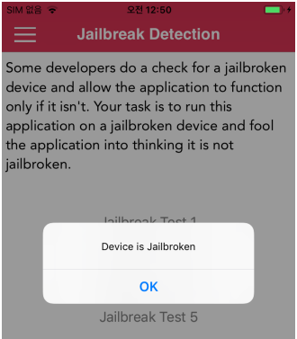

Jailbreak Test1을 탭할 경우 팝업창이 뜸


시작점을 찾기 위해 Frida Attach하여 UI Dump수행


```js
// Frida Code for Dumping UI
var window = ObjC.classes.UIWindow.keyWindow();
var rootControl = window.rootViewController();

var ui = window.recursiveDescription().toString();
var control = rootControl['- _printHierarchy']().toString();

// 현재 화면에 보여지는 UIController를 알고 싶은 경우
console.log(control); 
```

- 

  - state가 appeared 이면 현재 화면에 같이 표시 중이라는 의미
  - state가 disappeared 이면 지금은 안 보이는 화면

appeared 상태인 UINavigationController 안에서 가장 안쪽(leaf)에 있는 ViewController가
사용자가 보고 있는 화면이므로 `DVIA_v2.JailbreakDetectionViewController` 클래스를 분석의 기준점으로 선정한다.


- 

Ghidra에서 JailbreakDetectionViewController 검색 후 해당 메서드 클릭하여 이동한다

또는 Frida 코드로 가능하다. `DVIA_v2.JailbreakDetectionViewController` 클래스의 메서드 확인하는 코드는 아래와 같다.
```js
// Find All Methods of a specific class
if (ObjC.available) {
  try {
      var className = "DVIA_v2.JailbreakDetectionViewController";    // 찾고 싶은 class 이름으로 변경
      var methods = ObjC.classes[className].$ownMethods;

      console.warn("\n[*] Started: Find All Methods of a class " + '"' + className + '"');
      
      for (var i = 0; i < methods.length; i++) {
          try { console.log("\x1b[32m"+methods[i] + "\x1b[0m"); }
          catch(err) { console.log("[!] Exception1: " + err.message); }
      }}
  catch(err) { console.log("[!] Exception2: " + err.message); } }

else { console.log("Objective-C Runtime is not available!"); }

console.warn("[*] Completed: Find All Methods of a Class " + '"' + className + '"');
```
- 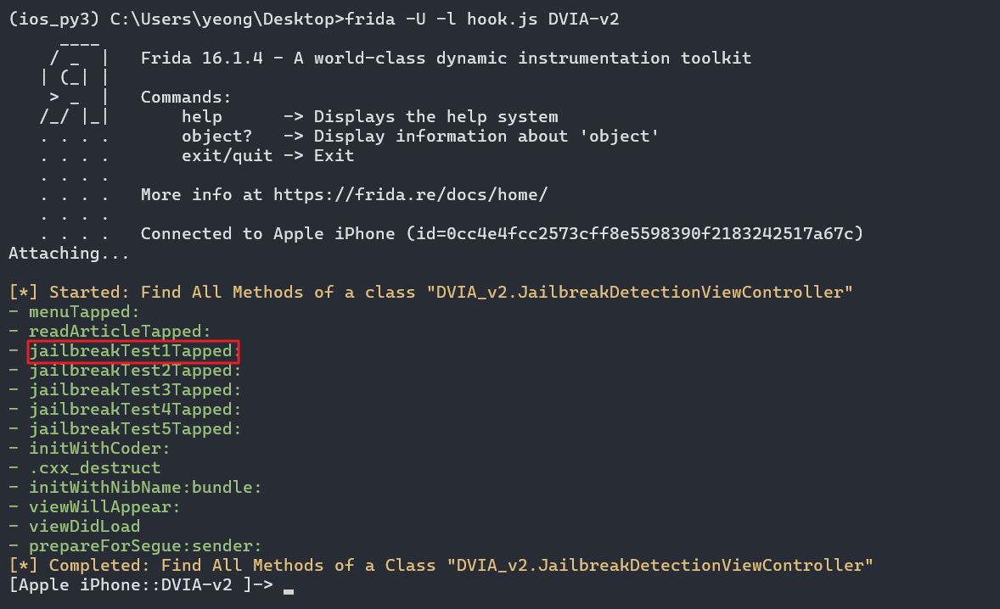


- 

메서드 내에서 Device is Jailbroken 알람창을 띄우는 로직이 보이진 않지만

많은 B(Branch) 지시어가 보이므로 lldb 동적 디버깅의 시작점으로 삼기에 적합하다


lldb-10 도구를 사용하여 attach 해보자

`ps -ef | grep DVIA-v2` : PID 확인
`lldb-10 -p [PID]` : 해당 프로세스 lldb-10 Attach
- 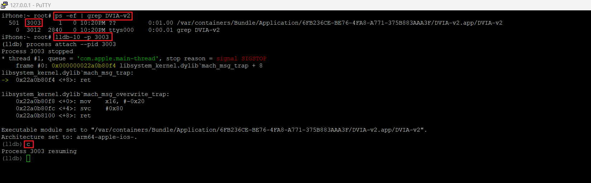

lldb 로 DVIA-v2 프로세스에 attach하게 되면 앱이 내가 클릭하는 대로 동작되지 않으므로 c 명령어로 프로세스를 resume 시켜줌


이제 해당 앱의 시작 주소를 알아보자

`image dump sections <appName>`

- 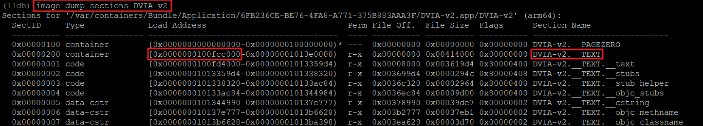

_TEXT가 있는 `0x0000000100fcc000` 주소가 해당 바이너리(DVIA-v2)가 메모리에 로드된 실제 시작 주소(Load Address), 즉 Base Address

- 

지금 내가 분석하고자 하는 함수의 시작 주소는 `0x100140728` 임

근데 이 주소도 Ghidra 의 Image Base 주소인 `0x100000000` 부터 시작하므로 최종적으로 

실제 메모리 주소 = 실제 시작 주소 + Ghidra에서 보이는 함수 시작 주소 - Ghidra Image Base = `0x0000000100fcc000` + `0x100140728` - `0x100000000`

`br s -a 0x0000000100fcc000+0x100140728-0x100000000` 
- 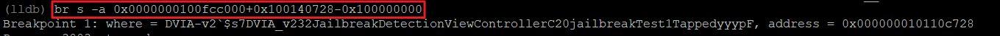

으로 브레이크 포인터 설정하였고

- 

브레이크 포인터 설정하여 화면의 Jailbreak Test1을 탭하게 되면 디버깅이 걸려 알림창이 현재 안 띄어지는 것을 알 수 있음

- 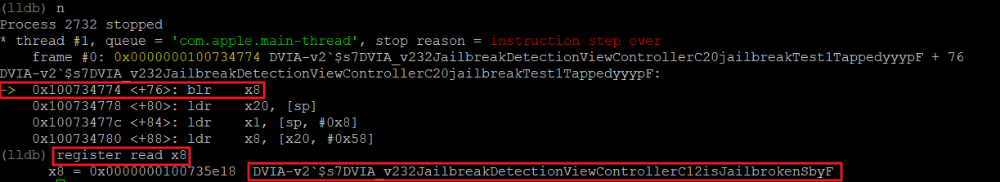

이제, `n`(Next, Step Over) 명령어로 arm 지시어를 하나씩 넘기면서 관찰을 진행하다가

- 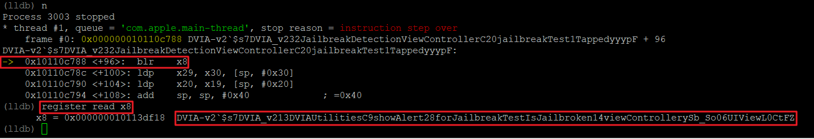

진행하다 의심스러운 blr(Branch with Link to Register) 지시어를 만난 경우, `register read` 명령어로 어디로 branch 되는지 확인한다

현재 `register read x8` 을 통해 함수명이 JailbreakTestIsJailbroken14viewControllerySb_So06UIViewL0CtFZ 인 것을 보아 알람창 띄우는 것과 관련된 함수로 이동하는 것을 알 수 있음.


`s`(Step In) 명령어로 branch된 함수 내부로 진입해서 계속 분석한다. 

이 때 Ghidra 에서 그 함수가 어떤 형식으로 구성되었는지 같이 분석하는 것이 도움되므로, JailbreakTestIsJailbroken14viewControllerySb_So06UIViewL0CtFZ 을 검색

- 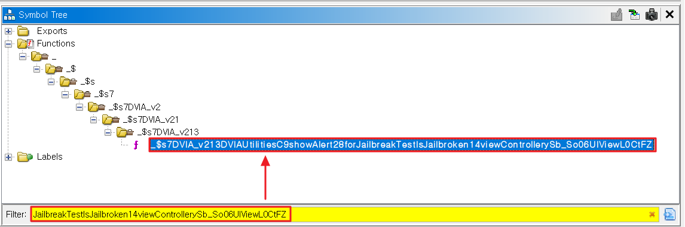

검색된 해당 함수를 더블 클릭 후 Function Graph 으로 분석한다.

- 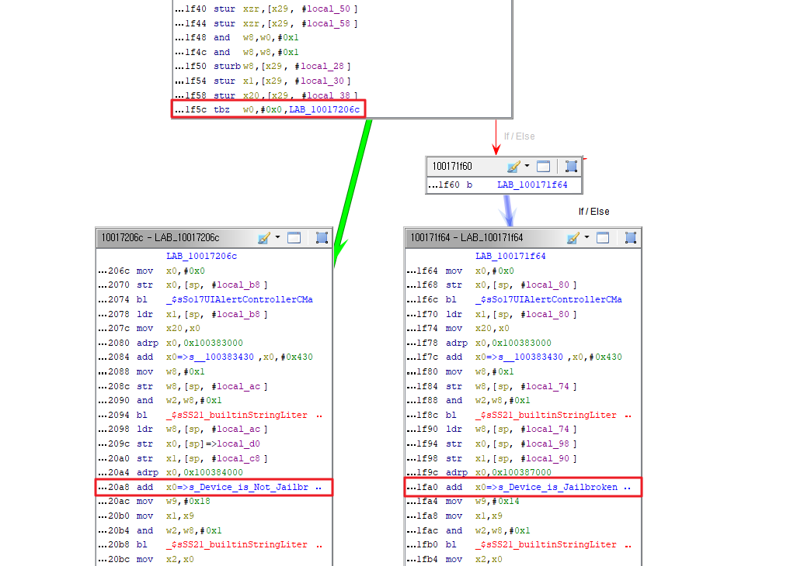

해당 함수는 TBZ 지시어에서 분기가 이루어져 "Device is Jailbroken" 또는 "Device is Not Jailbroken"을 출력하는 것을 알 수 있음

그렇다면 목표는 TBZ 지시어로 이동한 다음 register 값을 변경하여 분기 흐름을 변경시켜주는 것임

- 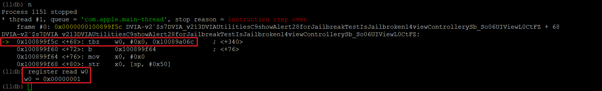

위 그림과 같이 TBZ 지시어에서 w0 레지스터의 값을 읽으면 1인 것을 알 수 있음. 

따라서, 이대로 진행하게 되면 "Device is Jailbroken"이 출력되는 것이므로 w0 레지스터의 값을 0으로 변경

- 

c명령어로 모든 process 를 resume시키게 되면 "Device is Not Jailbroken" 알람창이 뜨는 것을 확인 가능

- 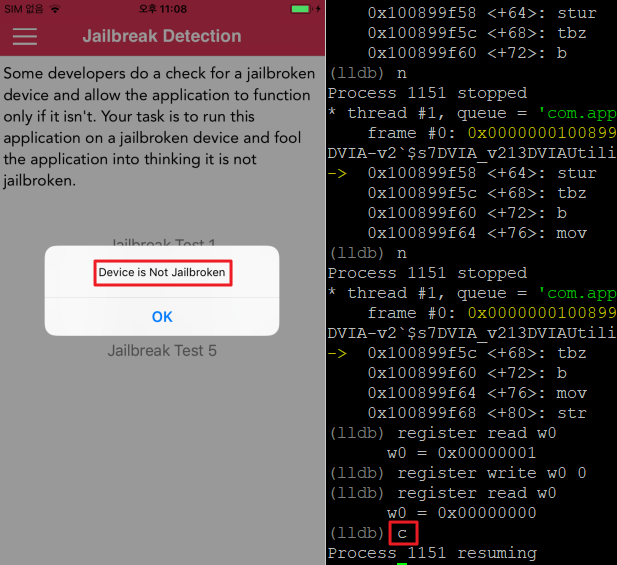


