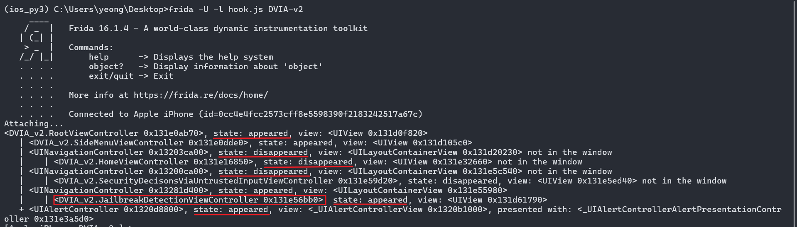

> 앞에서 푼 DVIA-v2 탈옥 탐지 우회를 LLDB 동적 디버깅 도구를 사용해서 우회하는 방법을 정리함

---

## 1. DVIA-v2 Jailbreak Detection Test1 Using LLDB

- 

Jailbreak Test1을 탭할 경우 팝업창이 뜸


시작점을 찾기 위해 Frida Attach하여 UI Dump수행


```js
// Frida Code for Dumping UI
var window = ObjC.classes.UIWindow.keyWindow();
var rootControl = window.rootViewController();

var ui = window.recursiveDescription().toString();
var control = rootControl['- _printHierarchy']().toString();

// 현재 화면에 보여지는 UIController를 알고 싶은 경우
console.log(control); 
```

- 

  - state가 appeared 이면 현재 화면에 같이 표시 중이라는 의미
  - state가 disappeared 이면 지금은 안 보이는 화면

appeared 상태인 UINavigationController 안에서 가장 안쪽(leaf)에 있는 ViewController가
사용자가 보고 있는 화면이므로 `DVIA_v2.JailbreakDetectionViewController` 클래스를 분석의 기준점으로 선정한다.


- 

Ghidra에서 JailbreakDetectionViewController 검색 후 해당 메서드 클릭하여 이동한다

- 

메서드 내에서 Device is Jailbroken 알람창을 띄우는 로직이 보이진 않지만

많은 B(Branch) 지시어가 보이므로 lldb 동적 디버깅의 시작점으로 삼기에 적합하다


lldb-10 도구를 사용하여 attach 해보자

`ps -ef | grep DVIA-v2`, `lldb-10 -p [PID]`
- 

lldb 로 DVIA-v2 프로세스에 attach하게 되면 앱이 내가 클릭하는 대로 동작되지 않으므로 c 명령어로 프로세스를 resume 시켜줌


이제 해당 앱의 시작 주소를 알아보자

`image dump sections <appName>`

- 

_TEXT가 있는 `0x00000001005f4000` 주소가 해당 바이너리(DVIA-v2)가 메모리에 로드된 실제 시작 주소(Load Address), 즉 Base Address

- 

지금 내가 분석하고자 하는 함수의 시작 주소는 `0x100140728` 임

근데 이 주소도 Ghidra 의 Image Base 주소인 `0x100000000` 부터 시작하므로 최종적으로 

실제 메모리 주소 = 실제 시작 주소 + Ghidra에서 보이는 함수 시작 주소 - Ghidra Image Base = `0x00000001005f4000` + `0x100140728` - `0x100000000`

`br s -a 0x00000001005f4000+0x100140728-0x100000000` 
- 

으로 브레이크 포인터 설정하였고 (여기서 앱이 멈추면 c 입력하여 Resume할 것)

- 

브레이크 포인트 설정 후 화면의 Jailbreak Test1을 탭하게 되면 디버깅이 걸려 알림창이 현재 안 띄어지는 것을 알 수 있음

- 

이제, n(Next, Step Over) 명령어로 arm 지시어를 하나씩 넘기면서 관찰을 진행하다가

진행하다 의심스러운 blr(Branch with Link to Register) 지시어를 만난 경우, register read 명령어로 어디로 branch 되는지 확인한다

현재 `register read x8` 을 통해 알람창 띄우는 것과 관련된 함수로 이동하는 것을 알 수 있음. `s`(Step In) 명령어로 branch된 함수 내부로 진입해서 계속 분석한다.

참고로 Ghidra랑 같이 분석하여 해당 함수가 어떻게 진행되는지 함께 분석하면 좋음

해당 함수를 분석했다는 가정하에 내부에 TBZ(Test bit and Branch if Zero) 지시어에서 분기가 이루어져서 

"Device is Jailbroken" 또는 "Device is Not Jailbroken"을 출력하는 로직임을 확인

그렇다면 목표는 lldb 명령어로 TBZ 지시어로 이동한 다음 register 값을 변경하여 분기 흐름을 변경시켜주는 것임


---

## 2. DVIA-v2 Jailbreak Detection Test3 Using LLDB


