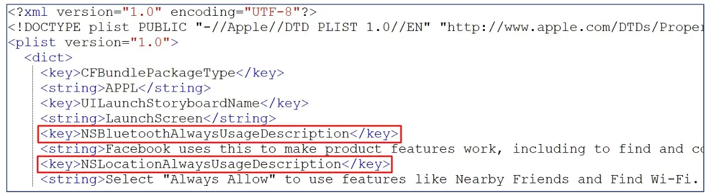
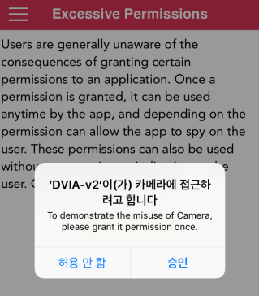

# 지나친 권한 부여

## Excessiv Permissions

- 앱 권한을 잘못 사용하는 방법에 대한 취약점
- 앱이 블루투스 인터페이스, 위치 정보 또는 사용자 사진과 같은 특정 보호된 자원에 접근하기 전에 시스템에서 앱 대신 권한을 요청함
- **앱에 접근 권한이 필요하단 것을 알리기 위해 UsageDescription 키를 앱의 `Info.plist` 파일에 저장**
- 키와 관련하여 앱에 접근해야 하는 이유를 설명하는 문자열에 설정함
  -  

## AOS 와 iOS 차이
- AOS의 경우 설치 시 권한 사용 유무 확인
- iOS의 경우 기능 사용 시 권한 사용 유무 확인
  - 따라서 기능 사용 권한 요청 시 description을 이용해서 권한 요청 문자열을 출력해 주어야 한다. 
  - 권한부여된 순간부터 해당 기능을 사용해 어떤 악의적인 공격이 이루어질지 모름
  - 그래서 애플리케이션은 올바른 공급처에서 다운하여 사용하는 것이 정말 중요 

## 취약점 기준

- `info.plist` 내 위와 같은 권한 확인 후 불필요한 권한 취약점 지정 시 취약한 판단
- 진단하는 앱을 충분히 사용, 파악 후 요청되는 권한이 기능과 상관없는 경우 취약 판단
- 개발자 또는 담당자와 이야기하여 권한 요청에 대한 이유를 확인한 뒤 취약 여부를 결정
- 권한 관련 KEY 들을 앞에 NS 가 붙어있는것이 특징. `info.plist` 에 find(찾기)로 NS 검색
- 위 표에 없는 권한은 저버전 권한 요청 KEY 임. 호환을 위해 존재하는 경우가 간혹 존재

## DVIA-v2

Bundle Container 경로의 `info.plist` 에 카메라 기능이 굳이 필요 없는 앱에서 요구하여 취약

## 대응방안
- 주어진 권한이 앱에서 반드시 필요한 것인지 확인 필요 
- 앱에서 지나친 권한을 사용할 경우 권한 삭제 권고

