# Anti Debugging

실제 금융권이나 DVIA-v2 앱 등 일반적으로 사용하는 안티 디버깅 로직은 3개이다.

1. sysctl
   - sysctl 을 사용한 디버깅 탐지 로직은 attach는 가능하나 디버깅 불가
2. ptrace 
   - ptrace 는 이미 프로세스가 선점되어 있어 attach 조차 불가능
3. SVC


---

## 풀이 방법 - 1

DVIA-v2 에서 Disable Debugging을 터치하면 

Debugger Protection applied. 

디버깅 방지 로직이 적용됐다는 메시지가 출력된다.


- 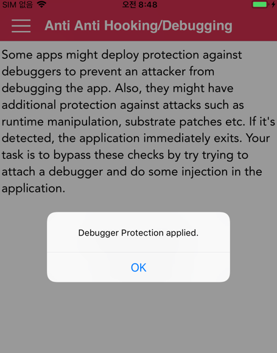


lldb로 디버깅 하려 했으나 attach 실패 된다.

- 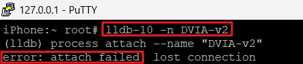

---

Ghidra 로 분석 진행한다

- 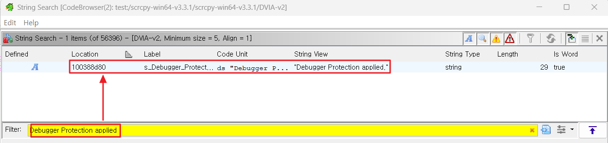

디버깅 시 출력된 Debugger Protection applied. 을 검색 후 더블 클릭하여 문자열 주소로 이동한다.

- 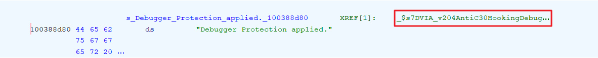

해당 문자열을 참조하는 곳은 한 곳이며 더블 클릭하여 이동한다.

- 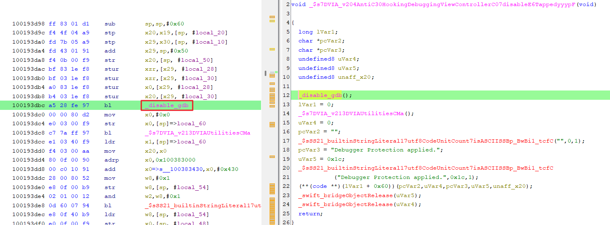

해당 메소드 로직을 살펴보았을 때, 중간에 _disable_gdb 로 분기(bl)하는 부분이 확인된다

더블 클릭하여 해당 메소드로 진입한다

- 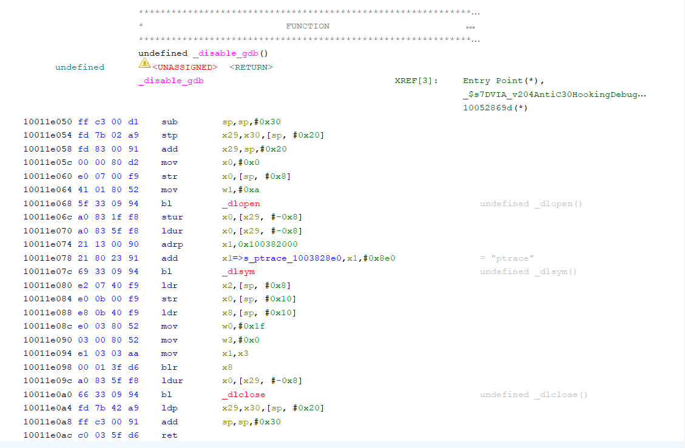

메소드 내부 로직에서 ptrace 라는 문자열을 확인된다.

이 ptrace는 iOS에서 안티 디버깅 방법 중 가장 기본적인 방법이다

```java
int	ptrace(int _request, pid_t _pid, caddr_t _addr, int _data);
```
ptrace의 함수 시그니처이며 첫 번째 인자 _request 값에 따라 안티 디버깅 적용할 수 있음

_request 정의 값들은 아래와 같다.

```text
#define	PT_TRACE_ME	0	/* child declares it's being traced */
#define	PT_READ_I	1	/* read word in child's I space */
#define	PT_READ_D	2	/* read word in child's D space */
#define	PT_READ_U	3	/* read word in child's user structure */
#define	PT_WRITE_I	4	/* write word in child's I space */
#define	PT_WRITE_D	5	/* write word in child's D space */
#define	PT_WRITE_U	6	/* write word in child's user structure */
#define	PT_CONTINUE	7	/* continue the child */
#define	PT_KILL		8	/* kill the child process */
#define	PT_STEP		9	/* single step the child */
#define	PT_ATTACH	10	/* trace some running process */
#define	PT_DETACH	11	/* stop tracing a process */
#define	PT_SIGEXC	12	/* signals as exceptions for current_proc */
#define PT_THUPDATE	13	/* signal for thread# */
#define PT_ATTACHEXC	14	/* attach to running process with signal exception */
#define	PT_FORCEQUOTA	30	/* Enforce quota for root */
#define	PT_DENY_ATTACH	31
#define	PT_FIRSTMACH	32	/* for machine-specific requests */
```

Frida 를 통하여 현재 ptrace의 첫 번째 인자(_request) 값이 어떻게 저장되어있는지 확인해보자

```js
Interceptor.attach(Module.findExportByName(null, "ptrace"), {
    onEnter: function (args) {
        console.log("[ptrace] " + args[0]); //args[0] 첫 번째 인자 출력
    },
    onLeave: function (retval) {
        console.log("[return] " + retval); // Return 값 확인
    }
});
```

- 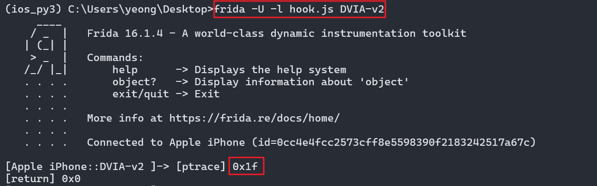

현재 첫 번째 인자 값인 _request 는 0x1f(16 진수) 이며 10진수로 31 이다.

위에 정의된 31은 PT_DENY_ATTACH을 의미한다.

Frida 로 우회코드 작성 진행한다


```js
Interceptor.attach(Module.findExportByName(null, "ptrace"), {
    onEnter: function (args) {
        const request = args[0].toInt32();

        console.log("[ptrace] request =", request);

        // PT_DENY_ATTACH (31) 차단
        if (request === 31) {
            console.log("[*] PT_DENY_ATTACH detected → bypass");
           args[0] = ptr(0xA); // 변조
        }
    },
    onLeave: function (retval) {
        console.log("[ptrace return] =", retval);
    }
});
```

- 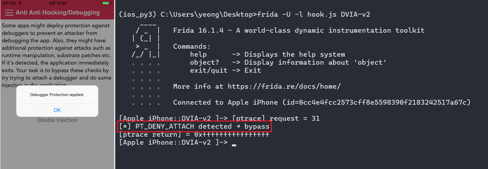

앱 재실행 후 Disable Debugging을 터치하면 Bypass 로그 정상적으로 출력되며

- 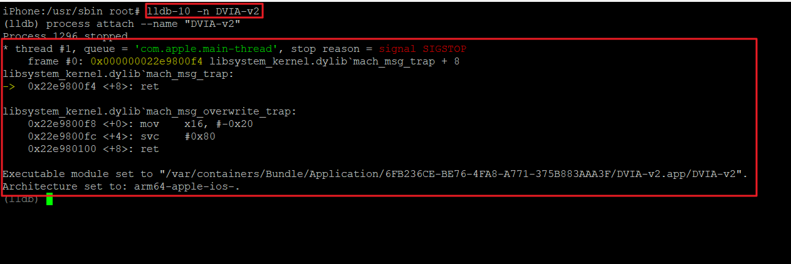

lldb-10 디버깅 attach가 성공됨을 확인하였다

---

## 풀이 방법 - 2

다른 방법으로도 푸는 방법을 정리하였다.

일단 앱을 재실행 후  Disable Debugging 을 탭하지 말고 먼저 lldb-10 디버깅을 attach 한다

- 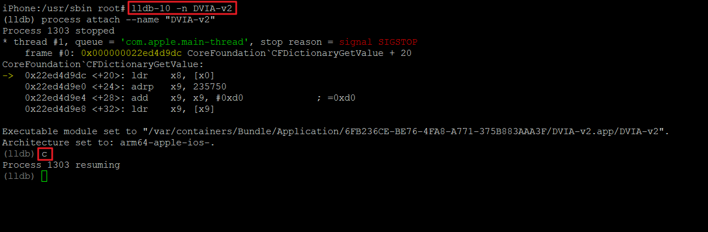

`b ptrace` 명령어로 ptrace 시스템 함수가 호출 시 브레이크 포인터 설정한다

- 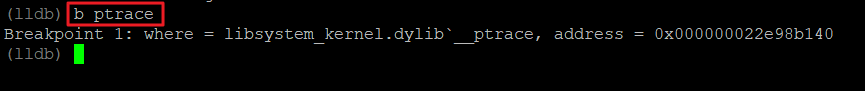

이 상태에서 Disable Debugging 을 클릭 시

- 
- 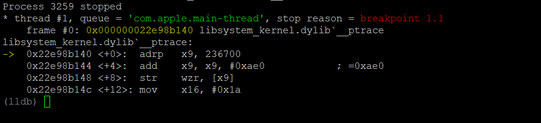

브레이킹 포인터가 걸리며 `regster read` 명령어를 사용하여 모든 레지스터의 값들을 출력한다.

- 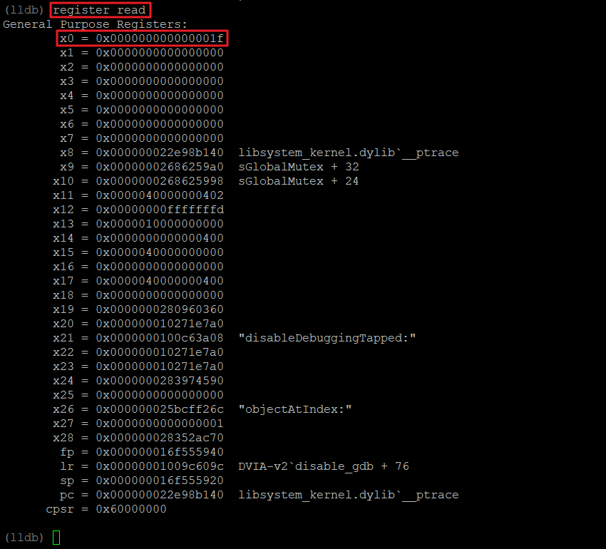

이 때 x0 레지스터가 중요하며 중요한 이유는

```js
Interceptor.attach(Module.findExportByName(null, "ptrace"), {
    onEnter: function (args) {
        console.log("[ptrace] " + args[0]); //args[0] 첫 번째 인자 출력
    },
    onLeave: function (retval) {
        console.log("[return] " + retval); // Return 값 확인
    }
});
```

- 

ptrace 함수의 첫 번째 인자 값인 _request 는 0x1f 가 저장되어 있고

결국 같은 0x1f 값이 저장된 x0 레지스터가 ptrace 함수의 첫 번째 인자인 것을 알 수 있음

- 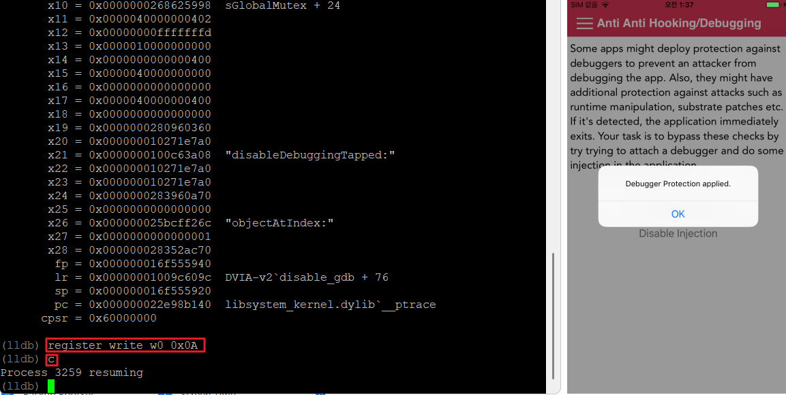

`register write w0 0x0A` 으로 w0 레지스터의 값을 변조한 뒤 `c` 명령어로 모든 process 를 resume 시키게 되어도 디버깅이 계속 동작 가능하다


