# 런타임 조작

Runtime Manipulation
- 앱이 실행될 때 흐름 조작, 정보 유출 등이 가능한 취약점 
- 런타임 조작을 사용하여 인스턴스 변수를 수정하고, 로컬 로그인 검사를 우회하고, 무차별 강제 핀 코드(Brute Force)를  사용 가능

- 탈옥 탐지 우회 시 사용한 JS Injection 도 런타임 조작의 일부. 즉 흐름 조작은 → 런타임 조작

---

### 1. 인증 우회 실습 - 1 (Object-C 우회)
#### Step 1. 로직 파악


임의 ID/PW 입력 후 Login Method 1 호출 시 인증 실패 확인

---

#### Step 2. 모든 클래스 정보 찾기 코드 작성 & 실행

```js
if (ObjC.available) { // ObjC 라는 문법 사용 및 실행이 가능한지 확인
    var list = [];
    for (var classname in ObjC.classes) {
        list.push(classname);
    }
    console.log(list.join("\n")); // 모든 클래스 출력
}
```

1. PC 에서 Frida를 ios_py3 이름의 아나콘다 가상 환경에 설치하였으므로 가상환경 진입 : `conda activate ios_py3`
2. 타겟 모듈 실행 중인지 확인 `frida-ps -Ua`
3. 코드 실행(출력 값 중 대소문자 구분 없이 Login 관련된 클래스만 조회) : `frida -U -l hook.js DVIA-v2 | findstr /i "Login"`


`LoginValidate` 이라는 로그인 관련 클래스 출력 확인

---

#### Step 3. 찾은 Login 관련 클래스 메서드 찾기 코드 작성 & 실행

```js
if (ObjC.available) {
    var classname = "LoginValidate"
    var methods = ObjC.classes[classname].$ownMethods
    console.log(methods.join("\n"));
}
```
1. PC 에서 Frida를 ios_py3 이름의 아나콘다 가상 환경에 설치하였으므로 가상환경 진입 : `conda activate ios_py3`
2. 타겟 모듈 실행 중인지 확인 `frida-ps -Ua`
3. 코드 실행 : `frida -U -l hook.js DVIA-v2`

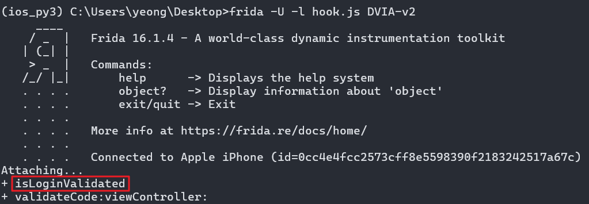
`isLoginValidated` 이라는 로그인 관련 메서드 출력 확인

---

#### Step 4. 찾은 메서드 반환 값 확인 코드 작성 & 실행

```js
if(ObjC.available){
	var classname = "LoginValidate"
	var methodname = "isLoginValidated"
	var hook = ObjC.classes[classname][methodname]
	
	Interceptor.attach(hook.implementation,{
		onLeave:function(retval){
            console.log("Runtime 조작")
			console.log("[+] 클래스 명: " + classname)
			console.log("[+] 메소드 명: " + methodname)
			console.log("[+] 반환 값 타입: " + hook.returnType)
			console.log("[+] 반환 값: " + retval)
		}
	})
}
```

1. PC 에서 Frida를 ios_py3 이름의 아나콘다 가상 환경에 설치하였으므로 가상환경 진입 : `conda activate ios_py3`
2. 타겟 모듈 실행 중인지 확인 `frida-ps -Ua`
3. 코드 실행 : `frida -U -l hook.js DVIA-v2`


boolean 타입이고 현재 반환 값은 0, 해당 값을 1로 조작 시 로그인 우회가 가능

---


#### Step 5. 변조 코드 작성 & 실행 및 우회 성공 확인
```js
if(ObjC.available){
	var classname = "LoginValidate"
	var methodname = "isLoginValidated"
	var hook = ObjC.classes[classname][methodname]
	
	Interceptor.attach(hook.implementation,{
		onLeave:function(retval){
			console.log("Runtime 조작")
			console.log("[+] 클래스 명: " + classname)
			console.log("[+] 메소드 명: " + methodname)
			console.log("[+] 반환 값 타입: " + hook.returnType)
			console.log("[+] 기존 반환 값: " + retval)
			
			var new_retval = ptr("0x1")
            console.log("[+] 변조 반환 값: " + new_retval)
			retval.replace(new_retval)
            console.log("[+] 런타임 조작 성공! ")
		}
	})
}
```

1. PC 에서 Frida를 ios_py3 이름의 아나콘다 가상 환경에 설치하였으므로 가상환경 진입 : `conda activate ios_py3`
2. 타겟 모듈 실행 중인지 확인 `frida-ps -Ua`
3. 코드 실행 : `frida -U -l hook.js DVIA-v2`

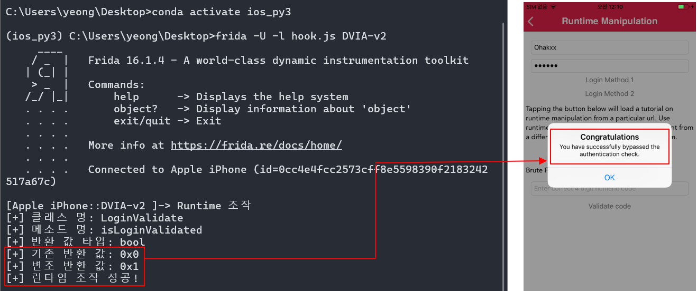

로그인 인증 우회 성공!

---

### 2. 인증 우회 실습 - 2 (바이너리 우회)

#### Step 1. 로직 파악

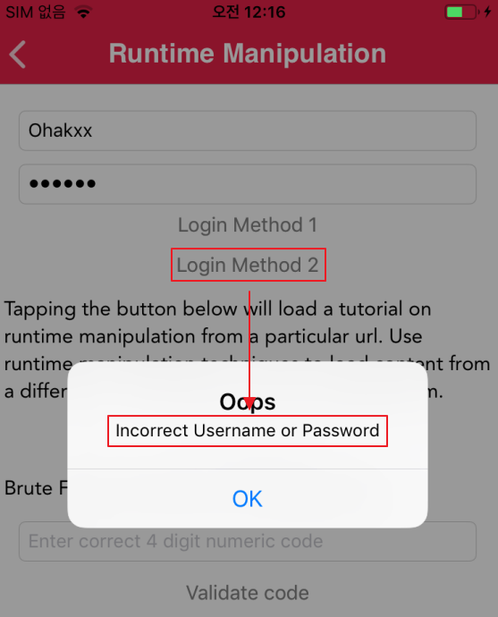

임의 ID/PW 입력 후 Login Method 2 호출 시 인증 실패 확인

- Login Method 1 에서는  Objective-C로 이루어져 있고 추가 로직 없음
- Login Method 2 와 같이 다른 경우에는 바이너리 분석이 추가 진행 필요함

---

#### Step 2. Ghidra 도구로 로직 파악

1. 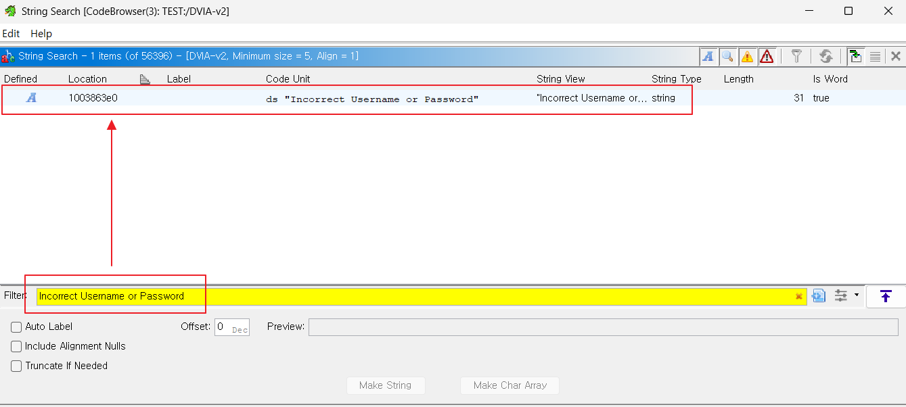


문자열 검색 기능을 사용하여 `Incorrect Username or Password` 검색하여 로그인 인증 위치를 확인한다.

1개의 결과가 출력되며 더블 클릭하면 해당 문자열 주소 위치로 이동한다.


2. 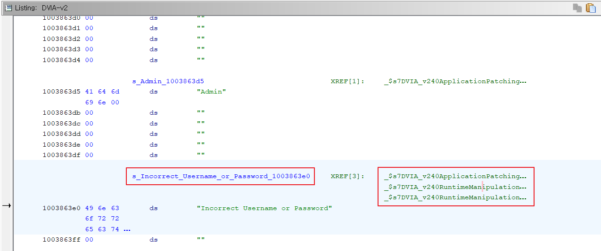

`Incorrect Username or Password` 문자열 주소 위치로 이동한 화면이며, 우측 초록색 주소는 해당 문자열을 사용하는 참조 주소이다.

해당 문자열을 사용하는 참조하는 곳은 세 군데이며 첫 번째 Application 으로 시작하는 참조는 다른 취약점 항목이므로 Skip 하고 나머지 두 군데를 추가 분석한다. 더블 클릭하면 해당 주소 위치로 이동한다.


3. 

`Incorrect Username or Password` 을 사용하는 참조 주소 위치로 이동한 화면이다.


[Window] -> [Function Graph] 탭을 사용하여 함수 로직을 분석한다.


4. 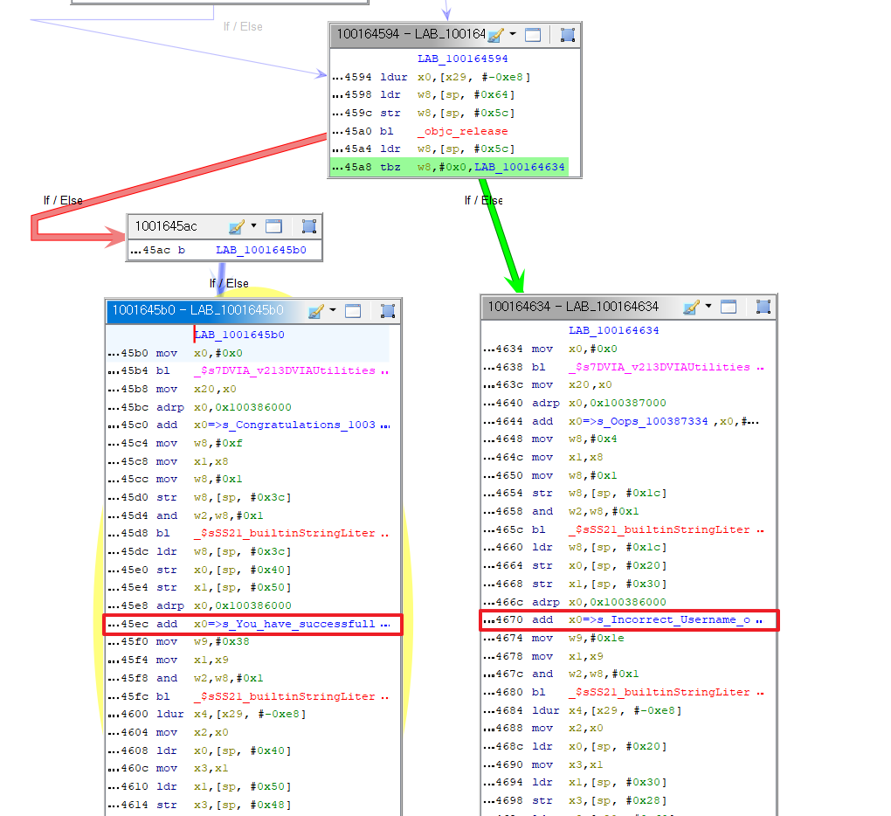


- 붉은 선은 로그인 성공 문자열이 있는 것을 보아 인증 성공일 때
- 초록 선은 로그인 실패 문자열이 있는 것을 보아 인증 실패일 때

임을 알 수 있다.

5. 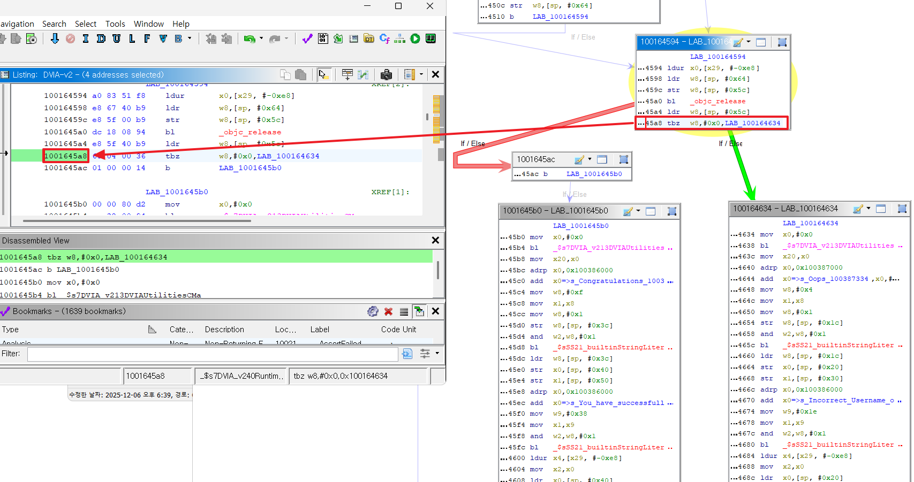

다시 분기 직전으로 돌아와서 초록 선과 붉은 선으로 나뉘어지는 분기 주소는 `1001645a8` 이다. 또한

- 분기 코드에서 핵심은 `w8` 값이 `0x0`인지 아닌지를 비교하여 분기된다.
    - `x8` 레지스터의 값을 변경하면 `w8` 레지스터 역시 하위 32 비트이므로 함께 변하게 된다.
    - 따라서 `x8` 레지스터의 값을 1로 변경하여 인증 우회 가능하다.

DVIA-v2 앱은 ASLR이 적용되어 있으며, 이에 따라 왜 Offset을 구하는지 `3.Jailbreak_Detection.md` 에서 자세히 정리하였으므로

Frida에서 후킹할 분기 주소는 `0x1645a8` 이다.


분기 흐름을 읽어 후킹할 지점을 파악 완료하였으며 `w8(x8)` 레지스터 값을 변경할
후킹 코드 작성을 진행한다.


---

#### Step 3. 파악된 로직을 Frida 도구로 인증 우회 코드 작성 & 실행

```js
//(1) 실 주소 확인 후 변조
var realBase = Module.findBaseAddress('DVIA-v2')
console.log("[+] ASLR로 바뀐 바이너리 실제 메모리 주소 : " + realBase)

var jailBreak_address = realBase.add('0x1645a8')
console.log("[+] 분기점 실제 주소 : " + jailBreak_address)

//(2) 반환 값 변조 
Interceptor.attach(jailBreak_address,{
    onEnter:function(args){
        console.log("[+] 변조 전 반환 값 : ")
        console.log(JSON.stringify(this.context))
        this.context.x8 = 0x1 // w8(x8) 레지스터 값 변경
        console.log("[+] 변조 후 반환 값 : ")
        console.log(JSON.stringify(this.context))
    }
})
```
1. PC 에서 Frida를 ios_py3 이름의 아나콘다 가상 환경에 설치하였으므로 가상환경 진입 : `conda activate ios_py3`
2. 타겟 모듈 실행 중인지 확인 `frida-ps -Ua`
3. 코드 실행 : `frida -U -l hook.js DVIA-v2`

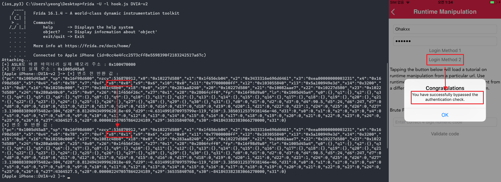

인증 우회 성공!

---

### 3. 인증 우회 실습 - 3 (Brute Force)

#### Step 1. 로직 파악

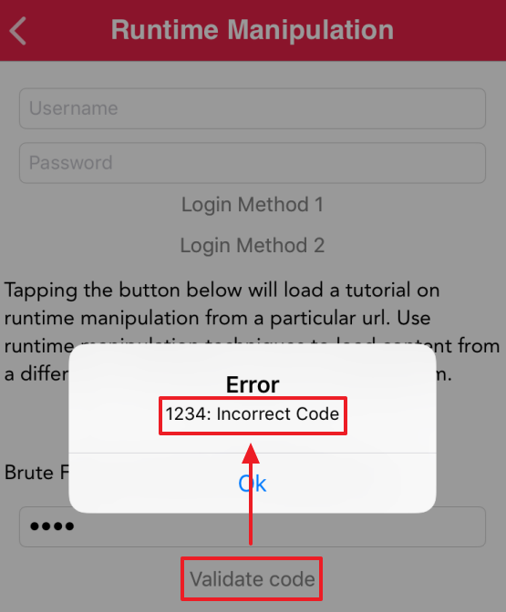

임의 코드 입력 후 Validate code 호출 시 `Incorrect Code` 출력 및 인증 실패 확인


---

#### Step 2. Ghidra 도구로 로직 파악

1. 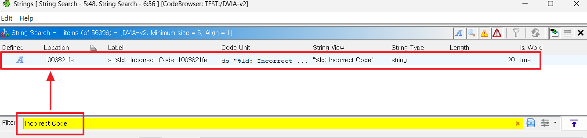

인증 실패 문구 `Incorrect Code` 문자열 검색 후 더블 클릭하여 해당 문자열 주소 이동 시도

2. 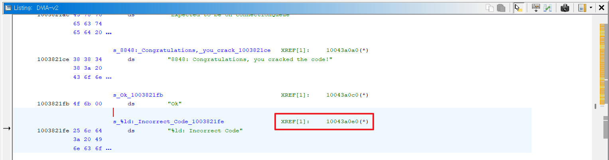


인증 실패 문구 `Incorrect Code`주소로 이동한 화면 

우측 초록색 더블 클릭하여 해당 문자열 참조하는 주소로 이동 시도


3. 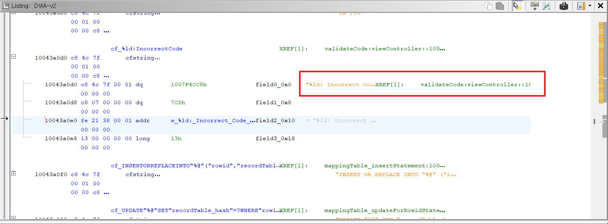

인증 실패 문구 `Incorrect Code` 참조하는 주소로 이동한 화면

[Window] -> [Function Graph] 탭을 사용 시 함수가 아닌 것으로 확인됨


따라서 다시 우측 초록색 더블 클릭하여 참조하는 주소로 이동 시도

4. 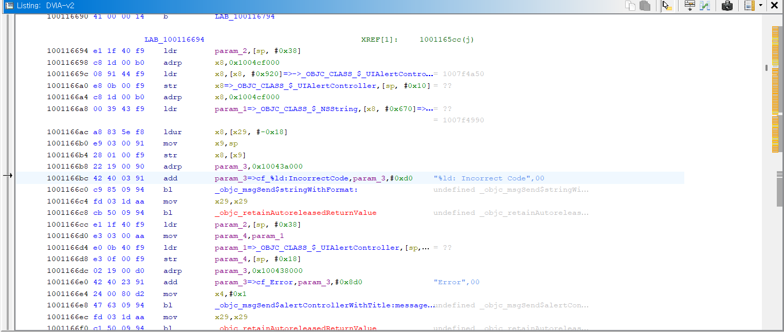

함수로 이동한 화면이며, [Window] -> [Function Graph] 탭을 사용하여 함수 로직을 분석한다.

5. 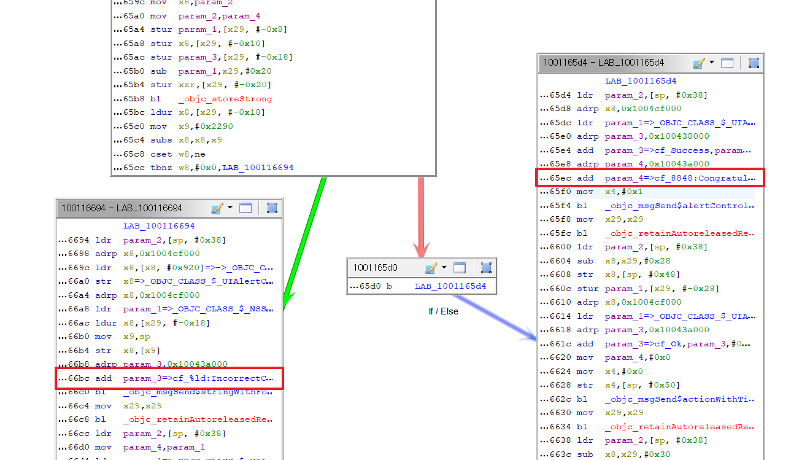

- 초록색은 코드 인증 실패한 문자열이 위치한 것으로 보아 코드 인증 실패 구간 확인
- 붉은선은 코드 인증 성공한 문자열(Congraturation) 문자열이 위치한 것으로 보아 코드 인증 성공 구간 확인
  - 인증 코드(8848)이 평문으로 노출되어 정답을 알 수 있으나, 런타임 조작에 중점을 두고 있으므로 없다고 가정

6. 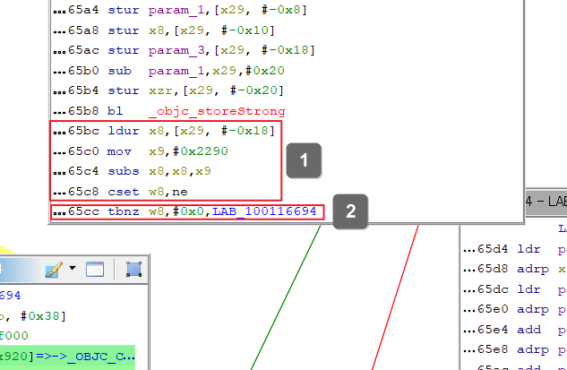

2번 스탬프 주소에서 w8 레지스터 값만 변경하면 우회할 수 있으나 

1번 스탬프 주소에서 브루트 포싱 방법으로 해결을 진행할 것이다.


- 1 Line : `ldur x8, [x29, #-0x18]` : 사용자 입력 값을 받아 저장
- 2 Line : `mov x9, #0x2290` : 레지스터 `x9` 에 0x2290(10 진수로 8848)을 저장
- 3 4 Line . `subs x8, x8, x9 / cset w8, ne` : 
  - 만약 x8 != x9 이면 → w8 = 1
  - 만약 x8  == x9 이면 → w8 = 0

7. 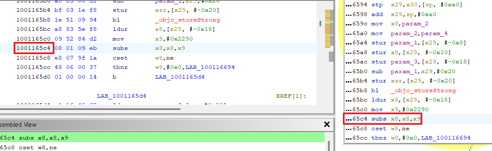


분기 주소는 값을 비교하는 곳인 `0x1165c4` 이다.

이유는 `0x1001165c4(Ghidra 상대주소)` - `0x100000000(Ghidra 기준주소)` = `0x1165c4`
- 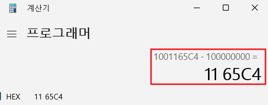


분기 흐름을 읽어 후킹할 지점을 파악 완료하였으며 후킹 코드 작성을 진행한다.

---

#### Step 3. 파악된 로직을 Frida 도구로 인증 우회 코드 작성 & 실행

먼저 x8, x9 비교하는 주소 부분에서  레지스터 값들을 확인한다.

```js
var realBase = Module.findBaseAddress('DVIA-v2')
console.log("[+] 앱 실제 메모리 주소 : " + realBase)

var runtime_address = realBase.add('0x1165c4')
console.log("[+] 분기점 실제 주소 : " + runtime_address)

Interceptor.attach(runtime_address, {
	onEnter:function(args){
		console.log("")
		console.log("[+] x8, x9 값 : ")
		console.log(JSON.stringify(this.context))
	}
})
```


1. PC 에서 Frida를 ios_py3 이름의 아나콘다 가상 환경에 설치하였으므로 가상환경 진입 : `conda activate ios_py3`
2. 타겟 모듈 실행 중인지 확인 `frida-ps -Ua`
3. 코드 실행 : `frida -U -l hook.js DVIA-v2`

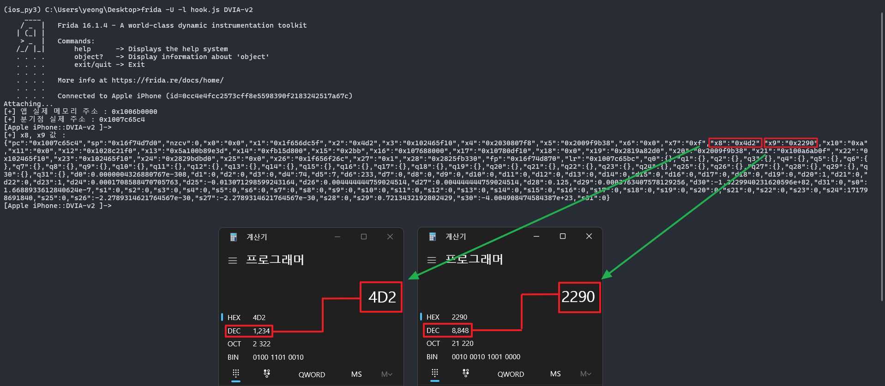

- 결과 화면에서 x8 레지스터에 입력 값 : 내가 입력했던 1234 가 저장됨을 확인 가능
- 결과 화면에서 x9 레지스터에 검증 값 : 8848 가 저장됨을 확인 가능


입력 값 x8 레지스터의 값 브루트 포스 코드 작성
```js
var realBase = Module.findBaseAddress('DVIA-v2')
//console.log("[+] 앱 실제 메모리 주소 : " + realBase)

var runtime_address = realBase.add('0x1165c4')
//console.log("[+] 분기점 실제 주소 : " + runtime_address)

// [+] 네 자릿수 맞춰주는 함수 정의
function padToFour(number){
  if(number<=9999){
    number = ("000" + number).slice(-4) // slice로 4자리 맞춰주면 됨
    return String(number)  // number가 1일 때 0001이 되고 number가 9999 일 때는 0009999 에서 4자리만 출력되어 9999
  }
}
Interceptor.attach(runtime_address,{
  onEnter:function(args){
    console.log("")
    console.log(JSON.stringify(this.context))
    console.log("old x8 값 :" + this.context.x8)

    // x9 레지스터 값 (기준값)
    var x9_value = parseInt(this.context.x9, 16)

    // 핵심: x8 을 0부터 증가시키도록 지정
    for (var i = 0 ; i < 10000 ; i++) {

      // x8 레지스터에 i 값을 넣는다
      this.context.x8 = i

      console.log("[+] x8 증가: " + i)

      // x8 == x9인 순간 break
      if (this.context.x8 == x9_value) {

        console.log("==== MATCH FOUND ====")
        console.log("x8 값 : " + this.context.x8)
        console.log("x9 값 : " + x9_value)
        console.log("======================")

        break
      }
    }
  }
})
```
1. PC 에서 Frida를 ios_py3 이름의 아나콘다 가상 환경에 설치하였으므로 가상환경 진입 : `conda activate ios_py3`
2. 타겟 모듈 실행 중인지 확인 `frida-ps -Ua`
3. 코드 실행 : `frida -U -l hook.js DVIA-v2`

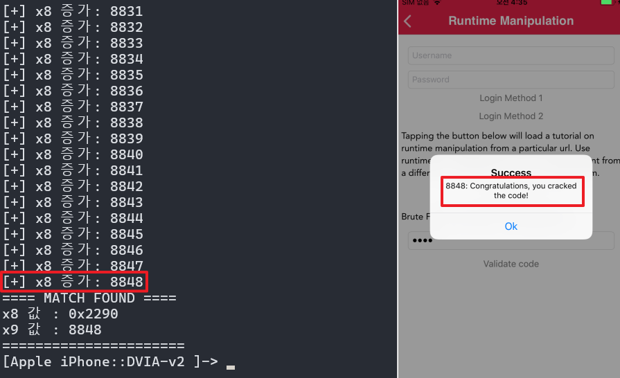

x8 레지스터 값이 계속 증가하다 8488에서 break 되며 인증 성공

---


