# Side Channel Data Leakage


Side Channel Data Leakage /  사이드 채널 데이터 유출 취약점이란?

애플리케이션이 중요한 데이터가  실수로 유출되는 취약점

아래 위치에 유출
- Device Log
- 앱 스크린샷
- Pasteborad(붙여넣기)
- Keystroke logging(입력 키를 누르는 행위)
- HTTP 쿠키에 사용되는 보안되지 않은 API 등과 같은 다양한 종류가 존재

---

### Device Log 취약점 진단 방법

개발자가 개발 단계에서 애플리케이션을 디버깅 하기 위해 추가한 로그 기능을 배포 시점에 제거하지 않고 배포하여
발생하는 취약점 (중요 정보는 Device Log에 기록되면 안됨)

1. 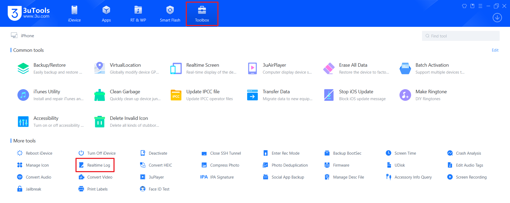

3utools 도구에 Realtime Log 기능 진입

2. 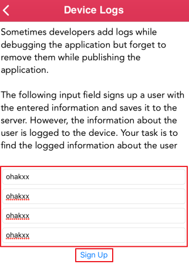

임의 입력 값 입력 후 저장 시도


3. 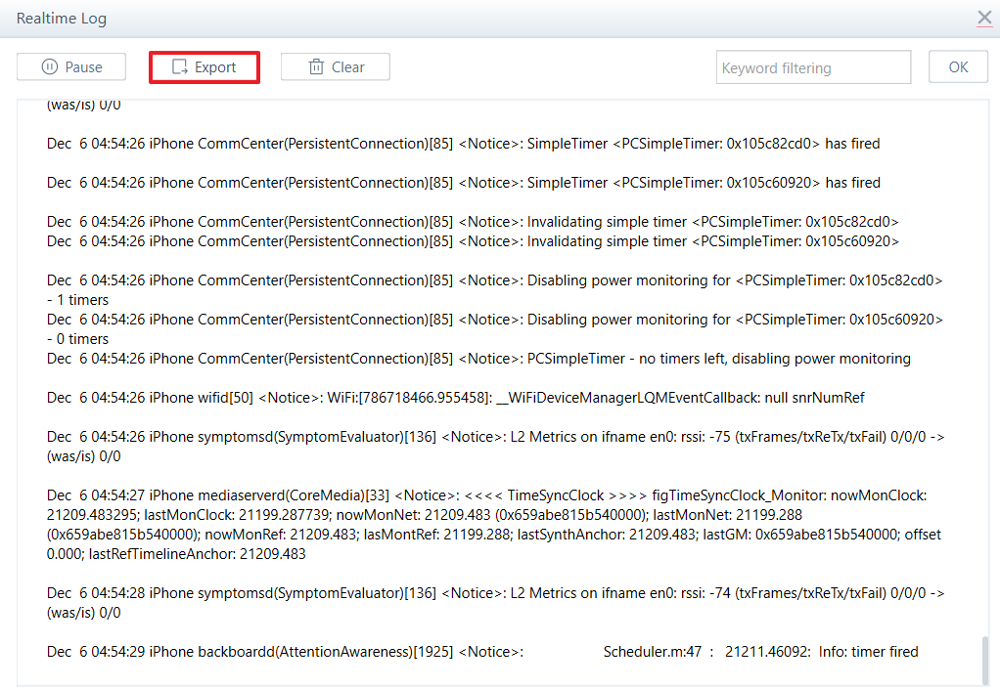

Export 기능 사용하여 로그 파일 저장

4. 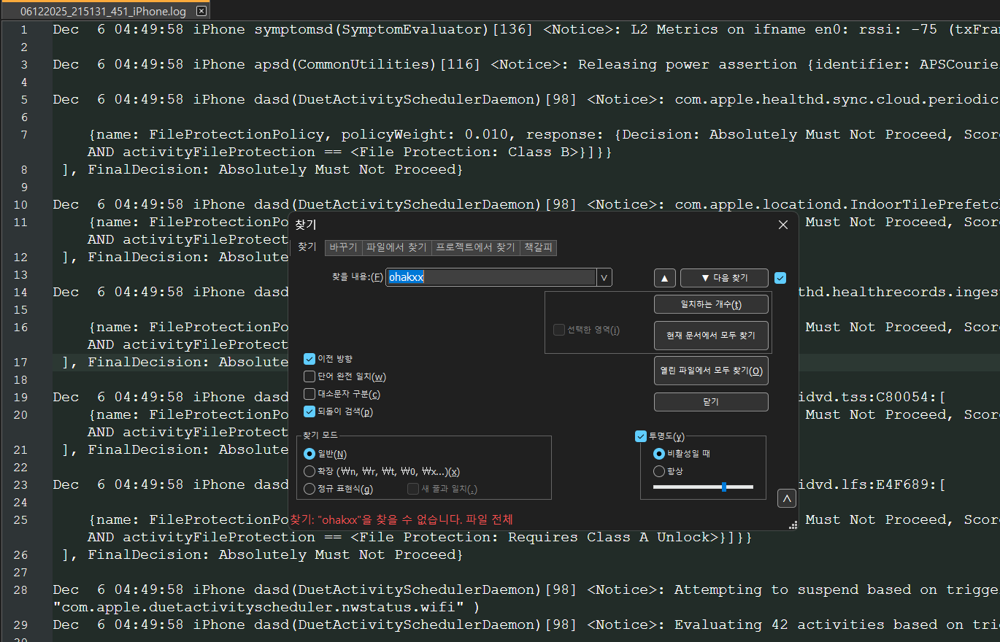

로그 파일 내 입력 값 존재 유무 확인

---

### App Screenshot 취약점 진단 방법

애플리케이션이 백그라운드로 들어갈 때 스크린샷을 찍는 것으로, 사용자에게 UI를 원활하게 보여주기 위해 사용

스크린샷에 중요한 정보가 담길 수 있고 적절한 보호조치 없이 애플리케이션 샌드박스에 저장되어 쉽게 확인 가능

1. 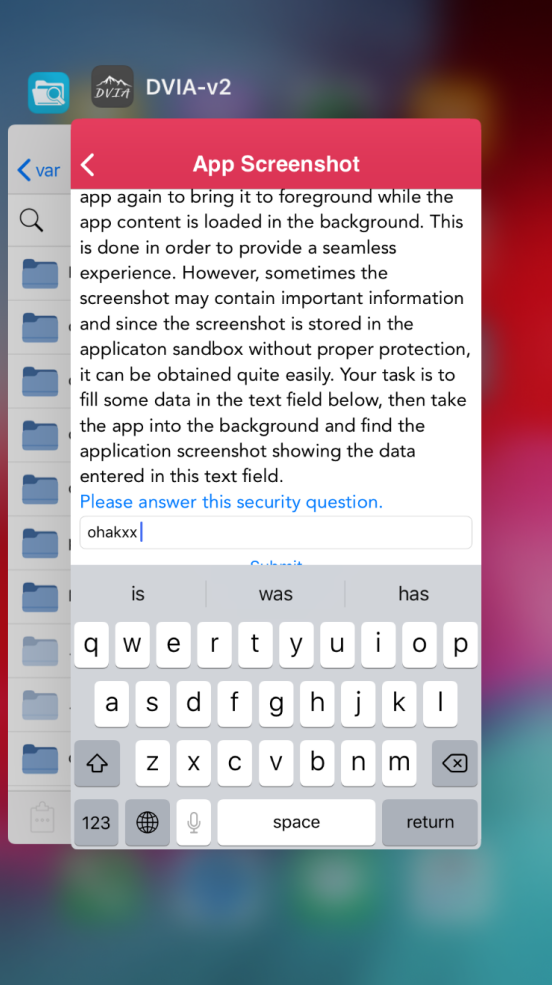

위처럼 작업 중이던 창들이 보이는데 이때 보이는 이미지는 실시간으로 반영되는 이미지가 아니라 백그라운드 전환 직전 자동으로 찍힌 스크린샷의 이미지로 

- 저장되는 스크린샷에 중요정보가 노출 되는지
- (금융권 앱의 경우) 실행중이던 애플리케이션이 백그라운드 상태로 진입할 때 적절한 화면 보호가 이루어 지는지

확인이 필요하다.

저장된 스크린샷은
- `/var/mobile/Containers/Data/Application/UUID/Library/SplashBoard/Snapshots/` 또는
- `/var/mobile/Containers/Data/Application/UUID/Library/Caches/Snapshots/`

경로에 ktx 파일로 저장됨


2. 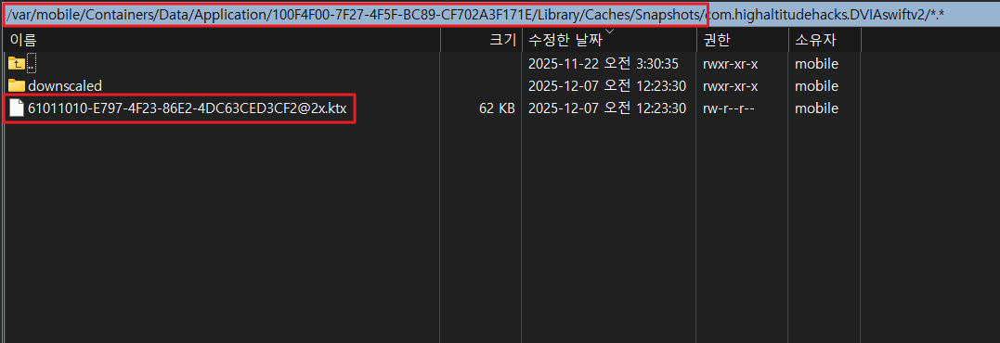


3. 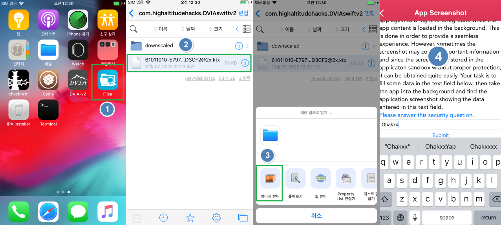

변환할 필요 없이 아이폰 단말기 Filza 앱을 통해 확인 가능하다.

중요정보도 그대로 저장되고 화면 보호도 이루어 지지 않으므로 취약하다.


---

### Pasteboard 취약점 진단 방법

일부 텍스트를 복사하면 Pasteboard 버퍼에 저장되어 다른 애플리케이션이 해당 버퍼에 저장된 데이터 확인 가능함

복사한 중요한 텍스트가 Pasteboard에 포함되어 있으면 다른 애플리케이션에서 유출 가능함


1. 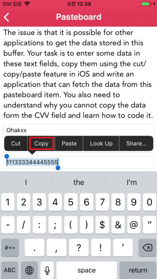

앱 내 카드번호 임의 입력 후 복사한다.

2. pasteboard 버퍼 확인 코드 작성

이런 후킹 코드는 오픈소스로 많이 공개되어 있으므로 참고 한다.

참고 : https://github.com/interference-security/frida-scripts/blob/master/iOS/pasteboard-monitoring.js


```js
// ------ iOS 클립보드(pasteboard)의 문자열 변화를 주기적으로 감시하는 함수 ------
function start_pasteboard_monitoring(interval_value) {

    // iOS 시스템의 공용 클립보드 객체 가져오기
    // ObjC 클래스 접근 → UIPasteboard.generalPasteboard()
    var pasteboard = ObjC.classes.UIPasteboard.generalPasteboard();

    // 마지막으로 출력한 값을 저장
    // (클립보드 내용이 같은데 setInterval 때문에 계속 찍히는 무한 출력 방지용)
    var latest_word = "";

    // interval_value(ms) 간격으로 주기적으로 실행
    setInterval(function () {

        try {
            // 현재 클립보드에 저장된 문자열 가져오기
            // (Objective-C NSString → JS 문자열 변환)
            var current_text = pasteboard.string().toString();

            // 클립보드 내용이 '바뀐 경우'에만 출력하도록 비교
            // 같은 내용이면 반복 출력되므로 이를 차단하기 위함
            if (current_text != latest_word) {
                console.log("[*] Found on pasteboard: " + current_text);

                // 최신 문자열로 업데이트
                // 이후 동일한 값은 출력되지 않도록 기준이 됨
                latest_word = current_text;
            }
        }
        catch (err) {
            // pasteboard.string() 이 null이거나 문자열이 아닐 때 에러 발생 가능 → 무시 후 계속 진행
        }

    }, interval_value);
}

// 2초(2000ms)마다 클립보드 감시 시작
start_pasteboard_monitoring(2000);

```
3. 코드 실행

- PC 에서 Frida를 ios_py3 이름의 아나콘다 가상 환경에 설치하였으므로 가상환경 진입 : `conda activate ios_py3`
- 타겟 모듈 실행 중인지 확인 `frida-ps -Ua`
- 코드 실행 : `frida -U -l hook.js DVIA-v2`

4. 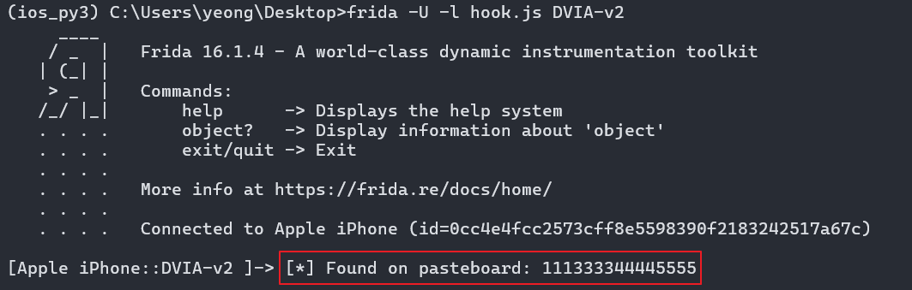

출력 결과를 통해 클립보드 내용 확인 가능


5. 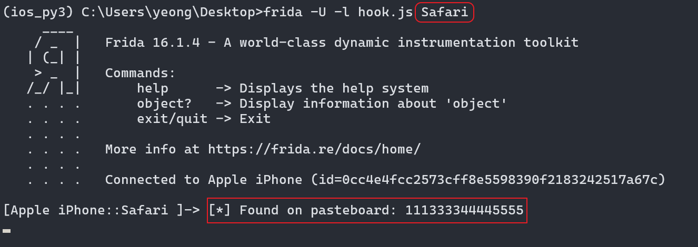

추가 테스트로 Safari 로 후킹 코드 Attach 하여 취약한 앱에서 복사한 값을 다른 앱에서 데이터 조회가 가능함 확인

---

### Keystroke logging 취약점 진단 방법

텍스트 필드가 Secure로 설정되지 않은 경우 기본적으로 디바이스의 텍스트 필드에 입력한 모든 입력을 기록함

Keystroke 로그는 디바이스에서 쉽게 가져올 수 있음

iOS 8 버전 이상부터 위치는 `/var/mobile/Library/Keyboard/ko-dynamic.lm/`에 확장자가 `.dat` 파일로 저장됨

`ko-dynamic.lm` 는 한국어로 입력된 데이터 저장됨
`en-dynamic.lm` 는 영어로 입력된 데이터 저장됨

1. 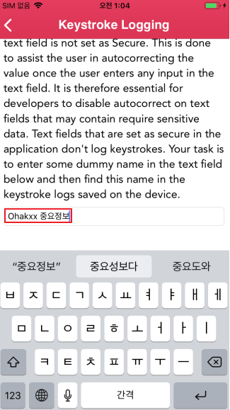

임의 데이터 입력

2. 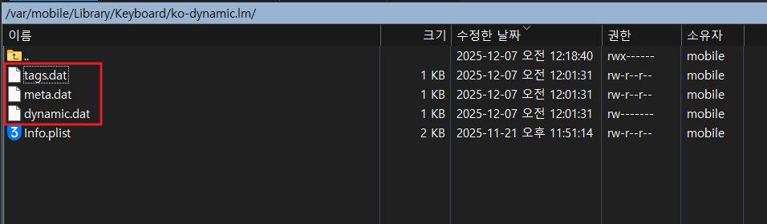

`/var/mobile/Library/Keyboard/ko-dynamic.lm/` 위치에 확장자 `.dat` 파일들을 열어 확인한다

보통 위 파일 살펴보면 기록이 남아 있는데 iOS 버전이 높아지면서 확인이 어려움

---

### Cookies 취약점 진단 방법

일부 애플리케이션은 Persistance Cookies(영구적, 지속적)를 생성해 cookie.binarycookies 파일에 저장함

이는 앱을 종료한 후에도 남아 있어서 확인 필요함

확인 경로는 `/var/mobile/Containers/Data/Application/$uuid/Library/Cookies/Cookies.binarycookies` 위치

1. 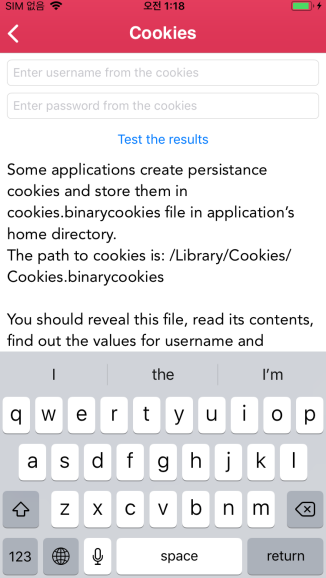

앱 실행

2. 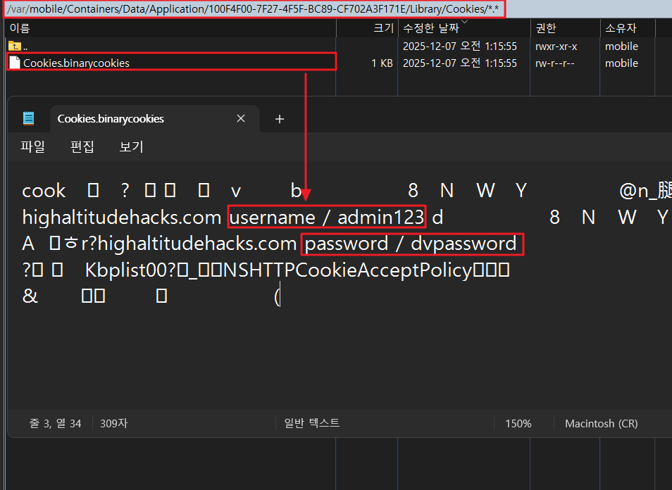

`/var/mobile/Containers/Data/Application/$uuid/Library/Cookies/Cookies.binarycookies` 확인 시 

- ID : admin123 
- PW : dvpassword

가독성은 좋지 않으나 ID/PW 확인됨


3. 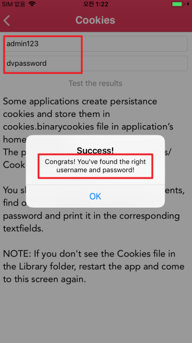

노출된 ID/PW 으로 인증 성공 확인


#### CookiReader 도구 사용

노트패드로 쿠키파일을 확인 시 글자가 깨져 가독성이 떨어지기 때문에 BinaryCookieReader 라는 툴을 통해 확인한다.

1. https://github.com/as0ler/BinaryCookieReader 에서 `BinaryCookieReader.py` 다운로드
2. 콘다에 python 2.7 환경 구성 : `conda create -n ios_py2 python=2.7 -y`
3. 생성된 python 2.7 환경 진입 : `conda activate ios_py2`
3. BinaryCookieReader.py 실행 : `python BinaryCookieReader.py [Target].binarycookies`

- 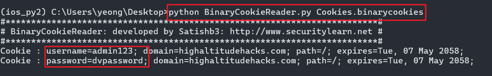

가독성 좋게 출력됨 확인

---

## 대응방안

#### Device Logs

개발자가 애플리케이션 실수로 로그 활서화하여 발생하므로 활성화 여부 확인이 필요

#### App Screenshot
앱 백그라운드 전환 시 앱 메인 화면 또는 중요한 데이터가 노출되지 않는 보호된 화면을 사용해야 함

#### Pasteboard
중요 데이터 입력 필요 시 가상 키패드 또는 Custom Pasteboard 을 사용해야 함

중요한 데이터 Pasteboard 버퍼 캐싱 여부 확인

#### Keystroke logging
텍스트 필드를 Secure로 설정하고 autocorrect(자동고침) 옵션을 해제

#### Cookies
중요한 데이터(계정정보)를 저장하지 않으며 서버에서 세션 값을 받아와 인증하도록 설정


