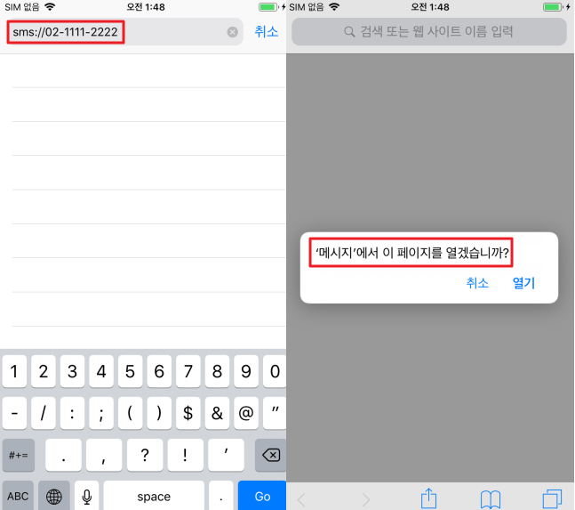
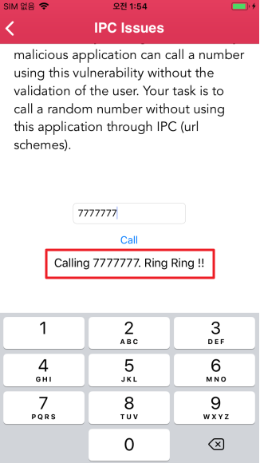
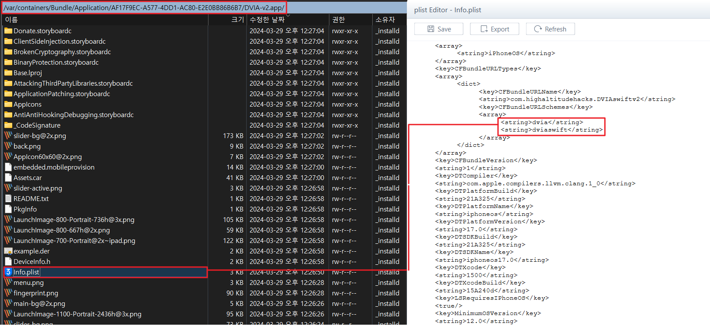
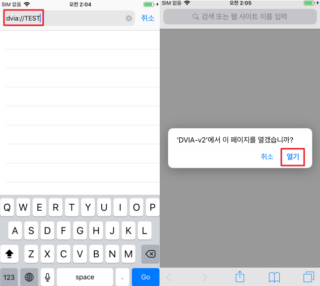
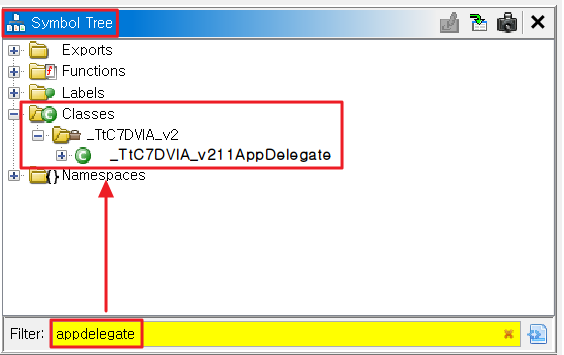
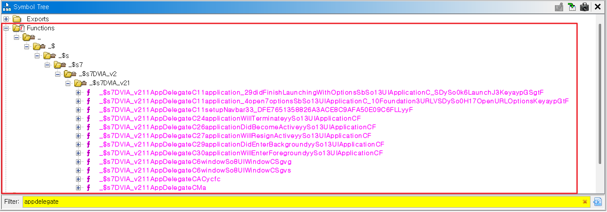
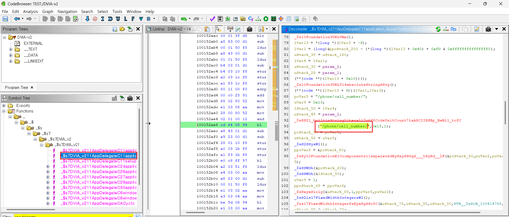
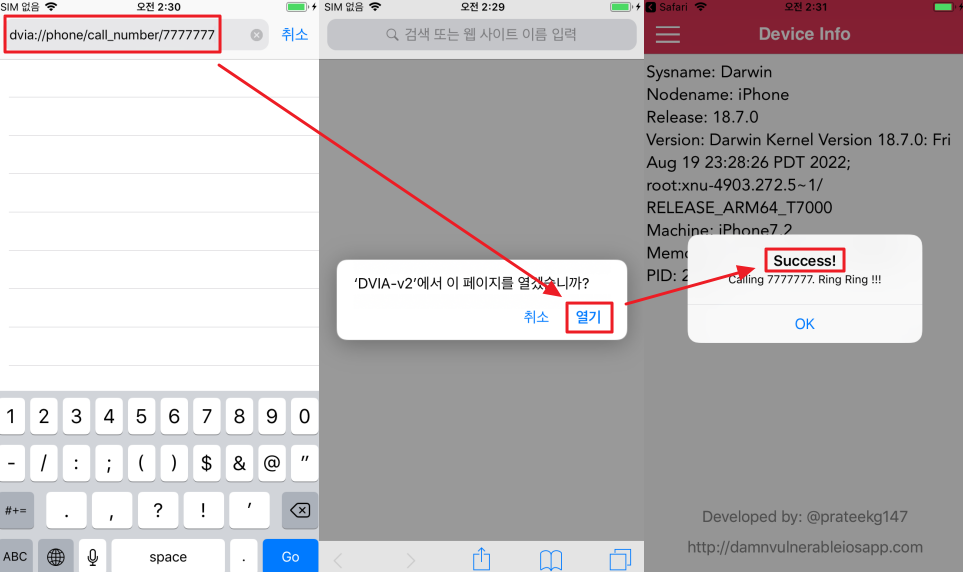

# IPC Issues 

IPC Issues 
- IPC(Inter Process Communication)는 프로세스들 사이에 서로 데이터를 주고받는 행위 또는 방법이나 경로
- 앱이 신뢰할 수 없는 출처의 URL Schemes를 통해 요청을 수신하는 데 이를 제대로 검증하지 않을 때 발생할 수 있는 문제
- 다른 앱에서 들어오는 요청을 제대로 처리하지 못하면 보안 취약점으로 이어질 수 있음
- iOS는 샌드박스 정책에 의해 다른 앱들과 정보를 주고 받기 힘드므로 URL Schemes를 이용한다.

---

### URL Schemes 종류

#### 1.) Built-in URL Schemes
| Scheme     | 설명                                                | 예시 URL                                                   |
|------------|-----------------------------------------------------|-----------------------------------------------------------|
| mailto     | Mail 앱을 시작하고 이메일 작성 시트 열기           | `mailto://frank@wwdcdemo.example.com`                    |
| tel        | 전화 앱을 시작하고 지정된 전화 번호로 전화 걸기    | `tel://1-408-555-5555`                                   |
| facetime   | 지정된 사용자에게 FaceTime 호출                     | `facetime://user@example.com`                            |
| sms        | 메시지 앱을 시작                                   | `sms://1-408-555-1212`                                   |
| maps       | 지리적 위치를 표시하고 두 지점 사이의 운전 경로 생성 | `http://maps.apple.com/?saddr=Cupertino&daddr=San+Francisco` |

Applie 사에서는 시스템 앱과 함께 통신할 수 있는 URL Schemes를 제공한다.

- 

예시로 사파리에서 sms 스키마를 사용해 메시지 앱으로 연결이 가능하다

---

#### 2) Custom URL Schemes

- 사용자 앱에서 URL Schemes를 구현하여 처리하도록 생성
- URL Schema를 사용하도록 구현해 놓은 경우 `Info.plist` 파일 `CFBundleUrlSchemes` 에서 해당 키값 확인이 가능
- 해당 키값을 수신하여 처리하는 부분은 `AppDelegate.swift` 파일에 지정되어 있는데 실제 업무에서는 대부분 소스코드 제공을 받지 않지만 받는 경우를 가정하여 Ghidra에서 바이너리 분석을 진행한다.

1. 

2. 

` /var/containers/Bundle/Application/UUID/DVIA-v2.app/info.plist` 파일 확인 시 2개의 스키마 값이 사용 중 확인

3. 

2에서 확인된 스키마를 테스트 시 열기를 누르면 DVIA 앱이 잠시 실행된 후 앱이 종료됨

정확하게 동작이 되지 않아 종료되었으므로 Ghidra로 추가 바이너리 분석이 필요함

- Ghidra 도구 분석 시 문자열 Search 기능은 사용하지 않는다. 
- 이유는 어떤 파일에서 스키마를 처리하는지 이미 알고 있기 때문에(`AppDelegate.swift`) 해당 클래스 파일을 확인하면 된다.
- 이럴 때 Symbol Tree 기능을 이용한다.

4. 
5. 

Symbol Tree에서 `AppDelegate` 검색 시 `AppDelegate` 관련된 1개의 클래스와 여러 개의 함수가 있는 것을 확인

functions를 위에서부터 하나씩 살펴보면서 어떻게 수신하고 처리하는지 우측 Decompile 창에서 확인한다.

6. 

2 번째 함수에서 `/phone/call_number/` URL 확인

7. 

외부 스키마를 통한 호출에 성공하여 Success 확인

사용자 동의나 허락 없이 전화를 걸 수 있기에 취약함

외부에서 호출이 가능하다 하여 항상 취약점은 아니며 이용자 인증(로그인)을 받은 후 접근 가능한 곳을 비인가자가 호출할 수 있는 경우에 취약함

예) 권한 없는 기능, 관리자 페이지 등 URL 스키마를 통한 접근이 가능한 경우 취약함

---

## 대응방안

Custom URL Schemes를 사용 시 사용자가 한 번 더 확인할 수 있는 로직 추가

중요한 기능/뷰에 대한 접근을 사용한다면 사용자 인증 정보 확인이 필요한 로직 추가

