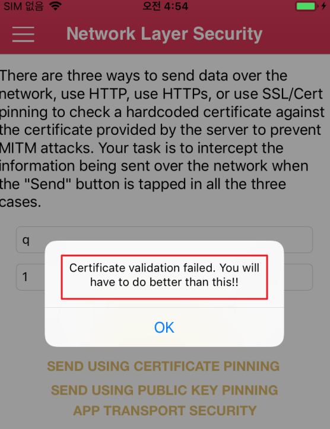
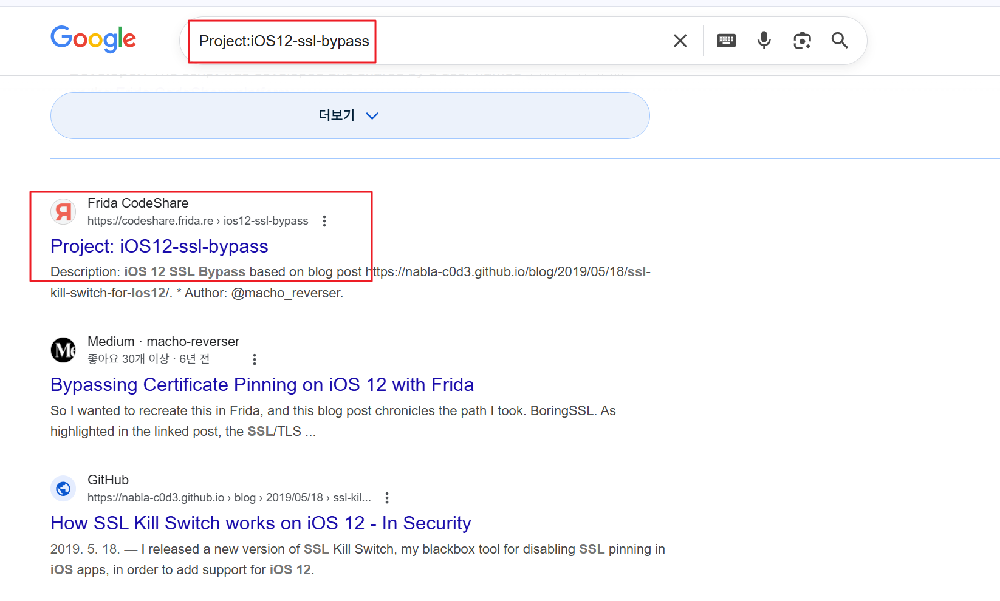
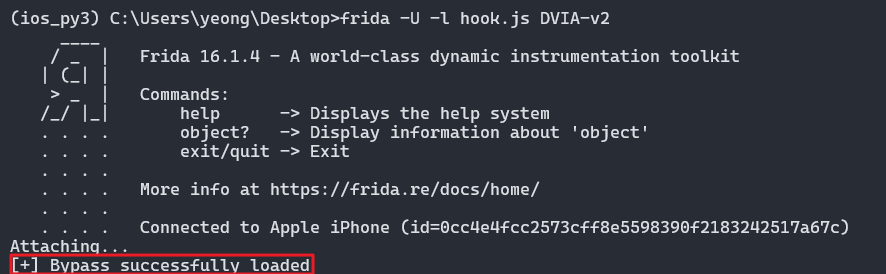
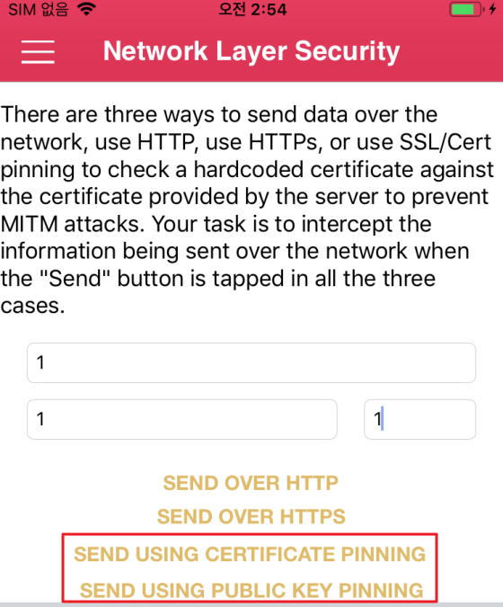
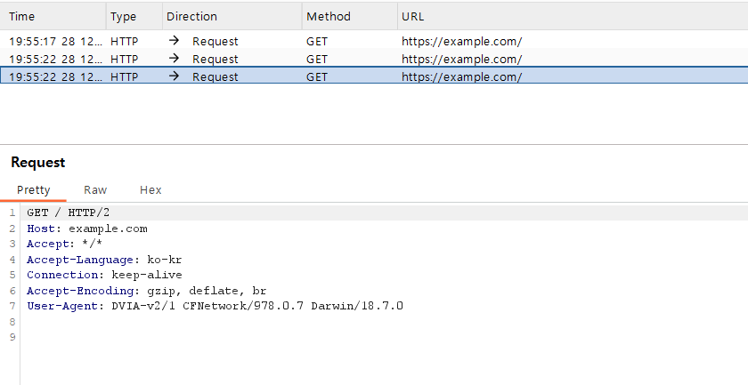
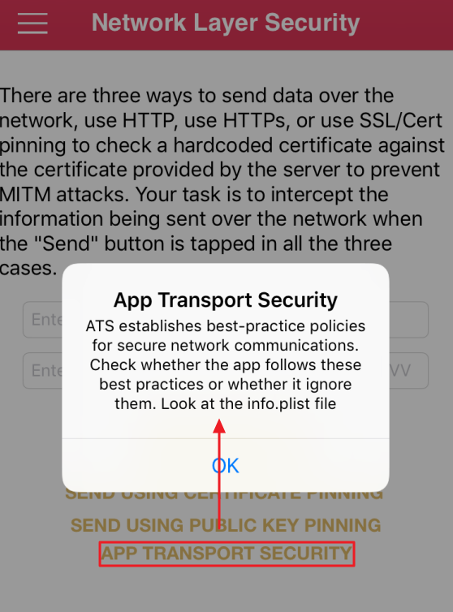
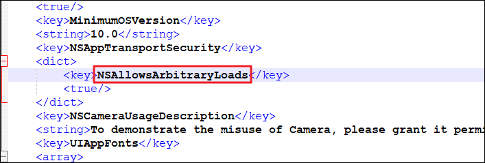
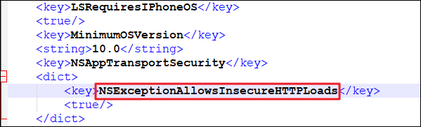
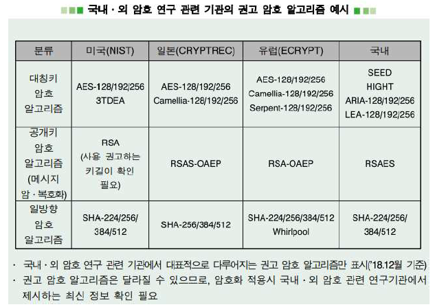

# Network Layer Security


## 1. SSL Pinning

금융권의 앱 및 몇몇 특정 앱들은 통신할 때 필요한 인증서가 특정 인증서로 따로 고정됨

이러한 앱을 진단하기 위해서는 관련 인증서를 제공받거나 고정된(pinning) 인증서를 우회를 해야함



인증서가 고정(Pinning)되어 Burp 인증서로 Burp에서 통신 과정을 볼 수 없음


---

#### Frida Code

pinning 우회 기법은 iOS 버전별로 조금씩 다르며 진단 단말기 버전에 맞는 우회 코드를 찾아 실행하면 된다.

https://codeshare.frida.re/

위 경로에 제공하는 소스코드는 Android, iOS 진단에 도움이 되는 유용한 코드가 많음

원하는 코드를 찾기 쉽지 않을 경우

구글에 Project:iOS12-ssl-bypass 등과 같이 키워드를 검색하면 된다.

- 

```js
/* Description: iOS 12 SSL Bypass based on blog post https://nabla-c0d3.github.io/blog/2019/05/18/ssl-kill-switch-for-ios12/
 *  Author: 	@macho_reverser
 */

// Variables
var SSL_VERIFY_NONE = 0;
var ssl_ctx_set_custom_verify;
var ssl_get_psk_identity;

/* Create SSL_CTX_set_custom_verify NativeFunction 
 *  Function signature https://github.com/google/boringssl/blob/7540cc2ec0a5c29306ed852483f833c61eddf133/include/openssl/ssl.h#L2294
 */
ssl_ctx_set_custom_verify = new NativeFunction(
    Module.findExportByName("libboringssl.dylib", "SSL_CTX_set_custom_verify"),
    'void', ['pointer', 'int', 'pointer']
);

/* Create SSL_get_psk_identity NativeFunction 
 * Function signature https://commondatastorage.googleapis.com/chromium-boringssl-docs/ssl.h.html#SSL_get_psk_identity
 */
ssl_get_psk_identity = new NativeFunction(
    Module.findExportByName("libboringssl.dylib", "SSL_get_psk_identity"),
    'pointer', ['pointer']
);

/** Custom callback passed to SSL_CTX_set_custom_verify */
function custom_verify_callback_that_does_not_validate(ssl, out_alert) {
    return SSL_VERIFY_NONE;
}

/** Wrap callback in NativeCallback for frida */
var ssl_verify_result_t = new NativeCallback(function(ssl, out_alert) {
    custom_verify_callback_that_does_not_validate(ssl, out_alert);
}, 'int', ['pointer', 'pointer']);

/* Do the actual bypass */
function bypassSSL() {
    console.log("[+] Bypass successfully loaded ");

    Interceptor.replace(ssl_ctx_set_custom_verify, new NativeCallback(function(ssl, mode, callback) {
        //  |callback| performs the certificate verification. Replace this with our custom callback
        ssl_ctx_set_custom_verify(ssl, mode, ssl_verify_result_t);
    }, 'void', ['pointer', 'int', 'pointer']));

    Interceptor.replace(ssl_get_psk_identity, new NativeCallback(function(ssl) {
        return "notarealPSKidentity";
    }, 'pointer', ['pointer']));

}

bypassSSL();
```


#### 1.2 실행


1. PC 에서 Frida를 ios_py3 이름의 아나콘다 가상 환경에 설치하였으므로 가상환경 진입 : `conda activate ios_py3`
2. 타겟 모듈 실행 중인지 확인 `frida-ps -Ua`
3. 후킹 코드 실행 `frida -U -l hook.js DVIA-v2`

- 

정상적으로 pinning 우회가 되며

- 

앱 내 PINNING 관련 기능을 누르면

정상적으로 패킷이 요청된다!


- 


---


## 2. ATS (App Transport Security)

- 

info.plist 파일 내

NSAppTransportSecurity

항목의 속성 값 확인!

- 

`<key>NSAllowsArbitraryLoads</key>`

위 설정은 HTTP 통신을 허용하는 경우 설정 값이다

HTTPS 통신만 허용하는 경우 값인

`<key>NSExceptionAllowsInsecureHTTPLoads</key>`

로 바꾼 후

- 

info.plist 파일을 업데이트해주면

HTTP 요청 패킷을 전송하지 않고

HTTPS만 잡히게 된다.


기타 속성 값은 아래 링크에 참고

https://developer.apple.com/library/archive/documentation/General/Reference/InfoPlistKeyReference/Articles/CocoaKeys.html


---


## 대응방안


- HTTPS 통신 필수 (중요한 데이터는 암호화를 통해 HTTPS 통신으로 전송)

- HTTP 통신을 사용하지 않는다면, ATS에 NSExceptionAllowsInsecureHTTPLoads 키 설정



