# Application Patching 

Application Patching 취약점은 위험도가 매우 높은 취약점

앞서 다뤘던 탈옥 탐지 우회, 런타임 조작 등의 취약점은

앱이 실행 중인 상태 즉, 런타임 상태에서 조작이 가능했던 취약점인데 반해

애플리케이션 패칭 취약점은 앱의 바이너리 파일을 변조하여 영구적으로 변경된 로직을 사용할 수 있는 취약점이다.

애플리케이션 패칭이 가능한 경우 로그인 메소드, 탈옥 탐지 메소드 및 앱에서 사용되는 특정 명령어 패치가 가능하여

각종 개인정보 유출, DDoS 공격 등의 악의적인 행위가 가능하다.

DVIA-v2에서는 다음의 4개 항목에 대한 바이너리 패칭을 시도하게 되는데

- 

1. 이용자가 입력한 계정 정보가 무엇이든 항상 로그인이 가능
2. 항상 탈옥 탐지 우회가 되어 있는 상태 유지
3. 경고 문구가 임의의 내용으로 출력되도록 조작
4. 앱 종료 버튼을 눌러도 앱이 종료되지 않도록 한다

앱의 바이너리 파일을 분석하기 위해


- 앱 바이너리의 위치는 Bundle Container(`/var/containers/Bundle/Application/$uuid`)에 위치하며 바이너리 파일이 제일 크기 때문에 사이즈 정렬 후 찾으면 편리함.
- 바이너리 파일를 Export 클릭하여 PC 으로 이동한다. 
- 바이너리 파일을 Ghidra에 Import 시켜준 뒤 분석한다.

---

## 1. Login Method 1

목표 : 사용자 입력 값에 상관없이 항상 로그인할 수 있도록 Login Method 1을 패치한다.

### Step 1. 앱 기능 사용

먼저 임의 아이디와 패스워드를 입력 시

- 

정보가 맞지 않다는 Incorrect Username or Password 힌트 메시지가 뜬다.

### Step 2. Ghidra 분석 및 변조 후 패치

기드라에서 Incorrect Username or Password 를 검색한 뒤 살펴보면

- 
- 

세 곳에서 해당 주소를 참조하고 있는데

아래 두 개는 런타임 조작에서 다뤘었고

남은 것은 맨 위 Application Patching,

(실무에서 관련 정보 확인이 어려운 경우 하나씩 들어가 로직 확인을 해야 함)

Function Graph 기능을 열어 분기점 및 목적지를 확인한다

- 

초록색 선은 정보가 맞지 않은 문자열이 존재하여 실패 로직임을 알 수 있꼬
붉은색 선은 정보가 맞는 문자열이 존재하여 성공 로직임을 알 수 있음

직전 분기는 tbz라는 어셈블리 코드를 사용해 w8 레지스터와 16진수 0x0과 비교한 뒤

분기가 이루어지기 때문에 해결책은 w8을 0x0으로 만들거나 0x0을 0x1로 바꿔주면 된다.

현재 w8 값이 어떻게 설정되어 있는지 모르기 때문에 코드를 작성해 해당 값을 먼저 확인해보자.

- 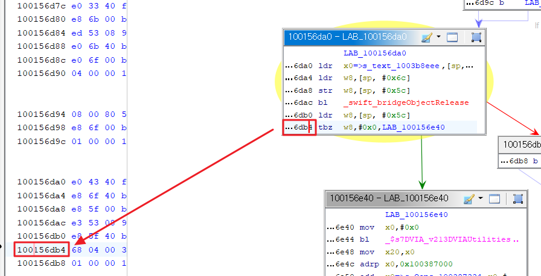

그 분기 주소는 offset 인 `100156db4` 이다

앞에서 ASLR 이 적용됨을 확인하였으므로 실제 로드되는 base(기준 주소) + offset(상대 주소) 을 더하면 목표 주소가 된다.

```js
var realBase = Module.findBaseAddress('DVIA-v2');
console.log("[+] ASLR로 바뀐 바이너리 실제 메모리 주소 : " + realBase);

var jailBreak_address = realBase.add(0x156db4);
console.log("[+] 분기점 실제 주소 : " + jailBreak_address);

Interceptor.attach(jailBreak_address, {
    onEnter: function(args) {
        console.log("[+] 변조 전 반환 값 : ")
        console.log(JSON.stringify(this.context))
    }
});
```

- 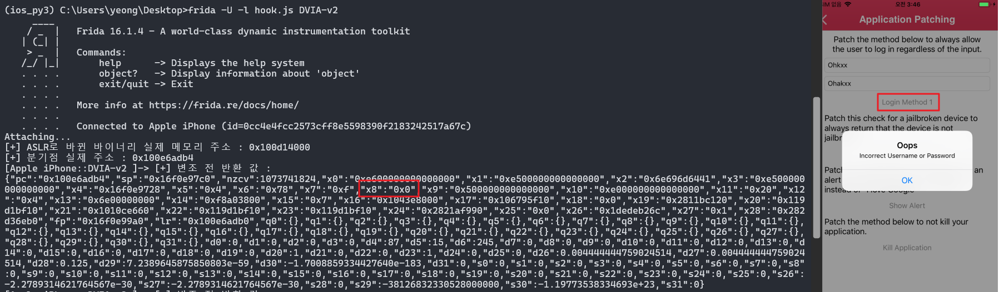

현재 x8 레지스터는 0x0 이 저장되어 있고 리턴 값을 변경하면 우회 가능하지만

이번에는 분기 시 이동하는 주솟값을 변조해보자

- 

기존에는 `100156db4` 분기 주소에서 `LAB_100156e64` 실패 문자열이 있는 곳으로 점프하게 되는데

로직을 변경하여 `LAB_100156dbc` 성공 문자열이 있는 곳으로 점프 변경한다.

- 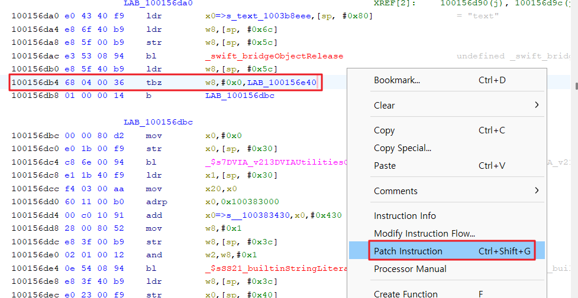

`100156db4` 분기 주소에서 마우스 우클릭 후 Patch Instruction 

- 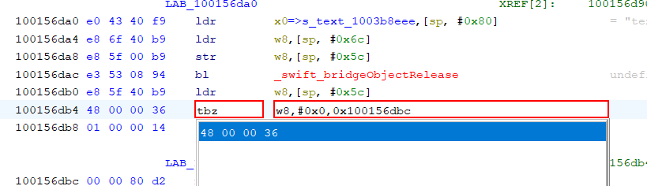
- 

### Step 3. 변조된 바이너리 파일 추출

패칭된 바이너리를 Export 하기 위해

- 

File > Export Program > Output File 포맷은 Original File 을 통해 바이너리 추출한다.

- 

기존 DVIA-v2 바이너리 파일을 replace 한다


### Step 4. 동작 확인

- 

정상적으로 패칭이 이루어져

어떤 값을 입력하든 로그인이 가능하다.

---

## 2. Check For Jailbreak


목표: 디바이스가 Jailbreak 되지 않았음을 항상 반환하도록 Jailbreak 된 디바이스 검사 로직 패치

### Step 1. 앱 기능 사용

- 

탈옥 탐지 되어 Device is Jailbroken 힌트 메시지가 뜬다.

### Step 2. Ghidra 분석 및 변조 후 패치

기드라에서 Device is Jailbroken 를 검색한 뒤 살펴보면

- 

- 

`100171f5c` 주소에서 w0 레지스터 값이 0x0와 비교한 뒤 

초록색 선 : LAB_10017206c(탈옥 탐지 X) 으로 분기한다.

현재 값이 0이 아니기 때문에

붉은색 선 : LAB_100171f64(탈옥 탐지 O) 으로 분기하고 있다.

Frida로 `100171f5c` 주소의 w0 값을 확인해 본다.

```js
var realBase = Module.findBaseAddress('DVIA-v2');
console.log("[+] ASLR로 바뀐 바이너리 실제 메모리 주소 : " + realBase);

var jailBreak_address = realBase.add(0x171f5c);
console.log("[+] 분기점 실제 주소 : " + jailBreak_address);

Interceptor.attach(jailBreak_address, {
    onEnter: function(args) {
        console.log("[+] 변조 전 반환 값 : ")
        console.log(JSON.stringify(this.context))
    }
});
```

- 

w0 값이 1이다. w0 값이 0인 경우 0과 비교하여 탈옥 X 로직으로 빠지게 되는데 

w0 레지스터 값이 1이니 비교 값을 0x0 에서 0x1로 바꾼다.

- 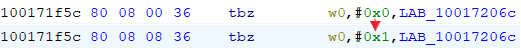

### Step 3. 변조된 바이너리 파일 추출

패칭된 바이너리를 Export 하기 위해

File > Export Program > Output File 포맷은 Original File 을 통해 바이너리 추출한다.

이후 기존 DVIA-v2 바이너리 파일을 replace 한 뒤 앱을 실행하면 

### Step 4. 동작 확인

- 

패치가 정상적으로 이루어져 탈옥 탐지 우회를 바이너리 패치로 성공 확인

---

## 3. Show Alert


목표 : I love Google 대신 I Love Apple 메시지가 항상 표시되도록 패치

[HxD Editor Download](https://mh-nexus.de/en/downloads.php?product=HxD20)

바이너리 Import 후 I love Google 검색
- 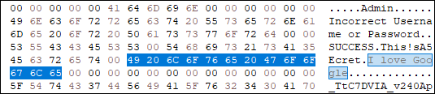

해당 부분을 Apple로 변조
- 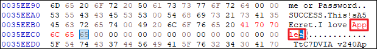

글자가 하나 남는데 남는 e 글자 바이너리 값인 65를 00으로 바꿔주고
- 

패칭된 바이너리를 Export 후 replace 후 앱 재실행 시

- 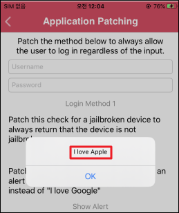

바이너리 패치 성공 확인


---

## 4. Kill Application

목표: Application Patching > Kill Application 항목을 누르면 앱이 강제 종료되는데 종료되지 않도록 패치

특정 문자열이 출력되지 않기 때문에 추측 문자열 검색 시도
- 

앱을 종료하는 기능이 있는건 없어보인다 문자열로 찾을 수 없으면 관련 기능을 수행하는 함수를 찾기

Ghidra에서 키워드 검색 (Kill, exit 등)
 
- 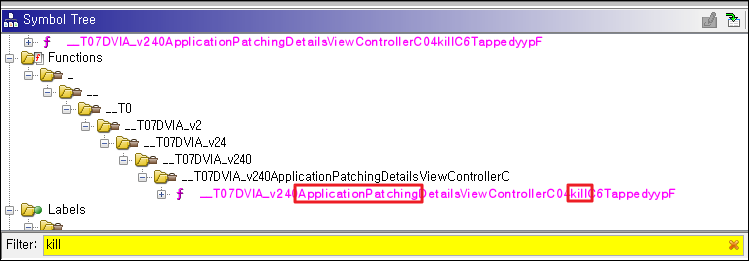
- 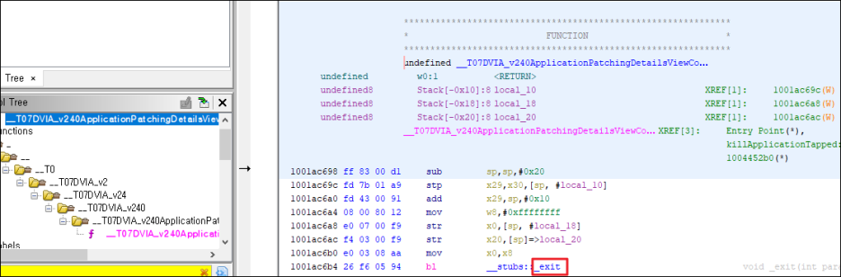

_exit 부분이 의심스럽고 더블클릭 후 들어가 보면

- 

앱 종료 코드 및 참조하고 있는 곳 확인이 가능하고 패칭이 필요한 곳은 

마지막의 ApplicationPatching 부분일 것이다. 더블클릭하여 확인 시

- 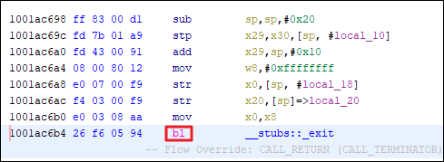

bl이라는 어셈블리 코드 확인이 가능한데

(bl : 지정된 곳으로 분기시키는 명령어)

해당 어셈블리 및 관련 기능을 사용하는

부분들을 모두 NOP으로 변조해 주면

아무런 동작을 하지 않게 될 것이다.

- 
- 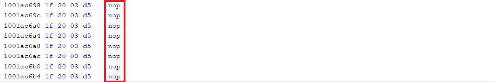
- 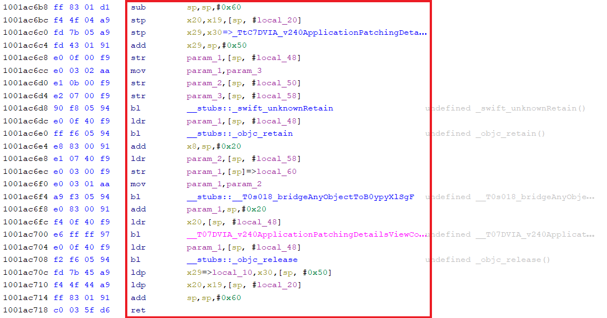
- 

마지막 ret(return) 만 제외하고 모두 nop 처리 후

해당 바이너리로 replace 후 앱 재실행 시 

- 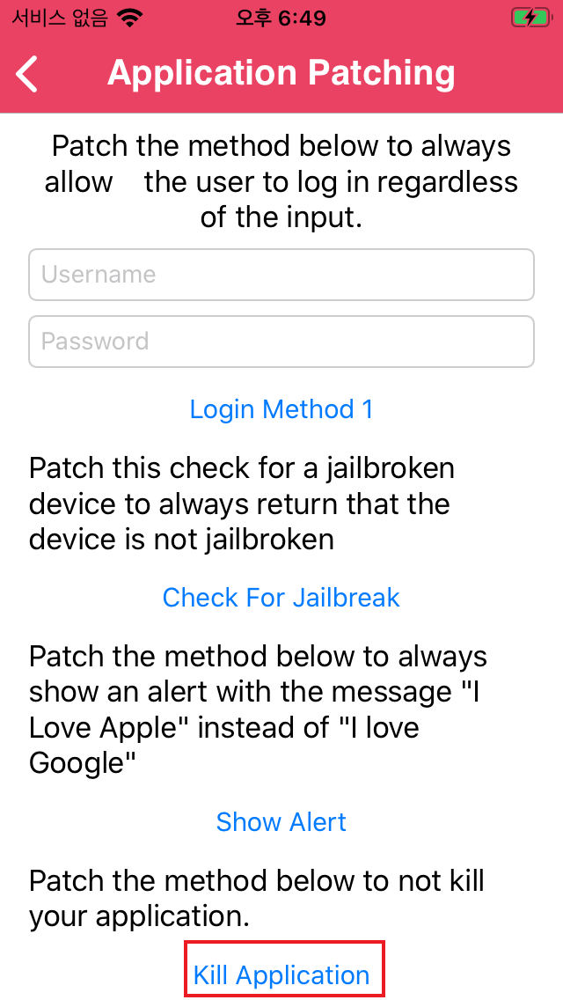

Kill Application 버튼을 클릭해도 앱이 종료되지 않음

---

## 대응방안

- 애플리케이션 바이너리 해시 값 검증 (코드 무결성 검증)
- 악성코드 삽입 및 실행, 보안 솔루션 우회, 인증 절차 우회 등

- 
