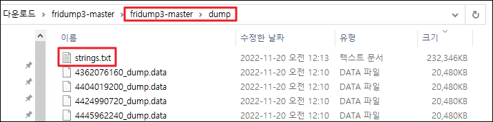

# Sensitive Information in Memory

Sensitive Information in Memory 
- 메모리에 존재하는 중요한 데이터를 덤프하여 확인 
- DVIA-v2 앱의 [Sensitive Information in Memory] 항목에서 테스트 가능 
- 일부 애플리케이션은 필요하지 않더라도 중요한 정보를 애플리케이션 메모리에 저장 
- 개발자가 중요한 정보를 포함할 수 있는 속성 또는 인스턴스 변수를 사용 후 제거하지 않아 발생


---


```bash
python fridump3.py -u -r -s [패키지명]
```
- `-u` : USB로 연결된 디바이스
- `-r` : 메모리의 읽기전용 부분을 덤프하며 해당 옵션을 사용하면 더 많은 데이터 획득 가능
- `-s` : 덤프 뜬 데이터 중 입력한 문자열들만 뽑아서 확인

자동으로 fridump/dump 디렉터리 내 용량이 가장 큰 strings.txt 파일이 있으며

- 

해당 파일 내 로그인 계정 등 중요정보가 평문으로 저장되는지 확인한다

---

## 대응방안

- 종단간 암호화(End-to-End) 적용 
  - 가상 키패드 사용 (키보드 보안 모듈 )
- 메모리 내 중요 정보는 바로 삭제 (할당된 메모리 블록 해제)
  - 가능한 한 최대한 짧게 노출되도록


