# 📌 Frida 학습 정리


### 🔹 [1. 기본 명령어](#1-기본-명령어)
### 🔹 [2. FridaTrace](#2-fridatrace)
### 🔹 [3. 기본 문법](#3-기본-문법)
- 🧩 [3.1. Java.perform(fn)](#31-javaperformfn)
- 🧩 [3.2. Java.use(className)](#32-javauseclassname)
- 🧩 [3.3. Java.choose(className, callbacks)](#33-javachooseclassname-callbacks)
- 🧩 [3.4. Java.enumerateLoadedClasses(callbacks)](#34-javaenumerateloadedclassescallbacks)
- 🧩 [3.5. setImmediate(fn)](#35-setimmediatefn)
- 🧩 [3.6. overload()](#36-overload)

### 🔹 [4. Frida 명령어 실습](#4-frida-명령어-실습)
- 🧪 [4.1 JS 인젝션 포인트 두 가지 상황](#41-js-인젝션-포인트-두-가지-상황)
- 🧪 [4.2 JS API 사용을 통한 Frida 명령어 사용](#42-js-api-사용을-통한-frida-명령어-사용)
- 🧪 [4.3 onResume 함수 후킹](#43-onresume-함수-후킹)

### 🔹 [5. Python Binding](#5-python-binding)

---

## 1. 기본 명령어

`frida-ps -U` `frida-ps -Ua`
- 프리다에 연결된 프로세스 목록을 출력하기 위한 도구

`frida-ls-devices`

- 연결된 디바이스를 출력하는 도구

`frida-trace`

- 함수 호출을 동적으로 추적하기 위한 도구

`frida-kill`

- 프로세스를 종료하는 도구

기타 주요 옵션

| 옵션                       | 설명                                       |
|----------------------------|--------------------------------------------|
| `-D ID`, `--device=ID`      | 주어진 ID로 장치에 연결                    |
| `-U`, `--usb`               | USB 장치에 연결                            |
| `-R`, `--remote`            | 원격 프리다 서버에 연결                    |
| `-H HOST`, `--host=HOST`    | HOST의 원격 프리다 서버에 연결             |
| `-a`, `--applications`      | 애플리케이션 리스트만 출력                 |
| `-i`, `--installed`         | 설치된 모든 애플리케이션 포함 출력         |
| `-I SCRIPT`, `--load=SCRIPT`| SCRIPT를 로드                             |
| `-f FILE`, `--file=FILE`    | spawn(스폰) FILE                           |
| `--no-pause`                | 시작할 때 자동으로 메인 쓰레드를 시작     |


---

## 2. FridaTrace

frida-trace -f [앱 패키지 이름] -i [검색하고 싶은 API] -U


`frida-trace -f com.android.chrome -i "open" -U`

연결된 후 앱을 사용할 때마다 

- 

open 함수를 사용하여 로그가 출력된다.

- 

`open.js`는 Frida의 `frida-trace` 명령어가 자동으로 생성한 JavaScript 핸들러 파일이다.

`Frida-trace`가 `libc.so`의 `open` 함수를 추적하기 위해 `C:\Users\yeong\__handlers__\libc.so\open.js` 경로에 이 파일을 만듦.

이 스크립트는 `open` 함수 호출 시 `onEnter`와 `onLeave` 콜백을 통해 매개변수와 반환값을 로깅하며, 동적 분석을 도와줌

파일 안에는 보통 다음과 같은 구조로 이루어짐

- `onEnter: function(args) { console.log('open() called'); }` : 함수 진입 시 로그 출력
- `onLeave: function(retval) { console.log('open() -> ' + retval); }` : 종료 시 결과 기록

`C:\Users\yeong\__handlers__\libc.so\open.js` 확인해보면

- 

  - `onEnter` 함수에서는 문자열 `open()` 출력
    - `onEnter`의 인수에는 3가지 logs / args / state 을 받아오는데 단순히 로그 출력만 하며 3가지 인수들을 사용하지 않음
  - `onLeave` 함수에서는 아무런 기능 없음


3가지의 인수가 어떠한 값이 전달되는지 궁금하므로 args 을 통해 호출 인수가 어떻게 동작중인지 확인한다.

그 전에 앞서 실제 리눅스에서 사용하는 `open()` 함수의 시그니처를 알아야 함.

- `int open(const char *pathname, int flags, mode_t mode);`

  - `pathname`: 파일 경로 문자열 (`args[0]`)
  - `flags`: 열기 옵션 (`args[1]`)
  - `mode`: 생성 시 권한 (`args[2]`)

onEnter의 `args` 배열에는 open 함수의 3가지 인수(pathname, flags, mode)가 순서대로 담겨 있으므로, `args[0]`이 pathname, `args[1]`이 flags 이다.
따라서 **파일 경로 문자열을 읽기 위한 메모리 주소** `args[0]`과 플래그 값 `args[1]`을 출력하도록 `open.js`를 수정함

```javascript
onEnter(log, args, state) {
  log('open(' + 'pathname=' + args[0] + ', flags=' + args[1] + ')');
},
```

저장 후 `frida-trace -f com.android.chrome -i "open" -U` 재 실행해 보면 

- 

파일 경로가 저장된 메모리 주소(pathname)와 플래그 값(flags) 확인이 가능함.

이처럼 함수를 호출할 때 확인이 필요한 함수에 어떤 정보들이 노출되는지 확인이 가능함.

또한 Frida의 메모리 Class 를 사용하여 메모리 주소의 값을 문자열로 변환하여 경로 추가 확인 가능함.
```javascript
 onEnter(log, args, state) {
    log('open(' + 'pathname=' + Memory.readUtf8String(args[0]) + ', flags=' + args[1] + ')');
  },
```

저장 후 `frida-trace -f com.android.chrome -i "open" -U` 재 실행해 보면
- 

파일 경로가 저장된 메모리 주소(pathname)로 실제로 간 뒤, UTF8 문자열 읽음

따라서 실제 호출 경로 확인이 가능한데 이처럼 특정 앱에서 어떤 함수가 언제 호출이 되는지 TID 값을 통해 알 수 있으며

호출 시 어떤 경로에서 호출이 되는지 pathname 을 통해 확인이 가능하다.

---

## 3. 기본 문법

### 3.1. `Java.perform(fn)`

1. "VM 준비됐어?" 확인 → 안 됐으면 대기

2. 준비되면 fn() 실행 → Java.use(), Java.choose() 등 안전하게 호출

- 프리다를 활용하려면 반드시 해당 메서드를 통해 가상머신 또는 단말기 연결을 확인해야 하므로 가장 많이 사용됨

```javascript
Java.perform(function() {     // 대소문자 주의!
/*
  ...
  do sth
  ...
*/
})
```

```javascript
❌ 잘못된 코드 (VM 미로드 상태에서 호출)
Java.use("com.example.MainActivity");  // TypeError: cannot use before VM ready!

✅ 올바른 코드
Java.perform(function() {
    Java.use("com.example.MainActivity");  // VM 준비 후 안전 호출
});

```

---

### 3.2. `Java.use(className)`

- Java.use()는 변수와 메서드에 액세스 할 수 있는 클래스 객체를 반환

예) Java.use(A)를 선언한 경우 지정한 A 클래스를 사용한다고 선언한 것!
- 주의! 클래스의 인스턴스를 반환하는 것이 아닌 클래스의 객체를 반환
- 안드로이드 앱의 내부 코드 중 인스턴스를 반환하려면 Java.choose라는 API를 사용해야 함

- 메서드 구현을 변경하려면 새로운 메서드로 덮어 써야 함

```javascript
Java.perform(function() {// 1️⃣ Java.perform: Dalvik VM 완전 로드될 때까지 대기 (안전장치)

  var myClass = Java.use("com.mypackage.name.class");  // 2️⃣ Java.use: 클래스 객체 반환, 인스턴스 아님!
  
  myClass.myMethod.implementation = function(param) {
    // 3️⃣ implementation 덮어쓰기: 원본 myMethod 완전 대체

    console.log("🔥 myMethod 후킹됨! param: " + param);  // 새 동작 추가

    var result = this.myMethod(param);  // 4️⃣ 원본 메서드 재호출 (중요!) 하고 원본 메서드의 return 값을 저장

    console.log("✅ 원본 실행 완료, 결과: " + result);
    return result;  // 5️⃣ 원본 반환값 그대로 전달
  }
});
```
---

### 3.3. `Java.choose(className, callbacks)`


- 힙을 스캔하여 클래스에서 실행 중인 인스턴스화 된 객체 찾기 가능

  - callbacks : onMatch, onComplete

  - onMatch : 실시간으로 인스턴스에 대해 호출

  - onComplete : function()의 모든 인스턴스가 열거될 때 호출

```javascript
Java.perform(function() { // 1️⃣ Java.perform: Dalvik VM 완전 로드될 때까지 대기 (안전장치)


  Java.choose("com.myPackage.name.class", {  // 2️⃣ Java.choose: 지정 클래스 *모든 인스턴스* 검색

    onMatch: function(instance) {     // 3️⃣ onMatch: 각 인스턴스마다 호출
      console.log("🔍 발견된 인스턴스: " + instance.toString());  // 인스턴스 정보 출력
      //    예: com.myPackage.name@0x7fabc123456 (메모리 주소 + 클래스명)

      // 🎯 여기서 인스턴스별 후킹 가능!
      instance.myMethod.implementation = function(param) {
        console.log("🔥 인스턴스 후킹! " + param);
        return this.myMethod(param);  // 원본 myMethod 호출
      };
    },

    onComplete: function() {          // 4️⃣ onComplete: 모든 인스턴스 검색 완료 시 호출
      console.log("✅ 모든 com.myPackage.name 인스턴스 검색 완료!");
    }
  });
});
```

Java.choose vs Java.use 차이
- Java.use("Class")     → 클래스 자체 반환 (모든 인스턴스 공통 후킹)
- Java.choose("Class")  → 생성된 모든 인스턴스 개별 반환 (인스턴스별 후킹)

---

### 3.4. `Java.enumerateLoadedClasses(callbacks)`

- 로드된 모든 클래스를 열거하고 모든 일치 항목을 출력

- onMatch : 실시간으로 인스턴스에 대해 호출

- onComplete : function()의 모든 인스턴스가 열거될 때 호출

사용 목적은 클래스명을 알고 싶기 위함

Java.choose("com.myPackage.name")  // ❌ 클래스명 미리 알아야 함
Java.enumerateLoadedClasses()      // ✅ 먼저 클래스 목록 확인 → 원하는 클래스 찾기

```javascript

Java.perform(function() {// 1️⃣ Java.perform: Dalvik VM 완전 로드 후 실행 (안전장치)
    
    Java.enumerateLoadedClasses({    // 2️⃣ 현재 메모리에 로드된 Java 클래스 전체 목록 반환
       
        onMatch: function(className) {     // 3️⃣ onMatch: 각 클래스마다 순차 호출
            //    className = 문자열 클래스명 (예: "com.android.chrome.MainActivity")
            //    수천개 클래스 모두 순회하며 출력
            
            console.log("📋 로드된 클래스: " + className);
        },
        
        onComplete: function() {         // 4️⃣ onComplete: 모든 클래스 열거 완료
            console.log("✅ 모든 클래스 열거 완료");
        }
    });
});

```

### 3.5. `setImmediate(fn)`

- Process terminated 오류 해결하기

 Frida는 emulation이 느려져 시간 초과가 되는 경우 연결을 자동으로 종료하는 경우가 있는데 이를 막기 위해 아래 코드처럼 스크립트를 setImmediate 함수로 포장한다.

Frida 스크립트 무한 생존 보장하는 안전장치

스크립트를 작성할 때 혹시 모를 상황을 대비해 함께 사용 추천

```javascript
setImmediate(function() {
    // 1️⃣ setImmediate: 스크립트 실행 후 즉시 콜백 실행 (타임아웃 방지)
    console.log("🔗 연결 유지 모드 활성화");
    
    Java.perform(function() {
        // ...
    });
});

```

---

### 3.6. overload()

```javascript
Java.perform(function() {
  var myClass = Java.use("com.test.name");  // 1️⃣ 클래스 로드

  // 2️⃣ 오버로드별 후킹: 매개변수 타입으로 정확한 메서드 지정

  // ✅ 매개변수 없음 (void test_method())
  myClass.test_method.overload().implementation = function() {
    console.log("🔥 test_method() 호출 (매개변수 없음)");
    return this.test_method();  // 원본 호출
  };

  // ✅ byte[] → byte[] (byte[] test_method(byte[]))
  myClass.test_method.overload("[B", "[B").implementation = function(param1, param2) {
    console.log("🔥 test_method(byte[], byte[]) 호출");
    console.log("param1 길이: " + param1.length);
    return this.test_method(param1, param2);  // 원본 호출
  };

  // ✅ Context, boolean (boolean test_method(Context, boolean))
  myClass.test_method.overload("android.content.Context", "boolean").implementation =
          function(param1, param2) {
            console.log("🔥 test_method(Context, boolean) 호출");
            console.log("Context: " + param1 + ", flag: " + param2);
            return this.test_method(param1, param2);  // 원본 호출
          };

  console.log("✅ 모든 오버로드 후킹 완료!");
});

});


```

overloading이 적용된 메서드가 여러 개 있는 경우 Frida에서  처리 방식은 위 코드와 같다.


오버로드 변수 카테고리
```text
.overload()
.overload('int’)
.overload('boolean')
.overload('float')
.overload('[B') // byte array
.overload('[B', '[B', '[B')
.overload('java.io.File')
.overload('java.lang.String')
.overload('android.view.View')
.overload('android.app.Activity')
.overload('android.content.Context')
.overload('android.content.Context', 'java.lang.String')
.overload('java.lang.String', 'java.lang.String')
.overload('android.graphics.Bitmap')
.overload('java.util.List’)
.overload('android.content.Context', 'java.lang.String', 'java.lang.String')
.overload('android.app.Activity', 'int', 'int', 'int', 'boolean')
```

---


## 4. Frida 명령어 실습

### 4.1 JS 인젝션 포인트 두 가지 상황

Frida에서 JS 인젝션 시 포인트는 두 가지 상황이 존재한다


1. 애플리케이션 프로세스 실행 후 JS 삽입


attach된 상황이 되면 JavaScript API를 사용하여 코드 및 명령어를 삽입할 수 있다.

- 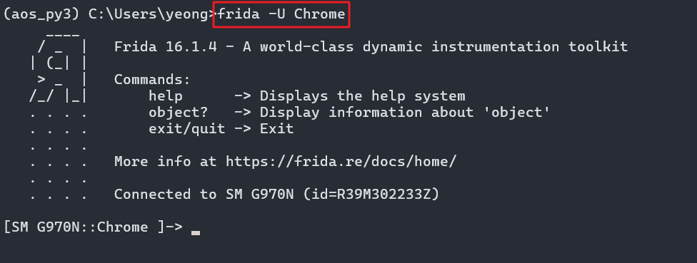


2. 애플리케이션 프로세스 시작되기 전 JS 삽입

- 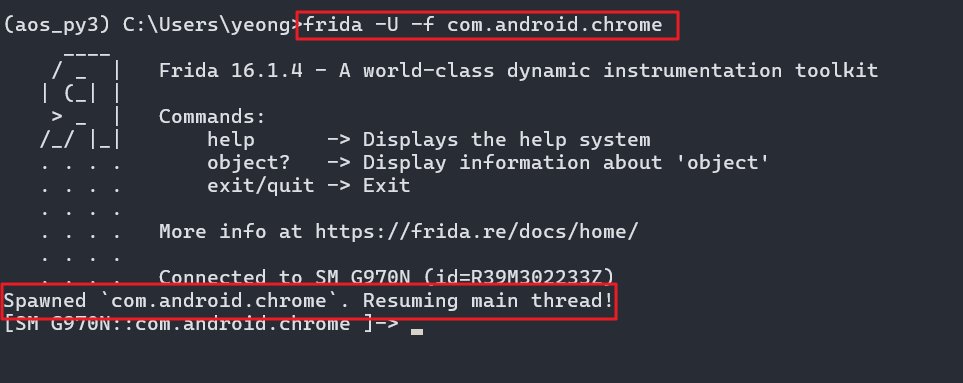


`-f` 옵션을 통해 프로세스가 메인 스레드 시작되기 전 상태를 다룰 수 있으며 현재 크롬 프로세스가 정상 spawn (Frida가 앱을 직접 실행) 되어 있는 상태이다.

예전에는 메인 스레드가 시작되기 전, 대기 상태가 오래되면 Frida 연결이 죽는 경우가 생겨 

해당 문제를 해결하기 위해 해당 프로세스 메인 스레드를 실행시키는 명령어를 입력하여  resume 상태를 유지하거나

- 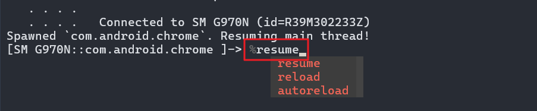


또는 처음부터 메인 스레드를 시작하는 명령어를 입력해 이를 방지했는데

- 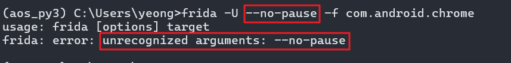


위 이미지에서 볼 수 있듯 해당 옵션은 사라졌고 기본 `-f` 옵션 연결 시 자동으로 resuming main thread 상태가 된다.

- 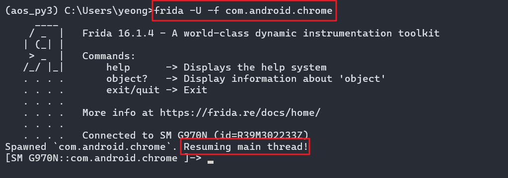

---

### 4.2 JS API 사용을 통한 Frida 명령어 사용

메인 스레드 시작 전 상태로 붙은 뒤(-f) 해당 쉘에서 TAP 키를 누르면 사용 가능한 명령어나 JS API 확인이 가능하고
- 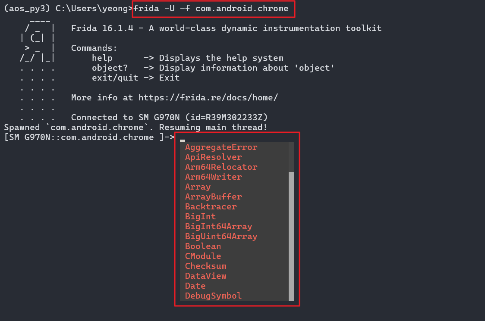


단말기 안드로이드 버전 확인이 가능한 자바스크립트 API를 사용해 본다.

- Java.androidVersion

- 

또한 로드된 클래스들을 출력하는 명령 코드를 출력 가능함

- 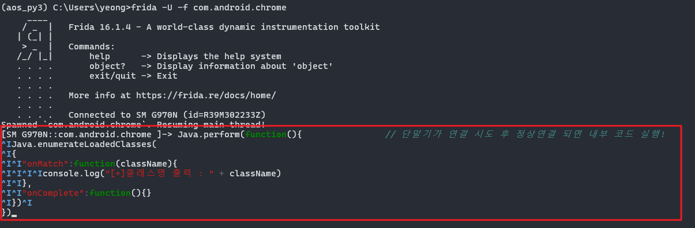

이 방식으로 코드를 작성하는 방법은 효율성과 정확성이 좋지 않으므로 별도의 JS 파일을 작성 후 로드해 사용하자

---

### 4.3 onResume함수 후킹


- 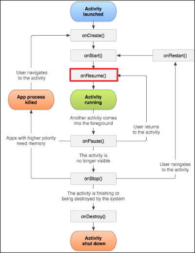

안드로이드의 생명주기 흐름에서 onResume은 앱을 실행하고 상호 작용 가능한 상태. 예를 들어
- 앱이 화면 최상단으로 돌아올 때 (onPause → onResume)
- 홈버튼 누르고 앱 재진입
- 등등

일 경우 안드로이드 시스템이 호출하는 함수이다. 개발자는 구현만 하고, 호출은 시스템이 책임짐

해당 함수를 후킹해본다

1. 먼저 후킹하려는 함수 onResume 의 클래스를 알아야 함

- 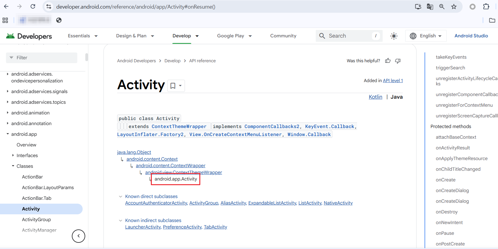

https://developer.android.com/reference/android/app/Activity#onResume()

안드로이드 개발자 사이트에 들어가서 

onResume() 함수는 android.app.Acitivity 클래스 확인

2. 코드 작성

```javascript
Java.perform(function(){
	var hook_resume = Java.use("android.app.Activity")
	hook_resume.onResume.implementation = function() {
		console.log("[+] onResume() 가 호출 되었습니다!"); // 여기까지만 작성하면 onResume의 역할이 console.log만 출력되고 끝나기 때문에 
		this.onResume();  // 이 부분을 입력해 줘야 앱이 우리가 변경한 부분이 비정상적인 로직임을 판단하지 못하고 기존의 함수 로직이 이어서 실행된다.
	}
})
```


3. 코드 로드

- 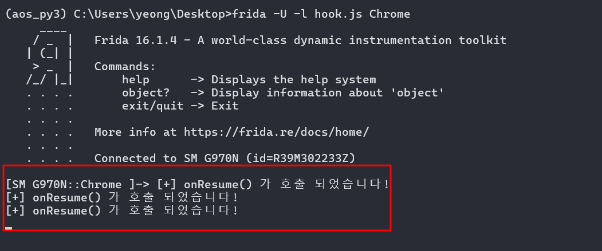

앱 기동된 상태에서 onResume() 호출을 위해 홈버튼 누르고 앱 재진입할 때마다 호출 로그가 출력이 된다.

안드로이드 앱 생명주기에서 확인할 수 있듯 앱이 

onPause() -> onStop()-> onRestart() ->onStart() -> onResume()로 반복 기동될 때마다 onResume가 정상 호출된다.


---

### 4.4 android.view.View 클래스 후킹

위에서 onResume 함수에 대해 클래스 객체를 반환하는 Java.use API 함수 재작성을 함

이번에는 Java.choose API 함수를 사용하여 인스턴스화된 객체를 찾아본다.

인스턴스화된 객체를 찾는 코드에서 다룰 클래스는 android.view.View 를 대상으로 함


1. 힙에서 인스턴스화된 android.view.View 객체 찾기

```js
Java.perform(function() {  // Java.perform: Dalvik VM 완전 로드될 때까지 대기 (안전장치)
  Java.choose("android.view.View", { // Java.choose: 지정 클래스 *모든 인스턴스* 검색
    onMatch: function(instance) {  // instance를 찾으면...
      console.log("🔍 발견된 인스턴스: " + instance.toString()); // 인스턴스 정보 출력
    },
    onComplete: function() { // 모든 인스턴스 검색 완료 시 호출
      console.log("✅ 모든 View 인스턴스 검색 완료!");
    }
  });
});
```

- 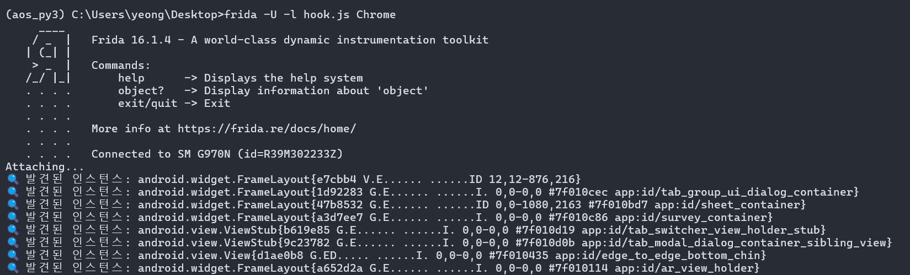

각각의 인스턴스가 어떤 값, 정보를  가지고 있는지 확인 가능함


---


## 5. Python Binding

후킹 코드를 별도 JS 파일로 저장하여 해당 파일을 Frida에서 load 하여 사용하는 방식 외에도 Python 코드 실행으로 아래와 같은 기능 구현 가능함

### 5.1 Python Binding 기본 뼈대
기본 Python 코드의 뼈대 구조는 아래와 같다

```python
# frida, sys 모듈 가져오기
import frida, sys

# 삽입할 자바스크립트 코드 넣기
jscode = """payload_code"""

# frida를 시작하고 USB 장치의 특정 패키지 프로세스 연결
session = frida.get_use_device().attach("com.package.name")

# jscode에 있는 스크립트 코드를 frida에서 사용할 수 있도록 생성
script = session.create_script(jscode)

# 생성한 script 로드
script.load()

# script가 동작하기 전에 종료되는 문제 예방
sys.stdin.read()
```

`-f(spawn)` 방식의 Python 코드의 뼈대 구조는 아래와 같다.

```javascript
// frida를 시작하고 USB 장치에 연결
device = frida.get_usb_device(timeout=10)

// 연결된 USB 장치에서 com.package.name 프로세스 생성 (이 때 메인 스레드는 시작되지 않은 상태여야 한다)
pid = device.spawn(["com.package.name"])

// com.package.name 프로세스 연결
session = device.attach(pid)

// jscode에 있는 스크립트 코드를 frida에서 사용할 수 있도로고 생성
script = session.create_script(jscode)

// 생성한 script를 로드 (앱의 메인 스레드가 실행 전인 상태이다)
script.load()

// com.package.name 프로세스 메인 스레드 실행
device.resume(pid)

// script가 동작하기 전에 종료되는 문제 예방
sys.stdin.read()
```


**주의. `frida.get_usb_device()` 와 같이 Frida 버전이 올라가면서 인자 값으로 timeout 미설정 시 연결이 끊기면서 device not found 에러가 발생한다.**
올바른 사용법 : `frida.get_usb_device(timeout=10)`


### 5.2 추가 바인딩 코드 예

```python
import frida, sys, os

jscode= """
setImmediate(function(){
	Java.perform(function() {
		console.log("[*] System.exit() 후킹을 시작합니다.");
		var exitBypass = Java.use("java.lang.System");
		exitBypass.exit.implementation = function () {
			console.log("[*] Hooking Success");
		};
	});
})
"""

# 실제 안드로이드 기기와 ADB 연결 시 포트 포워딩 설정
device_id = '127.0.0.1:62001'
os.system("adb forward tcp:27042 tcp:27042")  # Frida Server와 통신할 수 있게 포트 포워딩

# 실제 기기의 Frida 서버에 연결 (Frida server 기기에서 실행 중이어야 함)
session = frida.get_remote_device(timeout=3).attach("com.package.name")

# 후킹 스크립트를 로드하고 실행
script = session.create_script(jscode)
script.load()

# 표준 입력을 유지 → 스크립트 종료 방지
sys.stdin.read()
```

device_id 변수에 지정할 디바이스 아이디 입력 후 os.system 명령어로 adb 명령어를 실행하여

Frdia 기본 포트로 포트포워딩 하면 지정된 디바이스로 연결됨!


### 5.3 메시지 처리하기

JS 파일에서 메시지를 처리할 때 주로 console.log 함수를 사용했는데

파이썬 바인딩에서는 send 함수를 사용한다.


send 함수는 메시지를 파이썬 스크립트로 전달하여 데이터를 처리하는데 수집한 데이터를 모았다가 원하는 구문을 분석하고

필요한 정보만 지정, 출력이 가능하다.

`send(message [,data])`

- Frida 스크립트 → Python으로 메시지 전송

`script.on('message', on_message)`

- 프리다 스크립트에서 보낸 메시지를 처리할 콜백 함수를 설정

`on_message(message, data)`

- `script.on('message', on_message)`에서 등록한 핸들러에 대한 정의를 하는 부분 
- 단순히 message 매개변수를 콘솔에 출력하는 역할

 
```python
import frida, sys

def on_message(message, data):
    """Frida 스크립트에서 send()로 보낸 메시지를 콘솔에 출력하는 콜백 함수"""
    print(message)  # message: {'type': 'send', 'payload': '실제 메시지 내용'}

jscode = """
setImmediate(function(){
    Java.perform(function(){
        var Activity = Java.use("android.app.Activity");  
        
        // onResume() 메서드 후킹
        Activity.onResume.implementation = function() { 
            // 1. Python으로 메시지 전송 (send 함수 사용)
            send("[+] send 함수 실습! onResume() 함수가 호출되었습니다!");   

            // 2. 원본 onResume() 호출 (앱 정상 동작 유지)
            this.onResume();     
        }
    })
});
"""
process = frida.get_usb_device(timeout=10).attach("Chrome") # Chrome 앱에 Frida 연결
script = process.create_script(jscode) # Frida 스크립트 객체 생성
script.on('message', on_message) # 메시지 수신 콜백 등록 (script.on('message', 핸들러))
script.load()
sys.stdin.read()
```

- 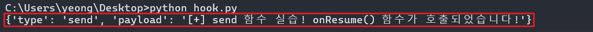

json 형식으로 출력이 되는데 send로 보낸 데이터가 payload 키의 값으로 담겨 전송이 되는 것을 볼 수 있다.

이번에는 코드를 수정해 원하는 내용만 출력 되도록 작성한다.


```python
import frida, sys

def on_message(message, data):
    if message['type'] == 'send':   # message 값의 type이 send이면 message 중 payload를 출력
        print(message['payload'])
    else:                  # type이 send가 아니면 그냥 message 출력
        print(message)

jscode = """
setImmediate(function(){     
    Java.perform(function(){   
        var Activity = Java.use("android.app.Activity");  
        Activity.onResume.implementation = function() { 
            send("[+] send 함수 실습! onResume() 함수가 호출 되었습니다!")   
            this.onResume();     
        }
    })
});
"""

process = frida.get_usb_device(timeout=1).attach("Chrome")
script = process.create_script(jscode)
script.on('message', on_message) 
script.load()
sys.stdin.read()
```

- 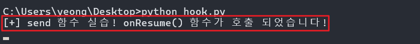


---


