# FRIDA LAB


FridaLab은 Ross Marks가 만든 Frida 연습 놀이터로 


총 8개의 문제로 구성되어 있으며 각 문제는 다음과 같다.

> (1) Change class challenge_01's variable 'chall01' to 1
> - 클래스 challenge_01의 변수 chall01을 1로 변경하기 
> - 하드코딩 된 변수를 변경하는데 목적이 있음

> (2) Run chall02()
> - Chall02() 메서드 실행하기
> - 사용하지 않는 메서드를 어떻게 불러와 실행시킬 것인가?

> (3) Make chall03() return true
> - chall03() 메서드 true 반환하게 만들기
> - 함수 반환 값 수정 (implementation)

> (4) Send ＂frida＂ to chall04()
> - chall04() 메서드에 frida 문자열 전송하기 
> - 함수에 전달되는 인수 값 수정 후 전송 (일회성)

> (5) Always send "frida" to chall05()
> - chall05() 메서드에 frida 문자열 항상 전송하기 
> - 함수에 전달되는 인수 값 수정 후 전송 (항시)

> (6)Run chall06() after 10 seconds with correct value
> - 올바른 값으로 10초 후 chall06() 메서드 실행하기 
> - 라이브 변수 조작

> (7) Bruteforce check07Pin() then confirm with chall07()
> - chall07Pin() 메서드를 브루트포스 해서 chall07() 메서드로 확인하기

> (8) Change 'check' button's text value to 'Confirm'
> - check 버튼의 텍스트를 Confirm으로 변경하기
> - 화면 출력 데이터 변조

---


### Frida LAB 환경구성

1. https://rossmarks.uk/blog/fridalab/  에서 apk 파일 다운로드
2. 다운로드 받은 apk 파일을 안드로이드 단말기 내로 이동 후 apk 설치 진행
3. https://github.com/skylot/jadx/releases/ 에서 jadx 디컴파일 도구 설치

jadx 디컴파일 도구의 경우  Frida로 후킹(변조) 하고 싶은 포인트가 어느 부분인지 확인하려면 진단할 앱(apk 파일)이

어떤 클래스를 가지고 있고 어떤 구조로 이루어져 있는지 파악이 필요하며 이를 위한 디컴파일 작업이 요구된다.

디컴파일러 도구는 jd-gui 디컴파일러를 사용하기도 하지만 jd-gui 는 dex2jar라는 도구로 중간 dex 파일을 jar 파일로 추가 변환해야 하는 작업을 진행해야 하기 때문에 번거로운 반면

jadx 디컴파일러는 dex2jar로 변환 작업 없이 APK 파일 넣어도 디컴파일이 진행되며 리소스 부분도 동시에 확인이 가능해 APK를 처음 분석하는 사람도 쉽게 사용이 가능하다.


- 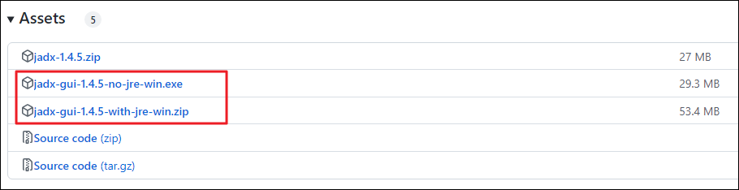


호스트 윈도우에 jre가 설치되어 있으면 no-jre을, jre가 없는 경우 with-jre를 다운로드하면 되는데

jre가 설치되어 있지 않아도 포터블로 이용이 가능하기 때문에 no-jre-win.exe 버전 다운!


---


### 문제 1 ~ 5

#### 문제 1

- 

challenge_01 클래스 내 chall01 변수를 1로 변경하면 

getChall01Int 메서드 호출 시 chall01(1) 값이 리턴되는 구조!

문제 해결을 위해 간단히 getChall01Int 함수(메서드)의 리턴 값을 변경해도 

문제는 풀리는데 문제의 의도는 challenge_01 클래스의 변수로 변경하는 방식으로 접근한다.

static 메서드는 클래스 레벨이므로 Java.use API 을 사용한다


```javascript
Java.perform(function() {
  // static 메서드를 찾을때는 Java.use API!!    
  var targetClass = Java.use("uk.rossmarks.fridalab.challenge_01");

    targetClass.chall01.value = 1;
    console.log("변경된 chall01 값 : " + targetClass.chall01.value);
  }
);
```
- 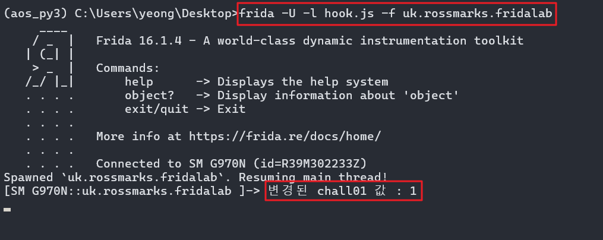

---

#### 문제 2

Chall02() 메서드는 다른 곳에서는 사용되지 않는 메서드이며 Frida 를 통해서만 실행할 수 있다.


- 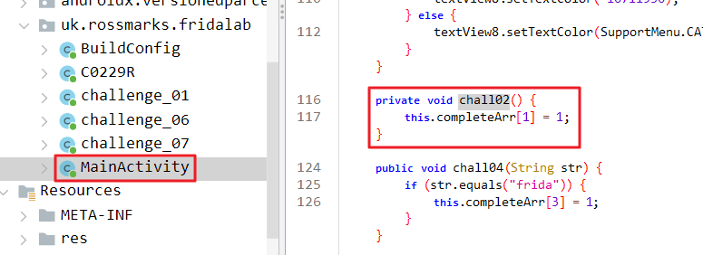

chall02() 메서드는 MainActivity 클래스 내 있음

⚠️

해당 메서드는 static 키워드가 없는 Instance 메서드임

Instance 메서드를 호출하기 위해서는 Instance 된 객체를 찾아 사용해야 한다.

Instance화 된 객체를 찾을때는 Java.choose 라는 API 함수를 사용한다.

```javascript
Java.perform(function() { 
  Java.choose("uk.rossmarks.fridalab.MainActivity", {  // Java.choose: 지정 클래스 *모든 인스턴스* 검색

    onMatch: function(instance) { // 해당 클래스 매칭이 되면
     instance.chall02(); // 타겟 메서드 호출
    },
    onComplete: function() {
        console.log("\n[+] 2번 문제 해결 완료!");
    }
  });
});
```

- 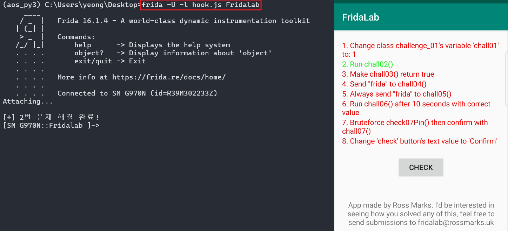

해결완료

참고로
instance 메서드를 Java.use로 호출하면
```javascript
setImmediate(function(){
	Java.perform(function(){
		var instance_call_test = Java.use("uk.rossmarks.fridalab.MainActivity")
			instance_call_test.chall02();
	})
})
```
- 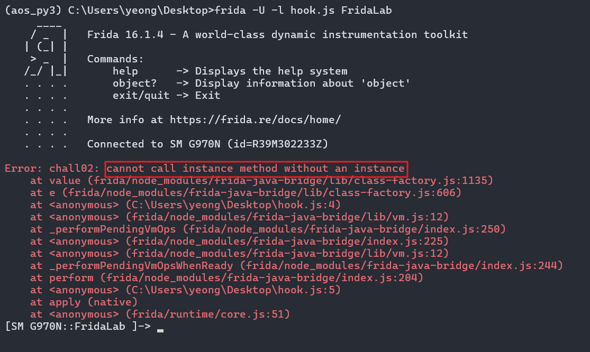

instance 메서드를 불러올 수 없다며 에러가 발생한다!

---
#### 문제 3

- 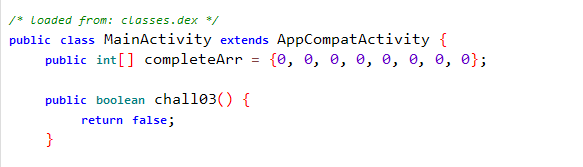

현재 chall03() 의 리턴값은 false 이다. true로 변조하면 된다.

본 문제는 chall03() 메서드를

호출하는 것이 아닌

반환 값만 변경하는 문제이며


⚠️

반환 값만 바꾸고, 메서드를 새로 호출하지 않을 때는 원래 호출 흐름(MainActivity 등) 그대로 두고, 

해당 메서드의 implementation만 하면 되므로 Java.use 사용이 가능하다

만약 chall03() 메서드를

직접 호출하고 싶을때는 해당 메서드가

static으로 선언된 메서드가 아니기 때문에

Java.choose를 사용해야 한다.


```js
Java.perform(function() {
  var targetClass = Java.use("uk.rossmarks.fridalab.MainActivity");
    targetClass.chall03.implementation = function(){
        console.log("\n[+] 리턴 값 true 변경");
        return true;
    }
  }
);
```

- 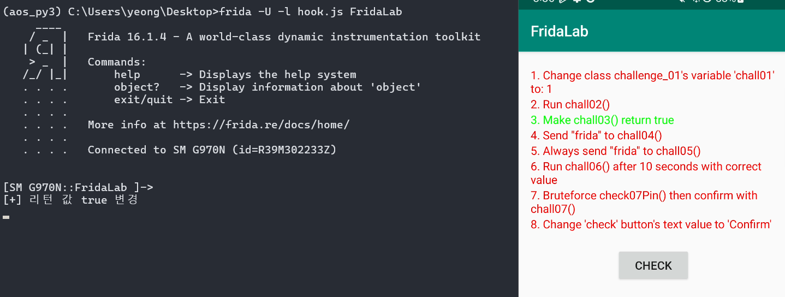

해결완료

---

#### 문제 4

함수에 전달되는 인수 값 수정 후 전송 (일회성) 해야하는 문제이다

- 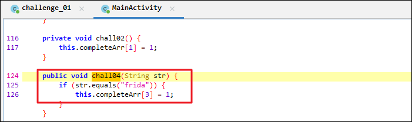


인자 값으로 string을 받는데

입력된 값이 frida 면 문제가 해결!

chall04라는 메서드를 호출할때

인자값으로 frida라는 문자열을

넣어주면 된다!


해당 함수는 static이라는 명시가 없기 때문에

Java.choose API를 사용한다.

```js
setImmediate(function(){
	Java.perform(function(){
		Java.choose("uk.rossmarks.fridalab.MainActivity", { // 타겟 클래스 지정
			onMatch : function(Instance){  // 타겟 클래스에 매칭되는 인스턴스를 찾는다면..
				console.log("\n[+] frida string을 보냅니다!")
                Instance.chall04("frida"); // frida 로 인수 값을 지정
			},
			onComplete : function() {
				console.log("\n[+] 4번 문제 해결!!");
			}
		})
	})
})
```
- 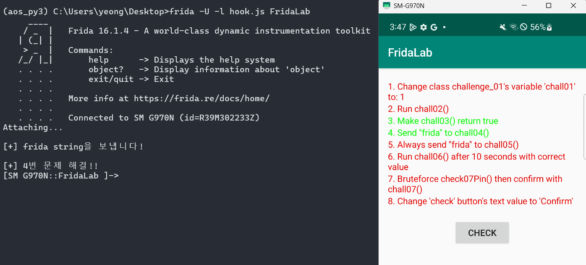

해결 완료

---

#### 문제 5

4번 문제는 frida라는 문자열을

한 번이라도 전송하면 문제가 해결되었지만

해당 문제는 항상 전송이 되어야 한다!

- 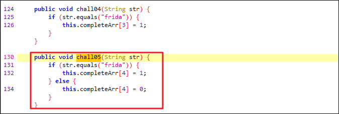

4번과 로직은 동일한데 else 문이 추가되면서 한 번이라도 전송이 안되면 다시 0(빨간색)으로 돌아온다!

MainActivity 클래스의 객체를 받아와 chall05 메서드를 재작성 해주면 되는데

this.chall05() API를 사용하여 기존의 chall05 메서드가 가진 행위를 하게 하면서 해당 인자 값에 원하는 문자열을 넣어준다.

한 마디로 내부 로직은 기존에 짜여진 대로 정상적으로 타게 하면서 chall05 메서드가

실행될때마다 우리가 임의로 넣어준 인자 값 frida가 들어가도록 세팅!

인스턴스를 사용하는 것이 아닌 기존의 메서드(함수)를 재작성(=아예 변경) 하는 것이기 때문에 Java.use를 사용한다!

```js
setImmediate(function(){
    Java.perform(function() {
            var targetClass = Java.use("uk.rossmarks.fridalab.MainActivity");
            targetClass.chall05.implementation = function(){
               this.chall05("frida"); // 원래의 chall05 함수를 호출하지만 무조건 frida 문자열을 인자받기로 설정함
                console.log("\n[+] 05번 문제 해결!")
            }
        }
    );
})
```
- 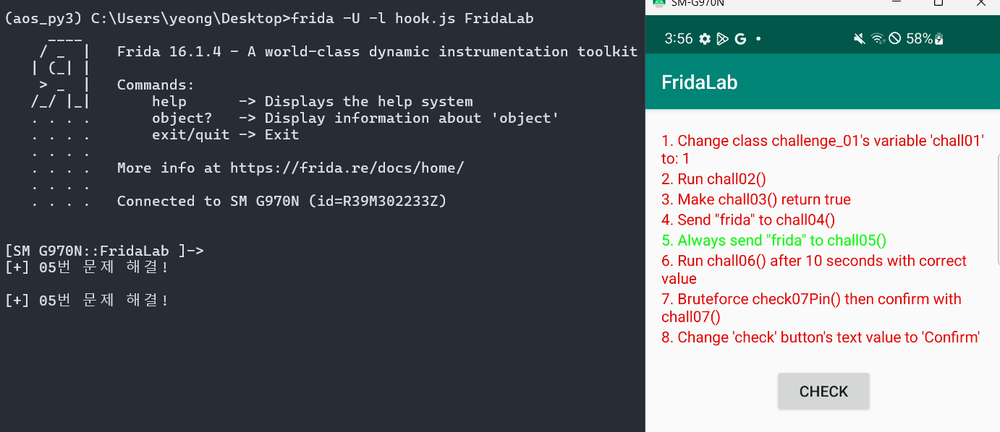

해결 완료


⚠️
여기서 궁금한 점이 생김

chall05은 Instance 함수이지만 Java.use 재작성(아예 변경)을 통해 해결!

- 그렇다면 chall04 도 Java.use 로 해결하면 안 됨?? 
  - chall04 테스트 시 `Java.use` 재작성하여 안에서 `this.chall04("frida"); console.log("TEST");` 으로 했을 때
    `"TEST"`가 출력되지 않음!
  - 즉 Chall04 함수는 앱에서 호출하는 순간이 단 한 번도 없다는 걸 알 수 있음!
  - Java.use로 함수 재정의해도 앱에서 호출을 단 한번도 하지 않으므로 애초에 재정의된 함수가 실행될 일이 없음
  - 그래서 chall04는 해당 클래스의 인스턴스를 찾아서 `Java.choose` 의 `instance.chall04("frida")`를 직접 호출한거임
- 반대로 Chall05 는 Java.choose로 해결하면 안 됨??
  - chall05는 앱이 이미 정상 호출해주는 메서드이므로 강제 호출보다는 Java.use 후킹이 더 자연스럽고 로직도 덜 꼬인다
  - 따라서 chall05와 같은 경우에는 Java.use 후킹이 적합함


---


### 문제 6 ~ 8


#### 문제 6

올바른 값으로 10초 후 chall06() 메서드 실행하기 : 라이브 변수 조작  문제이다


- 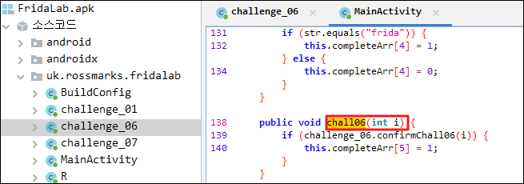

chall06 메서드에 어떤 정수형 값을 주면

if 문 내 challenge_06 클래스 내

confirmChall06(i) 메서드 값이

참이 나오면서 문제가 해결되는데

- 

confirmChall06 함수를 보면
`i == chal06 && System.currentTimeMillis() > timeStart + 10000;`
- 1. i 값과 chall06 값이 같으면서
- 2. 메서드가 시작된 지(startTime()) 10초가 지나면 참!


해결방안
1. setTimeout(fn, delay) API 함수 사용
  - delay에 시간을 주면(10000ms)해당 시간이 지난 후 fn에 작성한 로직이 실행이 됨 
  - setTimeout(function(){}, 10000);
2. confirmChall06 메서드를 항상 true가 반환되도록 설정 후 MainActivity 인스턴스를 활용하여 chall06을 호출하면 문제 해결됨!
3. chall06을 호출할 때는 int형 인자 값을 받음. 인자 상관없이 항상 true 반환되도록 설정할거므로 아무 숫자나 넣어주면 됨!


```js
setTimeout(function(){   // System.currentTimeMillis() > timeStart + 10000; 을 우회하기 위함
    console.log("\n[+] 10초가 지나 프로그램을 실행합니다!");  // 위에서 시작시간을 설정해 주었고 10초가 지나면 해당 로그가 뜬다.
    setImmediate(function(){
        Java.perform(function(){

            // MainActivity의 '실제 메모리에 올라와 있는 인스턴스'를 찾기 위해 사용
            // → 앱이 생성해 둔 액티비티 객체를 그대로 써서 chall06(1)을 호출하려는 목적
            Java.choose("uk.rossmarks.fridalab.MainActivity", {
                onMatch: function(instance) {
                    // Java.use를 사용하여 confirmChall06()가 어디서 호출되더라도 항상 true를 반환하도록 함수 로직 아예 바꿈.
                    const chall_06 = Java.use("uk.rossmarks.fridalab.challenge_06");
                    chall_06.confirmChall06.implementation = function () {
                        console.log("\n[+] 6번 문제 해결!");
                        return true;
                    }

                    // 위에서 찾은 MainActivity 인스턴스의 chall06(1)을 호출
                    // → 정상 앱 흐름을 그대로 타면서, 후킹된 confirmChall06() 결과(true)를 사용하게 됨
                    instance.chall06(1);
                },
                onComplete: function() {}
            });
        })
    })
}, 10000); // 2번째 인자인 10초 설정
```

- 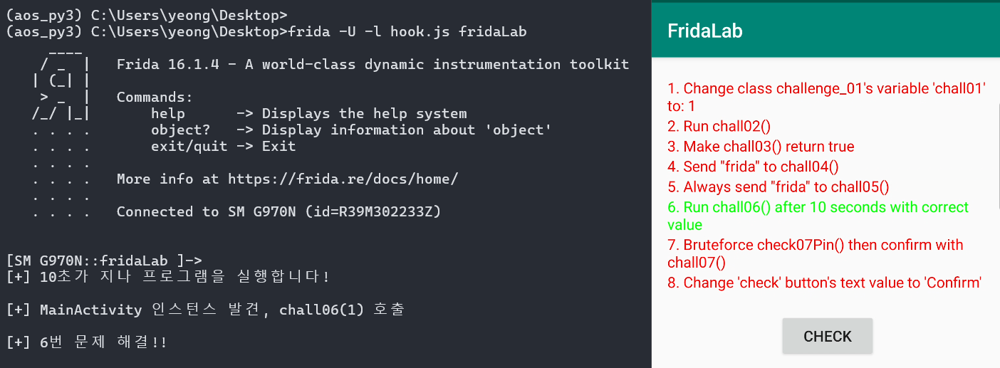


---

#### 문제 7

chall07Pin() 메서드를 브루트 포스 해서 chall07() 메서드로 확인하기
- 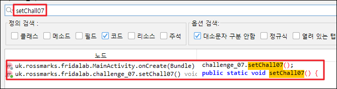
- 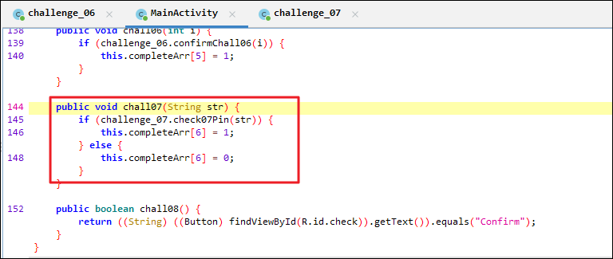
- 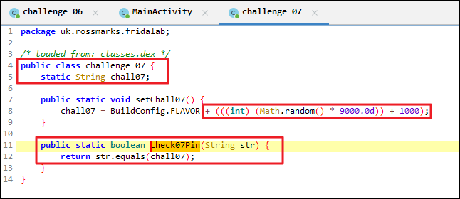


0~8999 + 1000

실 범위 = 1000 ~ 9999

```javascript
setImmediate(function(){
    Java.perform(function(){
        
        var targetClass = Java.use("uk.rossmarks.fridalab.challenge_07");

        // Java.choose :
        //  - 실제 메모리에 존재하는 MainActivity 인스턴스를 찾아오기 위해 사용
        //  - 앱이 생성해 둔 액티비티 객체에 대해 chall07(pin)을 정상 흐름대로 호출하려는 목적
        Java.choose("uk.rossmarks.fridalab.MainActivity",{
            onMatch : function(instance){
                for (var i = 9999; i >= 1000; i--) {
                    var pin = String(i);                          // 숫자 → 문자열 변환
                    if (targetClass.check07Pin(pin)) {            // check07Pin()이 true를 반환하는지 확인
                        console.log("\n[+] chall07 pin 값 :" + pin);
                        instance.chall07(pin);                    // 찾은 핀 값을 MainActivity 인스턴스에 전달
                        break;
                    }
                }
            },
            onComplete : function(){
                console.log("\n[+] 7번 문제 해결!");
            }
        });
    });
});
```
- 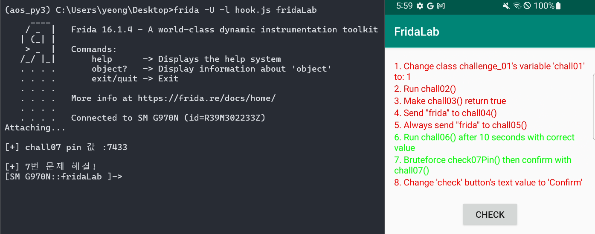

---

#### 문제 8

화면 내 CHECK 버튼 글씨를 CONFIRM으로 바꿔라!

- 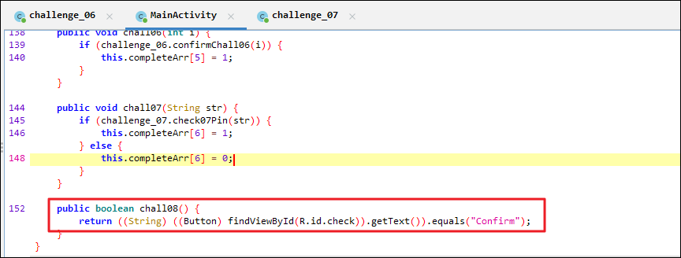
- 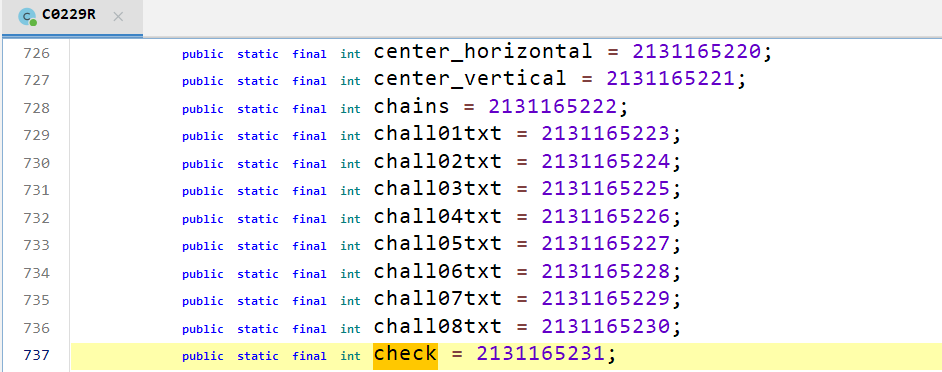

2131165231의 16진수 표현 : `0x7f07002f`


```js
setImmediate(function () {
  Java.perform(function () {

    // MainActivity의 실제 인스턴스를 찾아서 처리
    Java.choose("uk.rossmarks.fridalab.MainActivity", {
      onMatch: function (activity) {

        // android.widget.Button 클래스 래핑
        var Button = Java.use("android.widget.Button");

        // findViewById(리소스 ID)로 CHECK 버튼 뷰 얻기
        var checkView = activity.findViewById(0x7f07002f);

        // View → Button 으로 캐스팅
        var checkButton = Java.cast(checkView, Button);

        // "Confirm" 문자열 객체 생성 후 버튼 텍스트로 설정
        var JString = Java.use("java.lang.String");
        checkButton.setText(JString.$new("Confirm"));
      },

      onComplete: function () {
        console.log("\n[+] 8번 문제 해결!");
      }
    });

  });
});
```
- 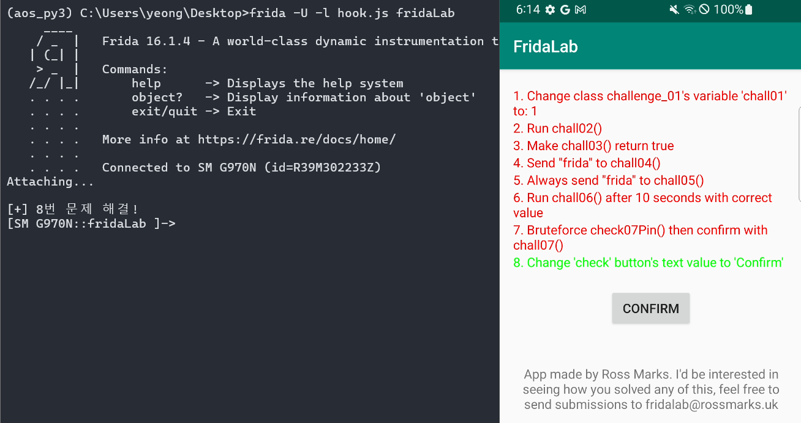


---