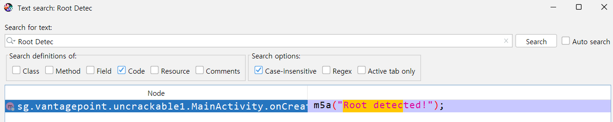
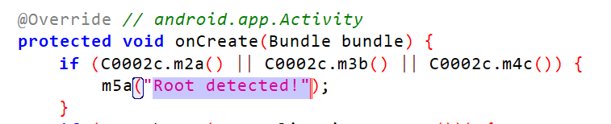
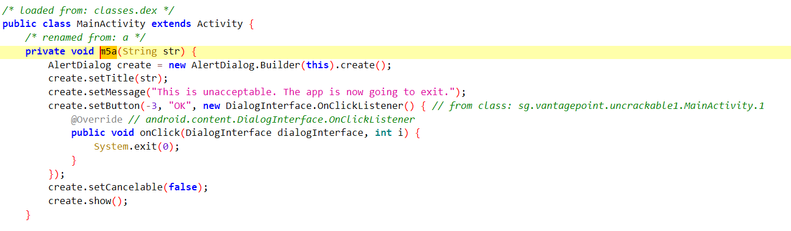
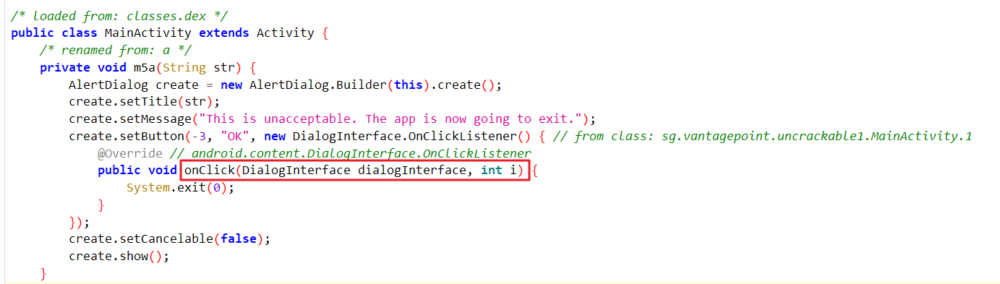
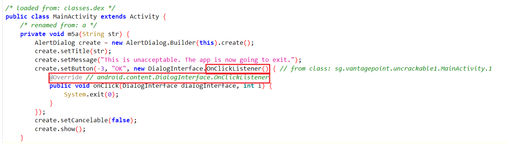
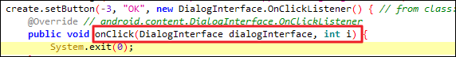
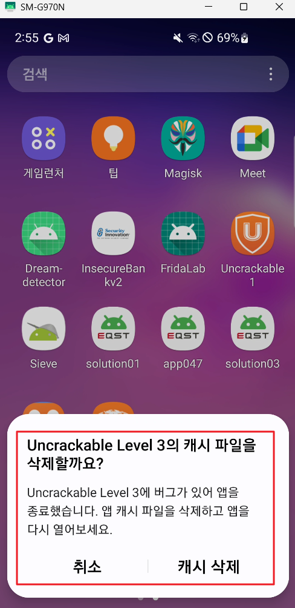
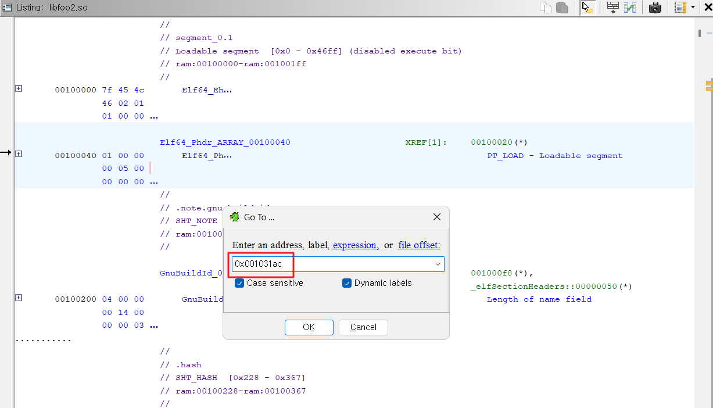
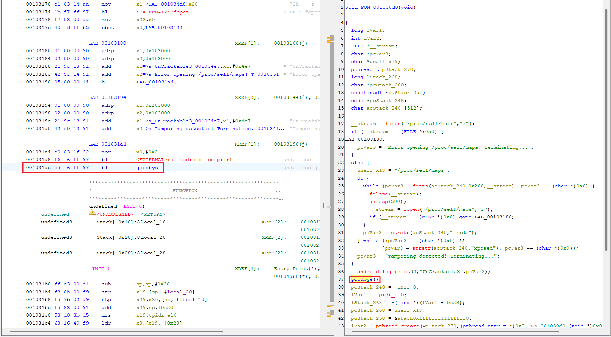

실습에 사용할 앱은

OWASP에서 배포한

UnCrackable이라는 앱으로


앱 보안 진단 입문용으로 매우

유용하게 사용할 수 있는 앱!

https://github.com/OWASP/mastg/blob/master/Crackmes/Android/Level_01/UnCrackable-Level1.apk APK 파일 다운로드


---

1. 루팅 탐지 로직 확인

- 

Root detected! 가 출력되며 OK 버튼 클릭 시 앱 종료됨

힌트가 되었던 문구를 찾아 살펴보면

- 

- 

MainActivity 클래스 내부

onCreate 메서드 내부에서

m5a 라는 메서드를 호출하면서

인자 값으로 루팅 탐지 문자열을

전달하고 있다.

- 

같은 MainActivity 클래스 내부에

m5a라는 메서드가 존재하며

m5a 메서드 인자 값으로

String str을 받고 있다.

str에 탐지 시 뜨는 문구를 볼 수 있고

앱 종료 시까지 작동 방식 확인이 가능하다.

---


### 아이디어 1

시스템 종료 함수 onClick 메서드를 후킹 해

OK 버튼을 눌러도 앱이 종료되지 않도록

만든다.

- 


현재 onClick은 OnClickListetner()를 통해

내부에서 만들어지고 OnClickListener는

android.content.DialogInterface.OnClickListener

클래스로 불러온다.

- 

android.content.DialogInterface.OnClickListener

클래스가 무엇인지 검색해 보면

- 


public 메서드로 기본적으로 제공되며

동일한 폼으로 작성되어 있는데

- 


특이한 점은 해당 클래스는 클래스가 아닌

'인터페이스'라는 점!


- 


```js
setImmediate(function(){
	Java.perform(function(){
		var targetClass = Java.use("sg.vantagepoint.uncrackable1.MainActivity");
        targetClass.onClick.implementation = function(arg, arg2){ // onClick 현재 인자값 2개 있음
			console.log("[+] Exit 방지 성공!");
		}
	})
})

```

- 

프리다 공식 API에서

해당 인터페이스를 다루는 기능이

없는 것으로 보여 애러가 발생!


따라서 해당 방법은 실패!

---

### 아이디어 2

- 

onClick 실행 시 System.exit가

실행되지 않도록 한다.

System 메서드는 java.lang.System에서

가져오는 메서드.

- 

```js
setImmediate(function(){
	Java.perform(function(){
		var exitBypass = Java.use("java.lang.System");
		exitBypass.exit.implementation = function () {  // function (arg) 받아도 상관 없음
			console.log("[*] 루팅 탐지 후킹 성공!");
		}
	})
})
```
- 

루팅 탐지 우회 가능 확인

