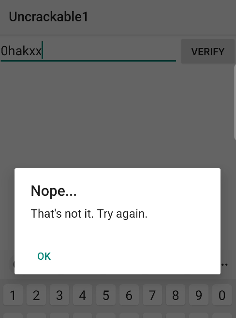
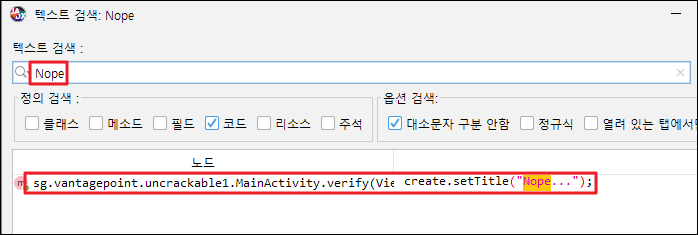
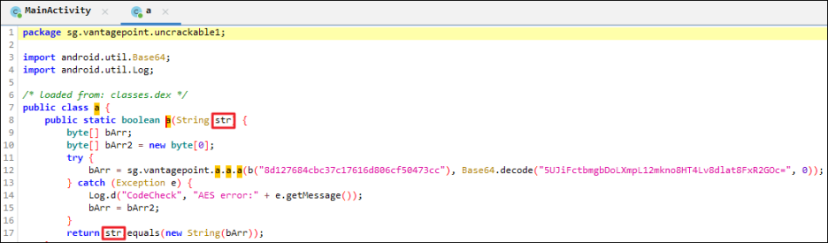
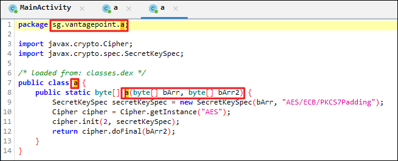
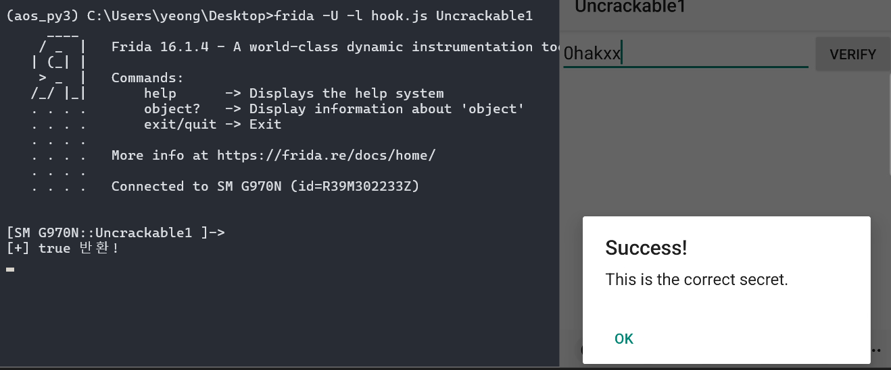

데이터나 입력 후

VERIFY를 누르면

- 

에러가 발생!

해당 검증을 우회해야 한다.

- 
- 

a 클래스 확인
- 


암호화 로직 확인
- 


---

### 방안 1

a 메서드 로직을 후킹해

내부 로직을 모두 삭제 후

항상 return true가 반환 되도록 실행!

```js
setImmediate(function(){
	Java.perform(function(){
        // 루팅 우회 로직
		var exitBypass = Java.use("java.lang.System");
		exitBypass.exit.implementation = function (arg) {
			console.log("[*] 루팅 탐지 후킹 성공!");
		}
        
        // 인증 우회 로직
		var always_true = Java.use("sg.vantagepoint.uncrackable1.a");
		always_true.a.implementation = function(arg){
			console.log("\n[+] true 반환!");
			return true;
		}
	})
})
```

- 

우회 성공

---

### 방안 2

- 

a 메서드라는 복호화 로직 확인

기존 함수 호출하여 복호화된 String 값을 탈취 진행


```js
setImmediate(function(){
    Java.perform(function(){
        var exitBypass = Java.use("java.lang.System");
        // 루팅 우회 로직
        exitBypass.exit.implementation = function (arg) {
            console.log("[*] 루팅 탐지 후킹 성공!");
        }

        var decryptClass = Java.use("sg.vantagepoint.a.a");
        decryptClass.a.implementation = function(arg1, arg2){
            var secret_string = this.a(arg1, arg2);
            console.log("\n[+] Secret String ASCII 값 :"+ secret_string + "\n");
            var secret_S = ''     // 한줄 출력을 위해 추가해줌
            for(var i=0; i<secret_string.length; i++){
                secret_S += String.fromCharCode(secret_string[i])
            }
            console.log("[+] ASCII 복호화 값은 : " + secret_S);
            return secret_string;
        }
    })
})
```

- 

복호화 값 확인 I want to believe

- 

