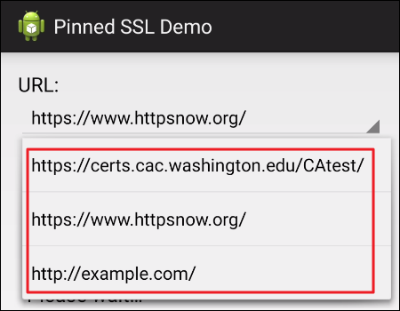

클라이언트가 SSL/TLS 암호화 통신에 사용하는 인증서를 최종 서버의 인증서로 고정(Pinning) 하는 방식을

HPKP(HTTP Public Key Pinning)라 하고 HSTS(HTTP Strict Transport Security는 강제 HTTPS로만 접속을 의미)


서버에서 제공하는 인증서로만 통신할 수 있도록 고안된 SSL Pinning은

SSL 통신에서 취약하다고 알려져 있는 중간자 공격(MITM)을 방지할 수 있는데


클라이언트가 최종 서버의 인증서를 Pinning(고정) 하면 통신 과정에서 클라이언트 측에 저장된

신뢰할 수 있는 특정 인증서와 서버가 제공하는 인증서를 비교 후 일치하지 않으면 연결이 중단되며

클라이언트 측의 요청은 서버로 전송되지 않는다.

프록시 도구(Burp Suite 등)로 SSL Pinning이 적용된 클라이언트에서 보내는 패킷은 중간에서 가로챌 수 없다

현재 대부분의 모바일 뱅킹 앱에는 SSL Pinning이 적용되어 있어 SSL 통신을 보호하고 있는데


이를 우회하지 않으면 패킷 변조 등의 항목 진단이 불가능해 곤란을 겪을 수 있다.


---

1. 환경구성

https://github.com/smuldr/android-ssl-pinning 에서 apk 파일 다운로드 후 안드로이드 기기 내 apk 설치 

테스트 URL이 3개 존재하며

- 

Pinning 적용 및 해제가 가능함

- 

---

smuldr.sslpin.PinnedSSLContextFactory 클래스
```java
package smuldr.sslpin;

import android.util.Log;
import java.io.IOException;
import java.io.InputStream;
import java.security.KeyManagementException;
import java.security.KeyStore;
import java.security.KeyStoreException;
import java.security.NoSuchAlgorithmException;
import java.security.cert.Certificate;
import java.security.cert.CertificateException;
import java.security.cert.CertificateFactory;
import javax.net.ssl.SSLContext;
import javax.net.ssl.TrustManager;
import javax.net.ssl.TrustManagerFactory;

/* loaded from: classes.dex */
public class PinnedSSLContextFactory {
    private static final String TAG = "PinnedSSLContextFactory";

    public static SSLContext getSSLContext(InputStream input) {
        try {
            Certificate ca = loadCertificate(input);
            KeyStore keyStore = createKeyStore(ca);
            TrustManager[] trustManagers = createTrustManager(keyStore);
            return createSSLContext(trustManagers);
        } catch (KeyManagementException e) {
            Log.e(TAG, "Failed to initialize SSL Context", e);
            return null;
        } catch (KeyStoreException e2) {
            Log.e(TAG, "Failed to get key store instance", e2);
            return null;
        } catch (CertificateException e3) {
            Log.e(TAG, "Failed to create certificate factory", e3);
            return null;
        }
    }

    private static Certificate loadCertificate(InputStream input) throws CertificateException {
        CertificateFactory cf = CertificateFactory.getInstance("X.509");
        return cf.generateCertificate(input);
    }

    private static KeyStore createKeyStore(Certificate ca) throws KeyStoreException {
        try {
            String keyStoreType = KeyStore.getDefaultType();
            KeyStore keyStore = KeyStore.getInstance(keyStoreType);
            keyStore.load(null, null);
            keyStore.setCertificateEntry("ca", ca);
            return keyStore;
        } catch (IOException e) {
            Log.e(TAG, "Could not load key store", e);
            return null;
        } catch (NoSuchAlgorithmException e2) {
            Log.e(TAG, "Could not load key store", e2);
            return null;
        } catch (CertificateException e3) {
            Log.e(TAG, "Could not load key store", e3);
            return null;
        }
    }

    private static TrustManager[] createTrustManager(KeyStore keyStore) throws KeyStoreException {
        try {
            String tmfAlgorithm = TrustManagerFactory.getDefaultAlgorithm();
            TrustManagerFactory tmf = TrustManagerFactory.getInstance(tmfAlgorithm);
            tmf.init(keyStore);
            return tmf.getTrustManagers();
        } catch (NoSuchAlgorithmException e) {
            Log.e(TAG, "Failed to get trust manager factory with default algorithm", e);
            return null;
        }
    }

    private static SSLContext createSSLContext(TrustManager[] trustManagers) throws KeyManagementException {
        try {
            SSLContext context = SSLContext.getInstance("TLS");
            context.init(null, trustManagers, null);
            return context;
        } catch (NoSuchAlgorithmException e) {
            Log.e(TAG, "Failed to initialize SSL context with TLS algorithm", e);
            return null;
        }
    }
}
```


후킹 포인트는 여러 가지가 있을 수 있는데

그중에서 가장 복잡한 smuldr.sslpin.PinnedSSLContextFactory 클래스의 PinnedSSLContextFactory 클래스 내

getSSLContext 메서드 4가지를 변조해 본다.

---

SSL 통신 시 클라이언트 인증서 사용 순서는

1. 클라이언트 인증서 로드 >
2. 로드한 클라이언트 인증서를 이용해 keyManager 만듦 >
3. 로드한 클라이언트 인증서 이용해 TrustManager 만듦 >
4. KeyManager, TrustManager를 이용해 SSLContext 생성

```js
setTimeout(function(){
	Java.perform(function(){
		// 01. 첫 번째 메서드 - loadCertificate (사용하려는 인증서 load)
		var CertificateFactory = Java.use("java.security.cert.CertificateFactory");
		var cf = CertificateFactory.getInstance("x.509");
		
		var FileInputStream = Java.use("java.io.FileInputStream");  // java에서 기본적으로 사용하는 파일 입출력 인풋스트림
		var fileInputStrem = FileInputStream.$new("/data/local/tmp/cert-der.crt"); // instance화 시켜줌
		var ca = cf.generateCertificate(fileInputStrem);
		console.log("\n[+] 1. 버프 인증서 정상 loading 완료!");
		
		// 02. 두 번째 메서드 - CreateKeyStore (키 매니저 생성)
		
		var KeyStore = Java.use("java.security.KeyStore");
		var keyStoreType = KeyStore.getDefaultType();
		var keyStore = KeyStore.getInstance(keyStoreType);
		keyStore.load(null, null);
		keyStore.setCertificateEntry("ca", ca);
		console.log("[+] 2. 키 매니저 생성 완료!");
		
		// 03. 세 번째 메서드 - createTrustManager (트러스트 매니저 생성) < 자격증명, 신뢰 결정 매니저
		var TrustManagerFactory = Java.use("javax.net.ssl.TrustManagerFactory");
		var tmfAlgorithm = TrustManagerFactory.getDefaultAlgorithm();
		var tmf = TrustManagerFactory.getInstance(tmfAlgorithm);
		tmf.init(keyStore);
		var tmf_get = tmf.getTrustManagers();
		console.log("[+] 3. 트러스트 매니저 생성 완료!\n\n[+] 앱에서 SSL PINNING 체크 후 request를 요청하세요! ");
		
		
		// 04. 네 번째 메서드 - createSSLContext 생성
		var SSLContext = Java.use("javax.net.ssl.SSLContext");
		SSLContext.init.implementation = function(a, b, c){
				SSLContext.init.call(this, a, tmf_get, c); // 기존에 작성된 코드 재 호출, 버프 인증서를 무조건 호출! call 메서드를 실행해 다른 새로운 객체의 init 메서드를 실행한다.
				console.log("\n\n[+] SSL Pinning 정상 우회 성공!!");
		}
	})
})
```

코드 작성 후
단말기 내 버프 인증서(시스템 인증서)를 /data/local/tmp 경로에 cert-der.crt 이름으로 생성해 줘야 한다.


---


참고로

프리다 없이 인증서를 변조하려는 경우

해당 앱이 무결성 검증을 하지 않는다는 가정하에

정상적으로 우회가 가능할 수 있다.
 