### 0.환경설정

https://mas.owasp.org/crackmes/ 에서 Uncrackable level2.apk 설치 후 진행


---

### 1. 루팅 탐지 우회


#### Step 1. 루팅/디버거 탐지 로직 파악

MainActivity 내에 onCreate 부분을 보면 루팅 탐지하는 알림 창을 띄우는 기능이 존재함

- 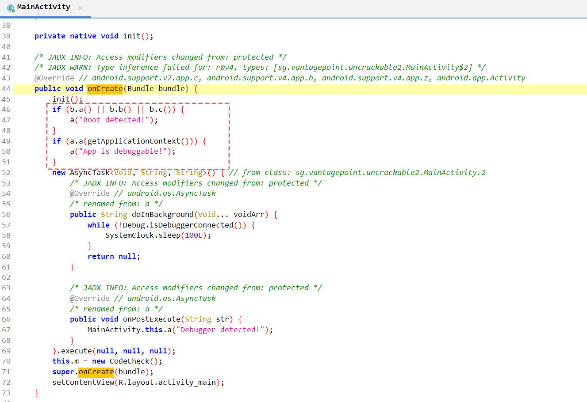

루팅 탐지, 디버거 탐지 로직이 있음을 확인함

루팅 및 디버거 탐지 시 a 라는 메서드에 탐지 문자열을 인자로 설정하여 호출하는 것을 알 수 있음

- 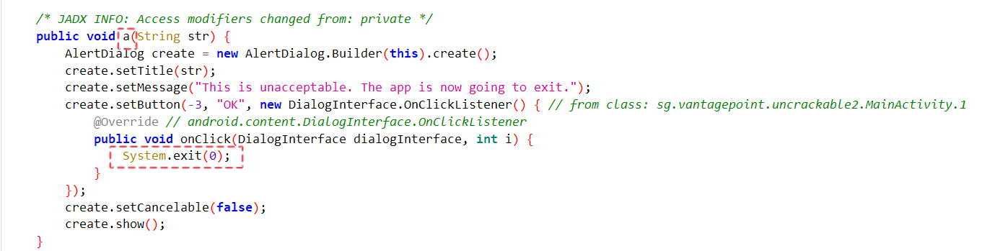

같은 MainActivity 클래스 내

a 메서드 확인 시 전달받은 문자열(String str) 을 화면에 띄운 후 exit 호출하여 앱 종료하는 로직임을 알 수 있음

루팅 탐지 우회를 위해서 함수를 종료시키는 exit() 함수를 후킹하거나, 

exit 함수를 호출하는 MainActivity.a 함수를 후킹하면 됨


#### Step 2. 후킹 코드 작성 및 실행

참고로 a 함수를 후킹 시 a 함수는 2개가 되어 있어서 Frida 가 어느 함수를 후킹할지 모르기 때문에

```text
1) a(java.lang.String)
2) a(sg.vantagepoint.uncrackable2.MainActivity, java.lang.String) 
```

원하는 건 1번에 해당하는 함수


```js
// MainActivity.a 함수를 후킹하는 방법
Java.perform(function() {
    var targetClass = Java.use("sg.vantagepoint.uncrackable2.MainActivity");
    targetClass.a.overload('java.lang.String').implementation = function(param) {
        // 아무 동작 하지 않고 전달받은 인자 출력만 하는 기능으로 수정함
        console.log("현재 전달받은 인자는 " + param);
    }
});
```
```js
// System.exit() 함수를 후킹하는 방법
Java.perform(function() {
    var System = Java.use('java.lang.System');
    System.exit.overload('int').implementation = function(param1){
        console.log("hooking exit function ");
    }
});
```
둘 중 하나의 코드로 우회 가능하다


- 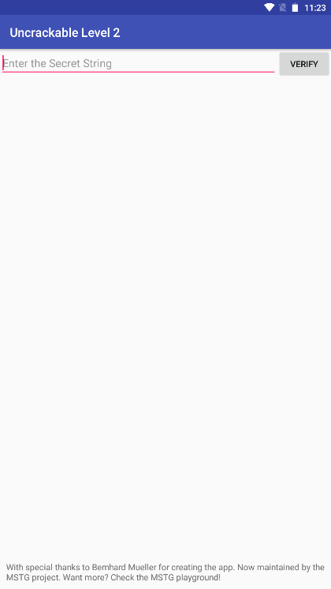

루팅/디버깅 루팅 탐지 메시지가 나오지 않고 종료되지 않음을 확인함

---

### 2. Secret 값 알아내기


#### Step 1. 로직 파악

Secret값이 무엇인지 알아내기 위해 MainActivity에 검증 메서드를 확인한다

- 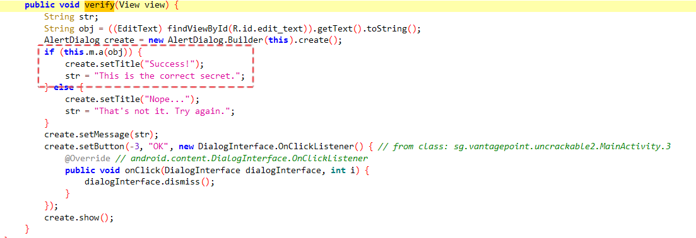
- 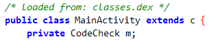


this.m.a(obj) 함수가 True를 반환하면 Success가 출력되도록 된다.

이때 m 은 CodeCheck 클래스의 객체임을 알 수 있음

```js
Java.perform(function() {
    var targetClass = Java.use("sg.vantagepoint.uncrackable2.MainActivity");
    targetClass.a.overload('java.lang.String').implementation = function(param) {
        // 아무 동작 하지 않고 전달받은 인자 출력만 하는 기능으로 수정함
        console.log("현재 전달받은 인자는 " + param);
    }
    var targetClass2 = Java.use("sg.vantagepoint.uncrackable2.CodeCheck");
    targetClass2.a.overload('java.lang.String').implementation = function() {
        return true;
    }
});
```

CodeCheck 의 a 메서드 반환 값 변조 후킹을 하면 검증 우회는 가능함.

그러나 Secret 값을 알아내기 위해 추가 분석한다.

CodeCheck의 a 메서드를 확인해본다

- 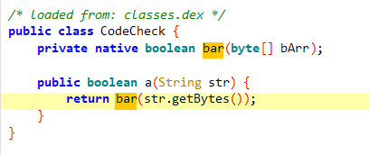

CodeCheck 의 a 메서드는 사용자가 입력한 String 값을 byte형식으로 변환해서 bar 메소드로 넘겨준다.

bar 함수는 바로 위에 정의가 되어있으며 내용은 아무것도 없다. 

`private native boolean bar(byte[] bArr);`

bar 메소드의 modifier을 살펴보면 native라는 것이 보인다. 


이는 JNI(Java Native Interface)로 자바코드에서 다른 언어들로 작성된 라이브러리를 호출하거나 반대로 호출되게 하는 프레임워크이다.


> ※ JNI(Java Native Interface)
JNI는 자바 가상 머신(JVM)위에서 실행되고 있는 자바코드가 네이티브 응용 프로그램(하드웨어와 운영 체제 플랫폼에 종속된 프로그램들) 그리고 C, C++ 그리고 어샘블리 같은 다른 언어들로 작성된 라이브러리들을 호출하거나 반대로 호출되는 것을 가능하게 하는 프로그래밍 프레임워크이다.


> ※ NDK(Native Development Kit)
NDK는 Android에서 C 및 C++ 코드를 사용할 수 있게 해주는 일련의 도구 모음입니다.


안드로이드에서 NDK를 사용하기 위해서는 so 파일을 load 시켜주는 과정이 꼭 필요로 한다.

그렇다면 bar 메서드가 어느 라이브러리에서 사용하는 함수인지 확인이 필요하다


- 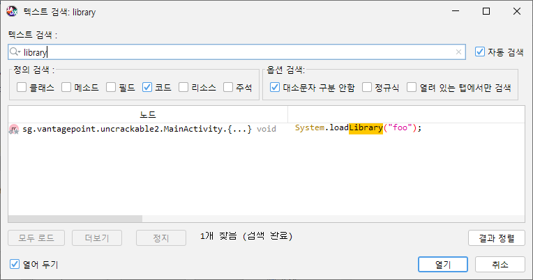
- 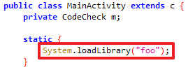

library 검색 시 외부 라이브러리 사용하는 것은 foo 라이브러리만 사용하는 것을 알 수 있다

즉, libfoo.so 파일에서 bar라는 메소드가 정의되어 있으며 해당 메소드에서 이리저리 처리되고 반환 값만 Java 단으로 retrun 해주는 형식이다.


---

#### Step 2. 라이브러리 추출 

> apk 파일의 확장자를 zip 으로 바꾼 뒤 압축 해제하면 lib 폴더 내 라이브러리 추출이 가능하다


단말기의  OS bit를 확인한다.


`getprop ro.product.cpu.abi`

- 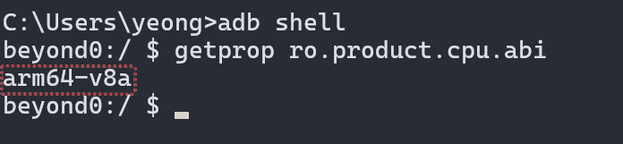

lib 폴더 내 단말기 OS에 맞는 폴더로 이동한 뒤 libfoo.so 파일을 Ghidra 나 IDA 으로 분석 진행하면 된다

---

#### Step 3. 라이브러리 파일 분석

찾고자 하는 Java_sg_vantagepoint_uncrackable2_CodeCheck_bar가 정의되어 있으며

- 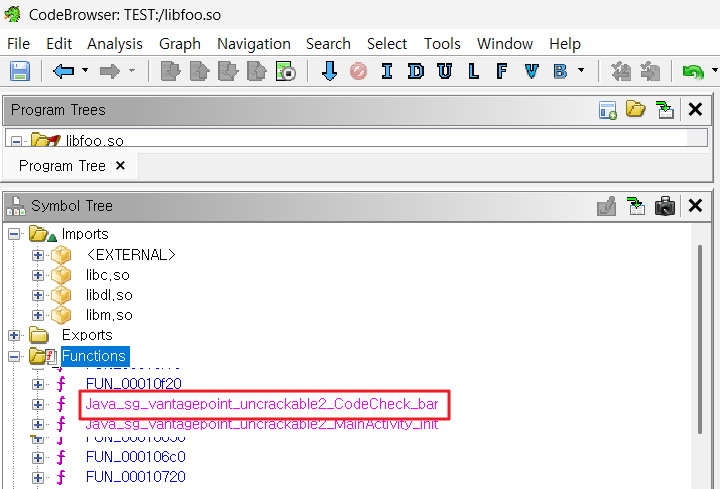

Java_sg_vantagepoint_uncrackable2_CodeCheck_bar 함수를 더블 클릭하여 확인한다.


- 

로직 설명은 생략하고

결국에는 사용자 입력 값이 23 글자(`0x17u`는 16 진수로 10진수로 바꾸면 23)인지 확인한 뒤에

사용자 입력 값과 secret String 값을 strncmp 함수를 통해 같은지 검증 중이라면

strncmp 을 후킹해서 어떤 값이 인자로 들어오는지만 알면 Secret String 을 알 수 있다.


- 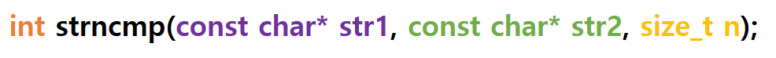

strncmp 함수의 시그니처 정의다

비교할 대상과 비교할 값의 순서는 모르지만 첫 번째 인자 args[0], 두 번째 인자 args[1] 알면 된다

나는 23 글자 01234567890123456789012 를 입력할 것이므로 아래와 같이 코드를 작성함

> ⚠️ 참고로 아래 코드에서 if 문을 사용하지 않으면 libfoo.so 라이브러리 파일 내에 모든 strncmp 함수를 로그 출력하므로 조건문을 만듦.

> ⚠️ indexOf 를 사용하는 이유는 메모리에서 문자열이 있는지 검사할 떄는 정확한 일치인 == 보다, 메모리에 포함되어 있는지 검사하는 indexOf를 사용하는게 훨씬 정확함


```js
Java.perform(function() {
    var targetClass = Java.use("sg.vantagepoint.uncrackable2.MainActivity");

    // 루팅 탐지 우회
    targetClass.a.overload('java.lang.String').implementation = function(param) {
        console.log("현재 전달받은 인자는 " + param);
        // 원래 함수가 하던 '종료' 동작을 하지 않도록 비워둠
    }

    Interceptor.attach(Module.findExportByName("libfoo.so", "strncmp"), {
        onEnter: function(args) {
            var p1 = Memory.readUtf8String(args[0]);
            var p2 = Memory.readUtf8String(args[1]);
            // 내가 입력한 값이 01234567890123456789012 가
            // 첫 번째 인자든 두 번째 인자든 포함되어 있으면 출력, (둘 중 어디에 들어올지 모르니까)
            if ((p1.indexOf('01234567890123456789012') !== -1) || (p2.indexOf('01234567890123456789012') !== -1)) {
                console.log("\n[!] strncmp match found!");
                console.log("Arg1 (Input or Secret): " + p1);
                console.log("Arg2 (Input or Secret): " + p2);
            }
        },
        onLeave: function() {}
    })
});
```


- 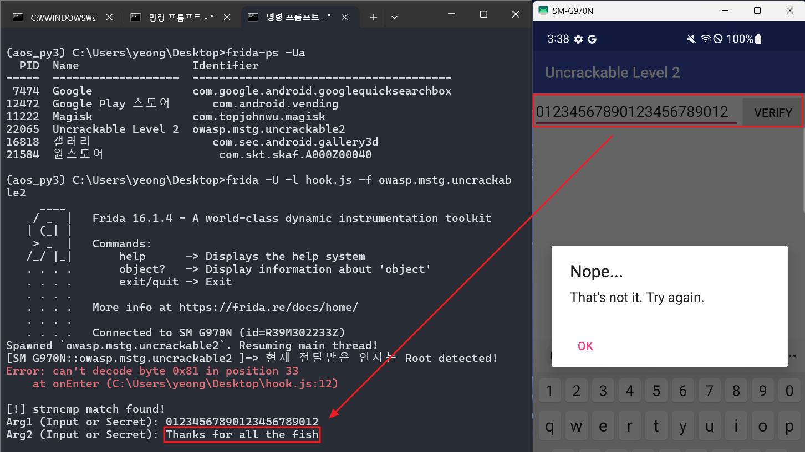


