### 0.환경설정

https://mas.owasp.org/crackmes/ 에서 Uncrackable level3.apk 설치 후 진행


---

### 1. 솔루션 탐지 우회


#### Step 1. 로직 파악


- 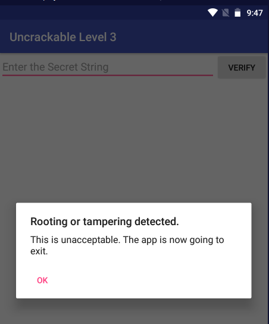

루팅 탐지 중인 것을 확인함


- 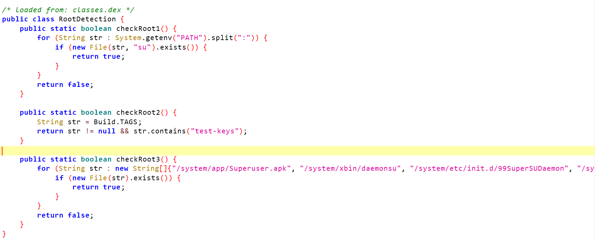

checkRoot1 메서드는 환경변수에 등록된 파일 중 su가 존재하는지 확인하여 루팅 여부를 판단 

checkRoot2 메서드는 테스트키가 등록되어 있는지 확인하여 루팅 여부를 판단

checkRoot3 메서드는 루팅된 환경에서만 사용되는 알려진 패키지, 파일들이 존재하는지 확인하여 루팅 여부를 판단

우회를 위해 코드를 작성함

```js
Java.perform(function () {
    var java_lang_System = Java.use('sg.vantagepoint.util.RootDetection');
    java_lang_System.checkRoot1.implementation = function () {
        if (this.checkRoot1()) { console.log("[*] CheckRoot1 is bypassed"); } return false;
    }
    java_lang_System.checkRoot2.implementation = function () {
        if (this.checkRoot2()) { console.log("[*] CheckRoot2 is bypassed"); } return false;
    }
    java_lang_System.checkRoot3.implementation = function () {
        if (this.checkRoot3()) { console.log("[*] CheckRoot3 is bypassed"); } return false;
    }
});
```

후킹하여 실행 시 

- 

단말기에서 확인 시 앱이 정상적인 종료가 아니라 완전히 종료됨

또한

- 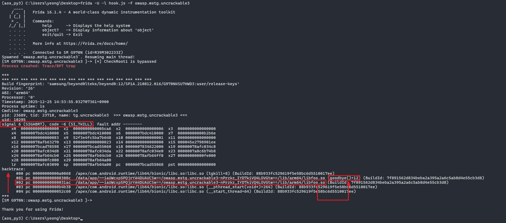

프리다에서 로그 확인 시 보면

`signal 6 (SIGABRT), code -6 (SI_TKILL)` 

이 크래시는 앱이 일부러 자기 자신을 죽인 것이고, 정상 종료랑 완전히 다르다

👉 의도적으로 크래시 발생하는 방법으로 전형적인 anti-debug / anti-frida 트램폴린


/lib/arm64/libfoo.so 라이브러리 파일의 `0x000031ac` 에서 goodbye() 함수를 실행시킨 것으로 보인다.


---

#### Step 2. so 파일 분석

libfoo.so 파일을 분석하기 위해 

> apk 파일의 확장자를 zip 으로 바꾼 뒤 압축 해제하면 lib 폴더 내 라이브러리 추출이 가능하다


단말기의  OS bit를 확인한다.


`getprop ro.product.cpu.abi`

- 

lib 폴더 내 단말기 OS에 맞는 폴더로 이동한 뒤 libfoo.so 파일을 Ghidra 나 IDA 으로 분석 진행하면 된다


- 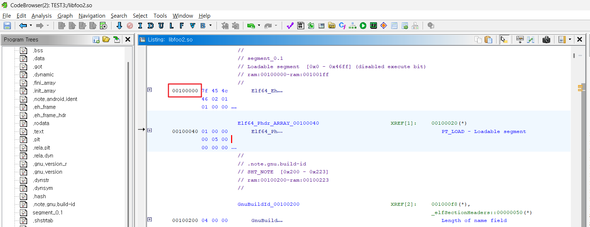

Ghdira의 코드 브라우저의 최상단에 가면 `0x00100000` 부터 시작하는 것을 알 수 있는데 기준 주소이다

내가 찾고자하는 주소 `0x000031ac`는 상대주소이니 기준 주소 + 상대주소 = `0x00100000` + `0x000031ac` = `0x001031ac` 이다


- 

대문자 G 단축키 > `0x001031ac` 으로 이동하면

- 

goodbye() 함수를 호출하는 부분으로 이동이 가능함

우측 디컴파일 창의 코드를 분석하면 대강 아래와 같다.

```text
※ 아래의 소스코드에 대한 라인 별 설명

17 라인 : 변수 __stream에 /proc/self/maps 파일을 읽기 권한으로 읽어드린다.
18 라인 : 파일을 읽어드리는데 실패하면 "Error opening /proc/self/maps! Terminating..." 문구를 pcVar1에 저장한다.
24 라인 : __stream에서 최대 0x200(512)바이트까지의 문자열을 읽어서 acStack_238 버퍼에 저장한다.
25 라인 : fget() 함수로 문자열을 성공적으로 읽은 경우 반복문을 중단한다.
36 라인 : acStack_238 문자열에서 "frida" 패턴을 찾은 경우 반복문을 종료한다.
39 라인 : acStack_238 문자열에서 "xposed" 패턴을 찾은 경우 더이상 반복하지 않는다.
40 라인 : "Tampering detected! Terminating..." 문구를 pcVar1에 저장한다.
43 라인 : pcVar1에 저장된 문구를 "UnCrackable3" 태그로 "INFO" 레벨의 로그로 출력한다.
45 라인 : 프로그램을 종료시키기위해 _exit(0) 코드를 사용하는 goodbye() 함수를 호출한다.
```


즉, frida, xposed 탐지 로직이며

방안은 2가지 정도로 생각할 수 있다.

1. strstr 함수에 후킹을 걸어 frida, xposed 문자열을 찾았을 때 반환 값을 0으로 변조하여 탐지 기능을 우회, strstr 함수는 표준 라이브러리 중 하나인 libc.so 내에 존재함
2. fopen 함수에 후킹을 걸어 /proc/self/maps 파일 대신 /proc/self/stat 파일을 분석하도록 하여 탐지 기능을 우회


1번의 방법으로 우회 코드를 작성한다

기존의 RootDetection 클래스의 checkRoot1,2,3 후킹 코드를 추가한 한 최종 우회 코드는 아래와 같다.

```js
Java.perform(function () {
    var java_lang_System = Java.use('sg.vantagepoint.util.RootDetection');
    // checkRoot1 메서드를 우회
    java_lang_System.checkRoot1.implementation = function () {
        if (this.checkRoot1()) {
            console.log("[*] CheckRoot1 is bypassed");  // checkRoot1이 호출된 경우 우회 로그 출력
        }
        return false;  // 루팅이 감지되었다고 가정하고 false를 반환하여 루팅 검사를 우회
    }
    // checkRoot2 메서드를 우회
    java_lang_System.checkRoot2.implementation = function () {
        if (this.checkRoot2()) {
            console.log("[*] CheckRoot2 is bypassed");  // checkRoot2가 호출된 경우 우회 로그 출력
        }
        return false;  // 루팅이 감지되었다고 가정하고 false를 반환하여 루팅 검사를 우회
    }
    // checkRoot3 메서드를 우회
    java_lang_System.checkRoot3.implementation = function () {
        if (this.checkRoot3()) {
            console.log("[*] CheckRoot3 is bypassed");  // checkRoot3가 호출된 경우 우회 로그 출력
        }
        return false;  // 루팅이 감지되었다고 가정하고 false를 반환하여 루팅 검사를 우회
    }
    
    var x = false;
    
    // 예제 1: 'libc.so'의 'strstr' 함수 훅킹
    Interceptor.attach(Module.getExportByName('libc.so', 'strstr'), {
        onEnter: function (args) {
            // 'strstr' 함수에서 첫 번째 인자(haystack)를 읽어들임 (검색할 큰 문자열)
            var haystack = Memory.readUtf8String(args[0]);
            
            // haystack 문자열에 'frida' 또는 'xposed'가 포함되어 있는지 검사
            if(haystack.indexOf('frida') !== -1 || haystack.indexOf('xposed') !== -1){
                x = true;  // 'frida'나 'xposed'를 찾으면 플래그를 설정
            }
        },
        onLeave: function (retval) {
            // 만약 'frida'나 'xposed'를 찾은 경우, 반환값을 수정하여 해당 문자열을 찾지 못하게 만듬
            if(x){
                retval.replace(0);  // strstr이 찾을 수 없게 하여 후속 코드가 정상적으로 실행되지 않도록 함
            }
        }
    });
});
```

- 

루팅 및 Frida, Xposed 탐지 우회 성공!


---

참고로 위에서 로그를 통해 어디서 frida 를 탐지하는지 확인하였다.

이 방법 말고도 Frida 코드를 통해 어디서 Frida 탐지를 하는지 알 수 있는 방법이 있다.

```js
Java.perform(function() {
    // "strstr" 함수가 호출될 때 후킹을 시작
    Interceptor.attach(Module.findExportByName(null, "strstr"), {
        onEnter: function(args) {
            // 첫 번째 인자로 전달된 파일 이름을 읽어옵니다 (strstr 함수의 두 번째 인자).
            this.file_name = args[1].readCString();
            
            if (/frida/i.test(this.file_name)){
                console.warn("str: ", this.file_name); // 경고 메시지 출력 (frida 관련 파일이 발견된 경우)

                // 현재 스레드의 백트레이스를 출력하여 함수 호출 경로를 추적합니다.
                console.log(Thread.backtrace(this.context, Backtracer.ACCURATE).map(DebugSymbol.fromAddress).join('\n\t'));
            }
        }
    });
});

```


- 


libfoo.so 파일의 0x3144 == 0x00003144(상대 주소) 에서 frida 문구를 비교하는 것을 알 수 있다

Ghidra에서의 0x00100000는 (기준주소)


`0x00100000는 (기준주소)` + `0x00003144(상대 주소)` = `0x00103144` 을 찾으면 된다

- 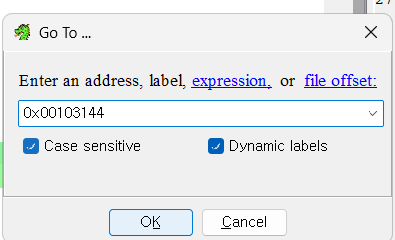

대문자 G 단축키 > `0x00103144` 으로 이동하면

- 

해당 위치에서 frida 문자 비교하는 곳으로 이동하여 로직을 분석 가능하다.

---


### 2. Secret String 값 알아내기

- 
- 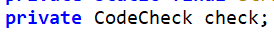

사용자 입력 값이 사전에 정의된 입력한 값과 같은지 check 객체의 check_code 메서드로 검증 중이며

check 객체는 CodeCheck 이다.

- 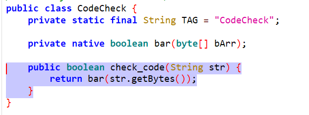

검증 메서드인 check_code 는 내부의 native bar 함수를 호출하여 리턴 받는 것을 알 수 있다.

라이브러리에 존재하는 bar 함수를 분석하기 위해 아래처럼 라이브러리 추출하여 분석 진행한다.


> apk 파일의 확장자를 zip 으로 바꾼 뒤 압축 해제하면 lib 폴더 내 라이브러리 추출이 가능하다


단말기의  OS bit를 확인한다.


`getprop ro.product.cpu.abi`

- 

lib 폴더 내 단말기 OS에 맞는 폴더로 이동한 뒤 libfoo.so 파일을 Ghidra 나 IDA 으로 분석 진행하면 된다


- 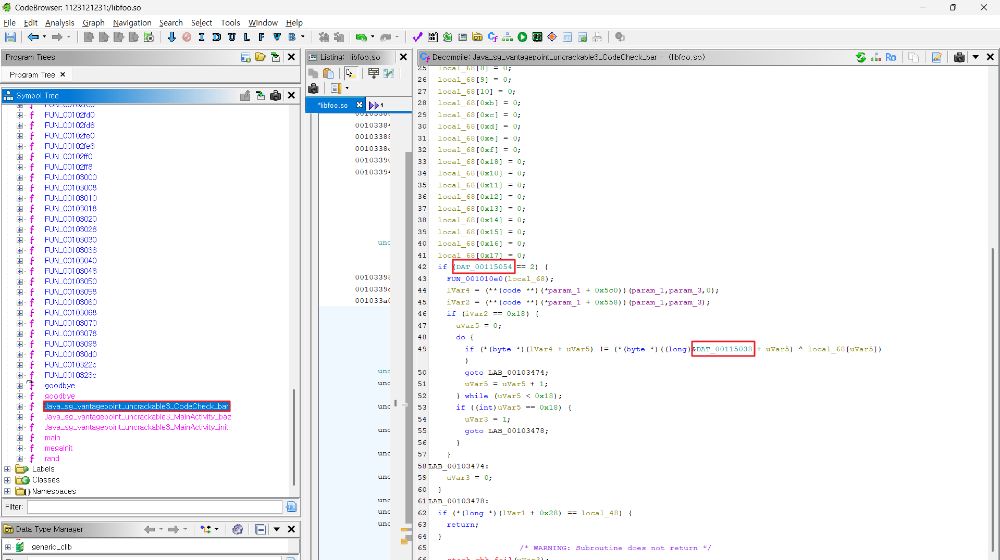

bar 함수 내 while 반복문에서 XOR 연산을 통해 데이터 검증 로직이 존재하는 것을 알 수 있다

분석 전에 가능한 변수를 줄이기 위해 `DAT_00115054` 값과 `DAT_00115038` 에 어떤 값이 있는지 알기 위해 코드로 알아내자

참고로 Ghidra에서 DAT_ 뒤에 메모리 주소로 설정한 변수명은 그 전역 변수가 놓여 있는 오프셋의 16진수 표현이다

각각 뒤의 5자릿수는 `15054`, `15038` 이므로 해당 offset 을 더하면 메모리에 저장된 값을 알 수 있다.

```js
// 기존 루팅 코드 생략...

function waitAndDump() {
    // libfoo.so 가 로드됐는지 확인
    var m = Process.findModuleByName("libfoo.so");
    if (!m) {
        // 아직 안 올라왔으면 잠깐 뒤에 다시 시도
        setTimeout(waitAndDump, 100);
        return;
    }

    function hexDump(offset) {
        var addr = m.base.add(offset);
        console.log("[*] hexdump offset 0x" + offset.toString(16) +
                    " => addr " + addr);
        console.log(hexdump(addr, {
            offset: 0,
            length: 0x40   // 필요하면 길이 늘려도 됨
        }));
    }
    
    // 여기서 원하는 전역 주소 offset 을 넣는다.
    hexDump(0x15054);
	hexDump(0x15038);
}
// 앱 시작 시 바로 대기 루틴 돌리기
setImmediate(waitAndDump);
```

- 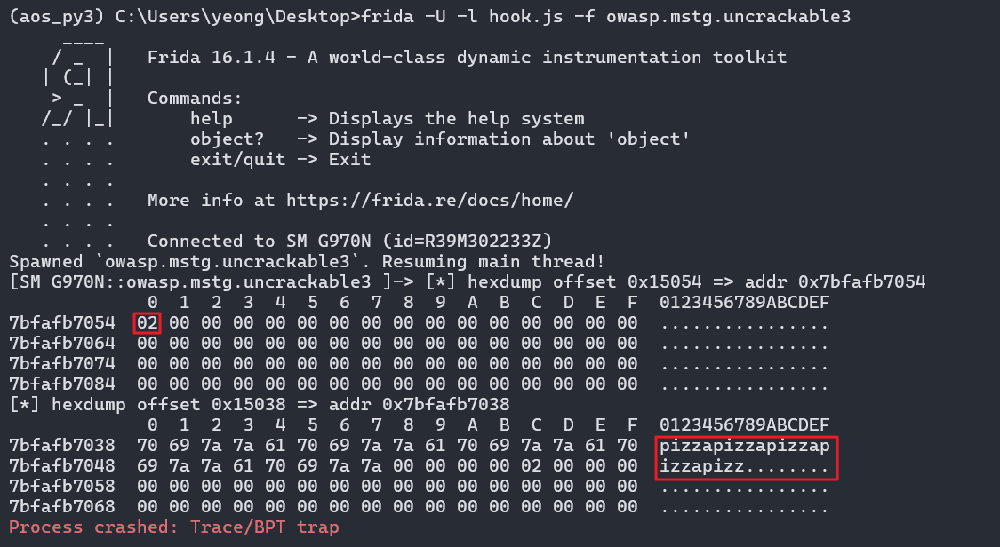

`DAT_00115054` 값은  0x02, `DAT_00115038` 은 24자리의 문자열  pizzapizzapizzapizzapizz 가 들어있다.

- 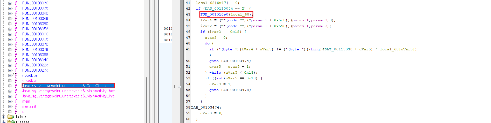

이번에는 FUN_001010e0(local_68) 에서 local_68 값을 알아내야 한다. 즉, FUN_001010e0 함수의 인자값을 알아야 한다.

왜냐하면 뒤의 if (*(byte *)(lVar4 + uVar5) != (*(byte *)((long)&DAT_00115038 + uVar5) ^ local_68[uVar5]) 에서 xor 연산을 수행하기 때문에 local_68 에 어떠한 값이 있는지 분석할 필요가 있기 때문이다

FUN_001010e0 함수를 더블 클릭한다


- 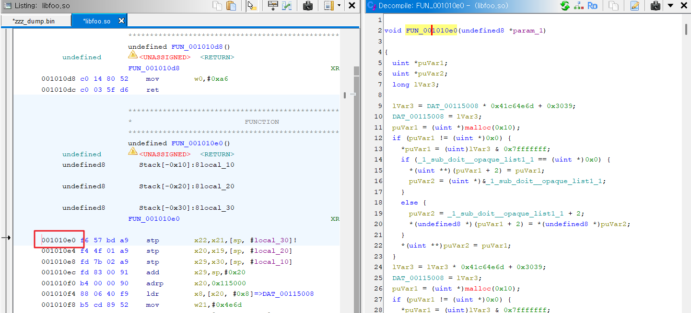

참고로 Ghidra에서 FUN_001010e0 이름의 001010e0 은 그 함수의 시작 주소 값이고, so 기준으로 보면 오프셋이라고 생각하면 된다

즉, base 주소 + `010e0`(FUN_001010e0 뒤의 5자릿수) 을 통해 주소값으로 함수 후킹이 가능하며 해당 함수의 인자 값을 알 수 있다.

```js
// 기존 루팅 우회 코드 생략..
function traceSub(sub_addr) {
    var module_name = "libfoo.so";

    var base = Module.findBaseAddress(module_name);
    if (base === null) {
        console.log("[!] lib not loaded yet, retrying...");
        setTimeout(function () {
            traceSub(sub_addr);
        }, 100);
        return;
    }

    var sub_realaddr = base.add(sub_addr);

    Interceptor.attach(sub_realaddr, {
        onEnter: function (args) {
            console.warn("[+] 0x" + sub_addr.toString(16) + " called");
            if (sub_addr === 0x10e0) {
                console.log("인자 값 출력 : " + args[0]);
            }
        },
        onLeave: function (retval) {
            console.warn("[-] 0x" + sub_addr.toString(16) + " Exiting");
        }
    });
}
traceSub(0x010e0);
```


- 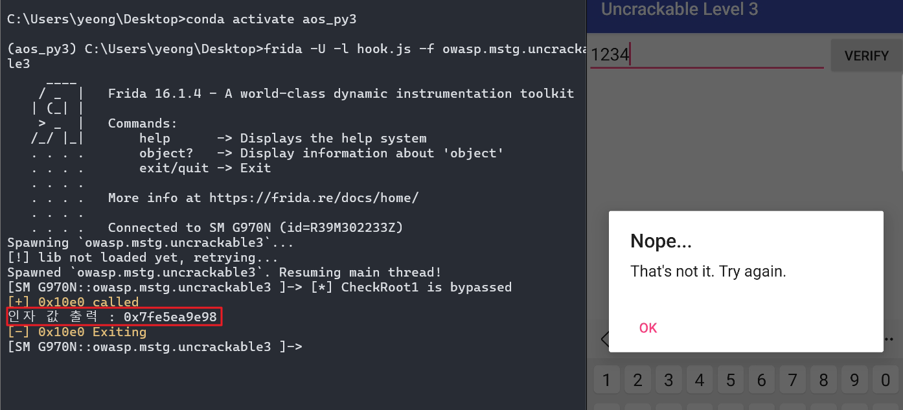

화면에 아무값이나 입력해서 실행결과를 살펴보면 FUN_001010e0 함수의 local_68 인자는 메모리 주소값으로 보인다.

그렇다면 FUN_001010e0 함수로 들어갈때의 local_68 의 주소값에 들어있는 값과, FUN_001010e0 함수를 나올때의 local_68 의 주소값에는 어떤값이 들어있는지도 살펴보자


```js
// 기존 루팅 코드 생략..
function hexDump(dump_addr){
    var module_base = Module.findBaseAddress("libfoo.so");    // libfoo.so 모듈의 base 주소 가져오기
    if (module_base === null) {
        console.log("Module not loaded yet!");
        return;
    }
    var dump_realaddr = module_base.add(dump_addr);    // base 주소 + offset = 실제 메모리 주소

    console.log("hexdump start at " + dump_realaddr); // 덤프 시작 주소 출력
    // 해당 주소부터 32바이트를 hex로 출력
    console.log(hexdump(dump_realaddr,{offset:0, length:32}));
}


function traceSub(sub_addr){
    var module_base = Module.findBaseAddress("libfoo.so");
    if (module_base === null) {
        console.log("Module not loaded yet!");
        return;
    }

    var sub_realaddr = module_base.add(sub_addr);

    console.log("Tracing " + sub_realaddr);

    Interceptor.attach(sub_realaddr, {   // set hook
        onEnter: function (args) {
            console.warn("[+] " + sub_realaddr + " called");

            if(sub_addr === 0x010e0){
                console.log("local_68: " + args[0]); // 인자 출력
                this.temp = args[0];
                console.log("onEnter sub_10e0:\n" + hexdump(ptr(this.temp),{offset:0, length:32}));
            }
        },
        onLeave: function (retval) {
            if (this.temp !== undefined) {
                console.log("onLeave sub_10e0:\n" + hexdump(ptr(this.temp),{offset:0, length:32}));
            }
            console.warn("[-] " + sub_realaddr + " Exiting");
        }
    });
}

// 🔹 spawn 후 모듈 로딩 대기용 딜레이
setTimeout(function () {
    traceSub(0x010e0);
}, 3000);  // 3초 후 실행, 필요하면 더 늘릴 수 있음
```


- 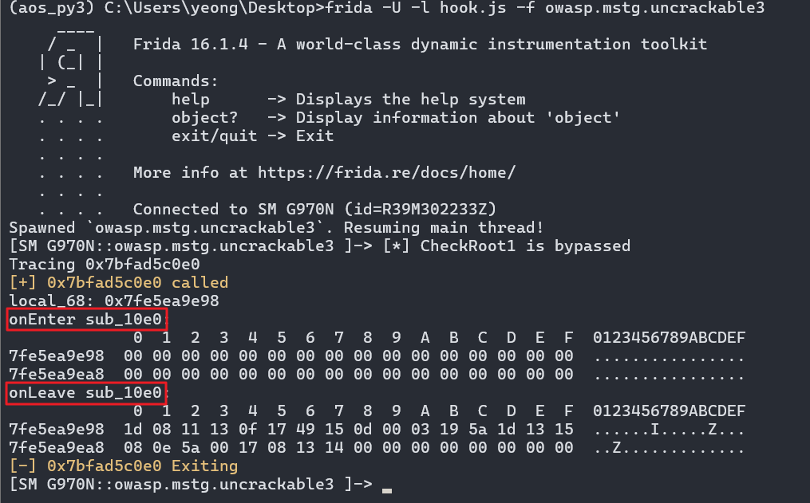

실행결과 FUN_001010e0 함수를 들어오고 나갈때 local_68 주소값에 들어있는 값에 분명한 차이가 있음

들어갈 때는
- local_68 : 00 00 00 00 00 00 00 00 00 00 00 00 00 00 00 00 00 00 00 00 00 00 00 00 00 00 00 00 00 00 00 00

나올 때는
- local_68 : 1d 08 11 13 0f 17 49 15 0d 00 03 19 5a 1d 13 15 08 0e 5a 00 17 08 13 14 00 00 00 00 00 00 00 00


따라서

if (*(byte *)(lVar4 + uVar5) != (*(byte *)((long)&DAT_00115038 + uVar5) ^ local_68[uVar5]) 동작에서


DAT_00115038 에 저장되어 있는 24자리의 문자열 pizzapizzapizzapizzapizz 와

local_68 : 1d 08 11 13 0f 17 49 15 0d 00 03 19 5a 1d 13 15 08 0e 5a 00 17 08 13 14 00 00 00 00 00 00 00 00 에 대하여 

xor 연산하는 것을 알 수 있다.


```js
Java.perform(function () {

    // ===== 기존 루팅 우회 코드 =====
    var RootDetection = Java.use('sg.vantagepoint.util.RootDetection');

    RootDetection.checkRoot1.implementation = function () { return false; }
    RootDetection.checkRoot2.implementation = function () { return false; }
    RootDetection.checkRoot3.implementation = function () { return false; }

    // ===== XOR 실행 =====
    function XOR(){
        var zzz = "pizzapizzapizzapizzapizz";
        var kkk = [
            0x1D,0x08,0x11,0x13,0x0F,0x17,
            0x49,0x15,0x0D,0x00,0x03,0x19,
            0x5A,0x1D,0x13,0x15,0x08,0x0E,
            0x5A,0x00,0x17,0x08,0x13,0x14
        ];

        var secret = "";

        for (var i = 0; i < zzz.length; i++) {
            secret += String.fromCharCode(
                zzz.charCodeAt(i) ^ kkk[i]
            );
        }

        console.log("[+] XOR result:", secret);
    }

    XOR();
});

```

- 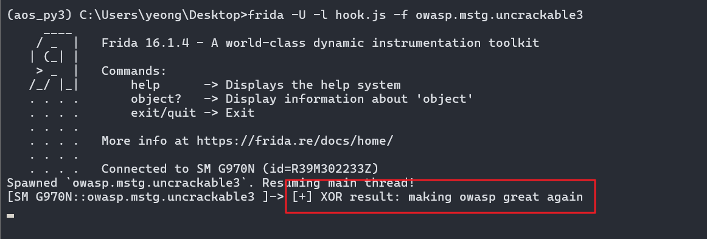

확인!!


