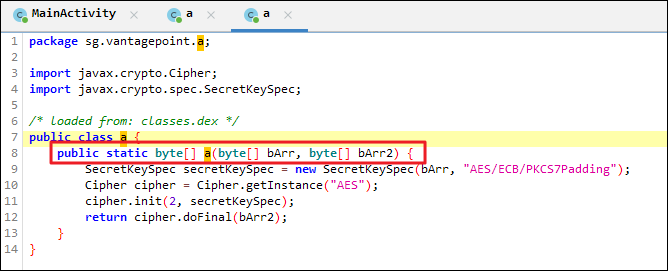
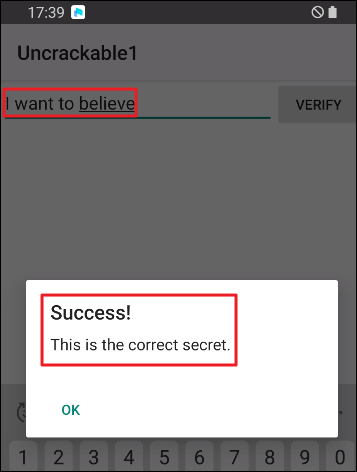
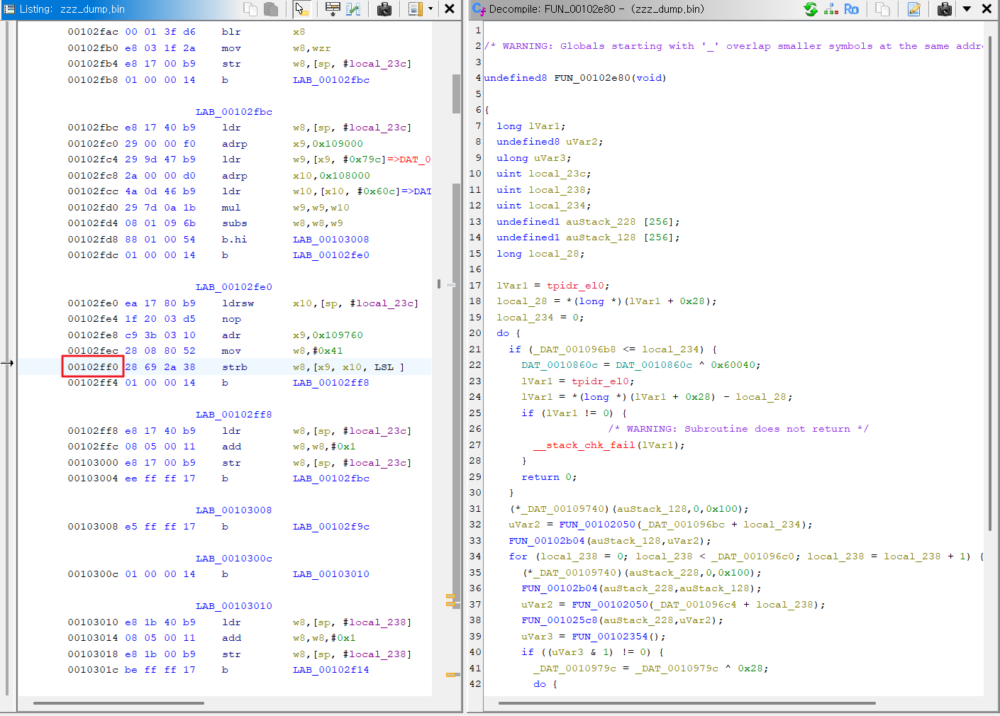

EQST LMS AOS 솔루션 우회 마지막 문제인 app48.apk 파일을 우회 및 Flag 획득해보자


---


```js
Java.perform(function () {


    var targetMain = Java.use("com.eqst.lms.solution3.MainActivity");
    // 무결성 검증 메서드 우회
    targetMain.illl1lillil1iil1lilil1il.overload().implementation = function() {
        return "Fake String";
    };
    targetMain.checkusbdebug2.implementation = function() {
        return;
    };
    var targetSplash = Java.use("com.eqst.lms.solution3.SplashActivity");
    targetSplash.checkusbdebug.overload().implementation = function() {
        return;
    };


    var targetSplash = Java.use("com.eqst.lms.solution3.SplashActivity");
    targetSplash.checkusbdebug.overload().implementation = function() {
        return;
    };
    targetSplash.illillillil1iillillillil.overload().implementation = function() {
        console.log("원래의 True/False 값 : " + this.illillillil1iillillillil()); // 기존 False
        return true;
    };
    targetSplash.illillillil1iilllilil1il.overload().implementation = function() {
        console.log("원래의 True/False 값 : " + this.illillillil1iilllilil1il()); // 기존 False
        return true;
    };
    targetSplash.illillillilliillillillil.overload().implementation = function() {
        console.log("원래의 True/False 값 : " + this.illillillilliillillillil()); // 기존 False
        return true;
    };


    /* ========================================
    * 🛡️ CRITICAL: finish() 우회 - MainActivity만!
    * ======================================== */
    var Activity = Java.use("android.app.Activity");

    // finish() 차단: MainActivity에서만!
    Activity.finish.overload().implementation = function() {
        var name = this.getClass().getName();

        if (name.includes("MainActivity")) {
            console.log(`[+] 🚫 MainActivity.finish() BLOCKED!`);
            return; // MainActivity 종료 방지
        }
        return this.finish(); //기타는 정상 종료
    };
    // finish(int) 오버로드도 동일 로직
    Activity.finish.overload('int').implementation = function(reason) {
        if (this.getClass().getName().includes("MainActivity")) {
            console.log(`[+] 🚫 MainActivity.finish(${reason}) BLOCKED!`);
            return;
        }
        return this.finish(reason);
    };
    // 🔧 시스템 ADB 체크 우회 (백업)
    Java.use("android.provider.Settings$Global").getInt.overload('android.content.ContentResolver', 'java.lang.String')
        .implementation = function(resolver, name) {
        if (name.toLowerCase().includes("adb")) {
            console.log("[+] Global ADB bypassed");
            return 0;
        }
        return this.getInt(resolver, name);
    };

    console.log("[*] ✅ ALL BYPASSED! Splash→Main→FLAG SUCCESS!");
});
```

기존 루팅 체크 후킹 코드로 우회 시도 시 


- 

`signal 11 (SIGSEGV), code 1 (SEGV_MAPERR)` 로그 발생 및 앱이 정상적으로 종료되지 않음
- 의미 : 존재하지 않는 메모리 주소로 실행/접근 
- 자연 발생 크래시 ❌ 
- 의도적으로 잘못된 주소로 점프한 크래시 ✅

`#00 pc 0000000000002ff0  /data/data/com.eqst.lms.solution3/cache/.zzz (deleted)`
- 앱 내부 cache 디렉터리 이름 없는 .zzz (deleted) 상태
- 그런데 PC(프로그램 카운터)가 여기 있음


즉 `/data/data/com.eqst.lms.solution3/cache/.zzz` 파일의 `0x00002ff0` 지점 분석이 필요함


```js
'use strict';

function dumpZZZ() {
    console.log("[*] searching memory ranges...");

    var ranges = Process.enumerateRangesSync({
        protection: 'r-x',
        coalesce: true
    });

    ranges.forEach(function (r) {
        if (r.file &&
            r.file.path &&
            r.file.path.indexOf("/data/data/com.eqst.lms.solution3/cache") !== -1 &&
            r.file.path.indexOf("(deleted)") !== -1) {

            console.log("[+] Found target range!");
            console.log("    Path :", r.file.path);
            console.log("    Base :", r.base);
            console.log("    Size :", r.size);

            try {
                var bytes = Memory.readByteArray(r.base, r.size);
                var f = new File("/data/data/com.eqst.lms.solution3/files/zzz_dump.bin", "wb");
                f.write(bytes);
                f.flush();
                f.close();

                console.log("[+] Dump success → /sdcard/zzz_dump.bin");
            } catch (e) {
                console.log("[-] Dump failed:", e);
            }
        }
    });
}

// 앱 초기화 끝난 뒤 실행되게 약간 지연
setTimeout(dumpZZZ, 1500);
```

해당 코드를 실행한 뒤 

`adb exec-out run-as com.eqst.lms.solution3 cat files/zzz_dump.bin > zzz_dump.bin`

메모리 덤프한 zzz_dump.bin 파일을 adb로 PC로 복사

이제 해당 파일을 Ghidra로 분석 진행한다

내가 봐야할 지점은

해당 파일의 `0x00002ff0` 주소이다

Ghidra 잡는 기준 주소 = 0x00100000 이므로

`0x00100000` + `0x00002ff0` = `0x00102ff0` 이다.

- 
- 

대문자 G > 해당 주소를 입력하여 그 주소로 바로 이동하여 로직 파악 가능함


