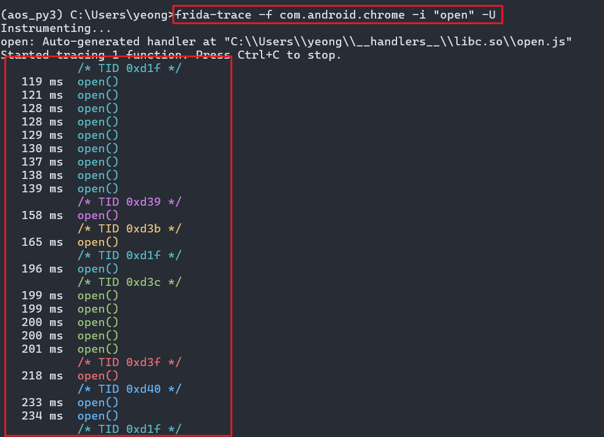
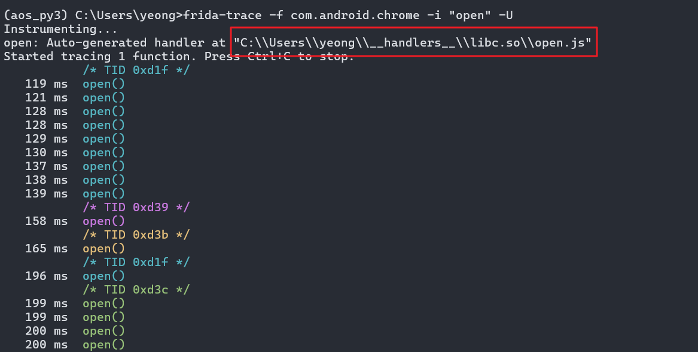
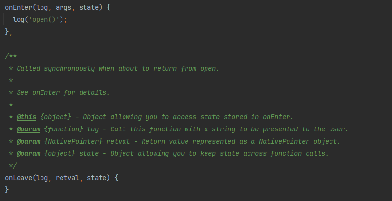
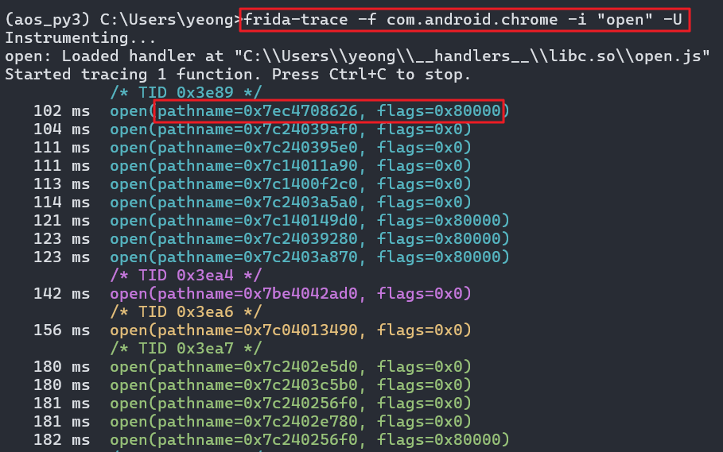
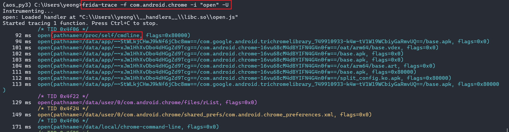

### 1. 기본 명령어


`frida-ps -U` `frida-ps -Ua`
- 프리다에 연결된 프로세스 목록을 출력하기 위한 도구


`frida-ls-devices`

- 연결된 디바이스를 출력하는 도구


`frida-trace`

- 함수 호출을 동적으로 추적하기 위한 도구


`frida-kill`

- 프로세스를 종료하는 도구


기타 주요 옵션

| 옵션                       | 설명                                       |
|----------------------------|--------------------------------------------|
| `-D ID`, `--device=ID`      | 주어진 ID로 장치에 연결                    |
| `-U`, `--usb`               | USB 장치에 연결                            |
| `-R`, `--remote`            | 원격 프리다 서버에 연결                    |
| `-H HOST`, `--host=HOST`    | HOST의 원격 프리다 서버에 연결             |
| `-a`, `--applications`      | 애플리케이션 리스트만 출력                 |
| `-i`, `--installed`         | 설치된 모든 애플리케이션 포함 출력         |
| `-I SCRIPT`, `--load=SCRIPT`| SCRIPT를 로드                             |
| `-f FILE`, `--file=FILE`    | spawn(스폰) FILE                           |
| `--no-pause`                | 시작할 때 자동으로 메인 쓰레드를 시작     |


---

### 2. FridaTrace

frida-trace -f [앱 패키지 이름] -i [검색하고 싶은 API] -U


`frida-trace -f com.android.chrome -i "open" -U`

연결된 후 앱을 사용할 때마다 

- 

open 함수를 사용하여 로그가 출력된다.

- 

`open.js`는 Frida의 `frida-trace` 명령어가 자동으로 생성한 JavaScript 핸들러 파일이다.

`Frida-trace`가 `libc.so`의 `open` 함수를 추적하기 위해 `C:\Users\yeong\__handlers__\libc.so\open.js` 경로에 이 파일을 만듦.

이 스크립트는 `open` 함수 호출 시 `onEnter`와 `onLeave` 콜백을 통해 매개변수와 반환값을 로깅하며, 동적 분석을 도와줌

파일 안에는 보통 다음과 같은 구조로 이루어짐

- `onEnter: function(args) { console.log('open() called'); }` : 함수 진입 시 로그 출력
- `onLeave: function(retval) { console.log('open() -> ' + retval); }` : 종료 시 결과 기록

`C:\Users\yeong\__handlers__\libc.so\open.js` 확인해보면

- 

  - `onEnter` 함수에서는 문자열 `open()` 출력
    - `onEnter`의 인수에는 3가지 logs / args / state 을 받아오는데 단순히 로그 출력만 하며 3가지 인수들을 사용하지 않음
  - `onLeave` 함수에서는 아무런 기능 없음


3가지의 인수가 어떠한 값이 전달되는지 궁금하므로 args 을 통해 호출 인수가 어떻게 동작중인지 확인한다.

그 전에 앞서 실제 리눅스에서 사용하는 `open()` 함수의 시그니처를 알아야 함.

- `int open(const char *pathname, int flags, mode_t mode);`

  - `pathname`: 파일 경로 문자열 (`args[0]`)
  - `flags`: 열기 옵션 (`args[1]`)
  - `mode`: 생성 시 권한 (`args[2]`)

onEnter의 `args` 배열에는 open 함수의 3가지 인수(pathname, flags, mode)가 순서대로 담겨 있으므로, `args[0]`이 pathname, `args[1]`이 flags 이다.
따라서 **파일 경로 문자열을 읽기 위한 메모리 주소** `args[0]`과 플래그 값 `args[1]`을 출력하도록 `open.js`를 수정함

```javascript
onEnter(log, args, state) {
  log('open(' + 'pathname=' + args[0] + ', flags=' + args[1] + ')');
},
```

저장 후 `frida-trace -f com.android.chrome -i "open" -U` 재 실행해 보면 

- 

파일 경로가 저장된 메모리 주소(pathname)와 플래그 값(flags) 확인이 가능함.

이처럼 함수를 호출할 때 확인이 필요한 함수에 어떤 정보들이 노출되는지 확인이 가능함.

또한 Frida의 메모리 Class 를 사용하여 메모리 주소의 실제 경로를 추가 확인 가능함.
```javascript
 onEnter(log, args, state) {
    log('open(' + 'pathname=' + Memory.readUtf8String(args[0]) + ', flags=' + args[1] + ')');
  },
```

저장 후 `frida-trace -f com.android.chrome -i "open" -U` 재 실행해 보면
- 

파일 경로가 저장된 메모리 주소(pathname)로 실제로 간 뒤, UTF8 문자열 읽음

따라서 실제 호출 경로 확인이 가능한데 이처럼 특정 앱에서 어떤 함수가 언제 호출이 되는지 TID 값을 통해 알 수 있으며

호출 시 어떤 경로에서 호출이 되는지 pathname 을 통해 확인이 가능하다.

---

### 3. 기본 문법

#### 1. `Java.perform(fn)`

1. "VM 준비됐어?" 확인 → 안 됐으면 대기

2. 준비되면 fn() 실행 → Java.use(), Java.choose() 등 안전하게 호출

- 프리다를 활용하려면 반드시 해당 메서드를 통해 가상머신 또는 단말기 연결을 확인해야 하므로 가장 많이 사용됨

```javascript
Java.perform(function() {     // 대소문자 주의!
/*
  ...
  do sth
  ...
*/
})
```

```javascript
❌ 잘못된 코드 (VM 미로드 상태에서 호출)
Java.use("com.example.MainActivity");  // TypeError: cannot use before VM ready!

✅ 올바른 코드
Java.perform(function() {
    Java.use("com.example.MainActivity");  // VM 준비 후 안전 호출
});

```

---

#### 2. `Java.use(className)`

- Java.use()는 변수와 메서드에 액세스 할 수 있는 클래스 객체를 반환

예) Java.use(A)를 선언한 경우 지정한 A 클래스를 사용한다고 선언한 것!
- 주의! 클래스의 인스턴스를 반환하는 것이 아닌 클래스의 객체를 반환
- 안드로이드 앱의 내부 코드 중 인스턴스를 반환하려면 Java.choose라는 API를 사용해야 함

- 메서드 구현을 변경하려면 새로운 메서드로 덮어 써야 함

```javascript
Java.perform(function() {// 1️⃣ Java.perform: Dalvik VM 완전 로드될 때까지 대기 (안전장치)

  var myClass = Java.use("com.mypackage.name.class");  // 2️⃣ Java.use: 클래스 객체 반환, 인스턴스 아님!
  
  myClass.myMethod.implementation = function(param) {
    // 3️⃣ implementation 덮어쓰기: 원본 myMethod 완전 대체

    console.log("🔥 myMethod 후킹됨! param: " + param);  // 새 동작 추가

    var result = this.myMethod(param);  // 4️⃣ 원본 메서드 재호출 (중요!) 하고 원본 메서드 return 값을 저장

    console.log("✅ 원본 실행 완료, 결과: " + result);
    return result;  // 5️⃣ 원본 반환값 그대로 전달
  }
});
```
---

#### 3. `Java.choose(className, callbacks)`


- 힙을 스캔하여 클래스에서 실행 중인 인스턴스화 된 객체 찾기 가능

  - callbacks : onMatch, onComplete

  - onMatch : 실시간으로 인스턴스에 대해 호출

  - onComplete : function()의 모든 인스턴스가 열거될 때 호출

```javascript
Java.perform(function() { // 1️⃣ Java.perform: Dalvik VM 완전 로드될 때까지 대기 (안전장치)


  Java.choose("com.myPackage.name.class", {  // 2️⃣ Java.choose: 지정 클래스 *모든 인스턴스* 검색

    onMatch: function(instance) {     // 3️⃣ onMatch: 각 인스턴스마다 호출 (하나 이상 발견됨)
      //    instance = 실제 객체 (new com.myPackage.name() 한 것들)
      console.log("🔍 발견된 인스턴스: " + instance.toString());  // 인스턴스 정보 출력
      //    예: com.myPackage.name@0x7fabc123456 (메모리 주소 + 클래스명)

      // 🎯 여기서 인스턴스별 후킹 가능!
      instance.myMethod.implementation = function(param) {
        console.log("🔥 인스턴스 후킹! " + param);
        return this.myMethod(param);  // 원본 호출
      };
    },

    onComplete: function() {          // 4️⃣ onComplete: 모든 인스턴스 검색 완료 시 호출
      console.log("✅ 모든 com.myPackage.name 인스턴스 검색 완료!");
    }
  });
});

```

Java.choose vs Java.use 차이
- Java.use("Class")     → 클래스 자체 반환 (모든 인스턴스 공통 후킹)
- Java.choose("Class")  → 생성된 모든 인스턴스 개별 반환 (인스턴스별 후킹)

---

#### 4. `Java.enumerateLoadedClasses(callbacks)`

- 로드된 모든 클래스를 열거하고 모든 일치 항목을 출력

- onMatch : 실시간으로 인스턴스에 대해 호출

- onComplete : function()의 모든 인스턴스가 열거될 때 호출

사용 목적은 클래스명을 알고 싶기 위함

Java.choose("com.myPackage.name")  // ❌ 클래스명 미리 알아야 함
Java.enumerateLoadedClasses()      // ✅ 먼저 클래스 목록 확인 → 원하는 클래스 찾기

```javascript

Java.perform(function() {// 1️⃣ Java.perform: Dalvik VM 완전 로드 후 실행 (안전장치)
    
    Java.enumerateLoadedClasses({    // 2️⃣ 현재 메모리에 로드된 Java 클래스 전체 목록 반환
       
        onMatch: function(className) {     // 3️⃣ onMatch: 각 클래스마다 순차 호출
            //    className = 문자열 클래스명 (예: "com.android.chrome.MainActivity")
            //    수천개 클래스 모두 순회하며 출력
            
            console.log("📋 로드된 클래스: " + className);
        },
        
        onComplete: function() {         // 4️⃣ onComplete: 모든 클래스 열거 완료
            console.log("✅ 모든 클래스 열거 완료");
        }
    });
});

```

#### 5. `setImmediate(fn)`

- Process terminated 오류 해결하기

 Frida는 emulation이 느려져 시간 초과가 되는 경우 연결을 자동으로 종료하는 경우가 있는데 이를 막기 위해 아래 코드처럼 스크립트를 setImmediate 함수로 포장한다.

Frida 스크립트 무한 생존 보장하는 안전장치

스크립트를 작성할 때 혹시 모를 상황을 대비해 함께 사용 추천

```javascript
setImmediate(function() {
    // 1️⃣ setImmediate: 스크립트 실행 후 즉시 콜백 실행 (타임아웃 방지)
    console.log("🔗 연결 유지 모드 활성화");
    
    Java.perform(function() {
        // ...
    });
});

```

---

#### 6. 

```javascript
Java.perform(function() {
  var myClass = Java.use("com.test.name");  // 1️⃣ 클래스 로드

  // 2️⃣ 오버로드별 후킹: 매개변수 타입으로 정확한 메서드 지정

  // ✅ 매개변수 없음 (void test_method())
  myClass.test_method.overload().implementation = function() {
    console.log("🔥 test_method() 호출 (매개변수 없음)");
    return this.test_method();  // 원본 호출
  };

  // ✅ byte[] → byte[] (byte[] test_method(byte[]))
  myClass.test_method.overload("[B", "[B").implementation = function(param1, param2) {
    console.log("🔥 test_method(byte[], byte[]) 호출");
    console.log("param1 길이: " + param1.length);
    return this.test_method(param1, param2);  // 원본 호출
  };

  // ✅ Context, boolean (boolean test_method(Context, boolean))
  myClass.test_method.overload("android.content.Context", "boolean").implementation =
          function(param1, param2) {
            console.log("🔥 test_method(Context, boolean) 호출");
            console.log("Context: " + param1 + ", flag: " + param2);
            return this.test_method(param1, param2);  // 원본 호출
          };

  console.log("✅ 모든 오버로드 후킹 완료!");
});

});


```

overloading이 적용된 메서드가 여러 개 있는 경우 Frida에서  처리 방식은 위 코드와 같다.


오버로드 변수 카테고리
```text
.overload()
.overload('int’)
.overload('boolean')
.overload('float')
.overload('[B') // byte array
.overload('[B', '[B', '[B')
.overload('java.io.File')
.overload('java.lang.String')
.overload('android.view.View')
.overload('android.app.Activity')
.overload('android.content.Context')
.overload('android.content.Context', 'java.lang.String')
.overload('java.lang.String', 'java.lang.String')
.overload('android.graphics.Bitmap')
.overload('java.util.List’)
.overload('android.content.Context', 'java.lang.String', 'java.lang.String')
.overload('android.app.Activity', 'int', 'int', 'int', 'boolean')
```

